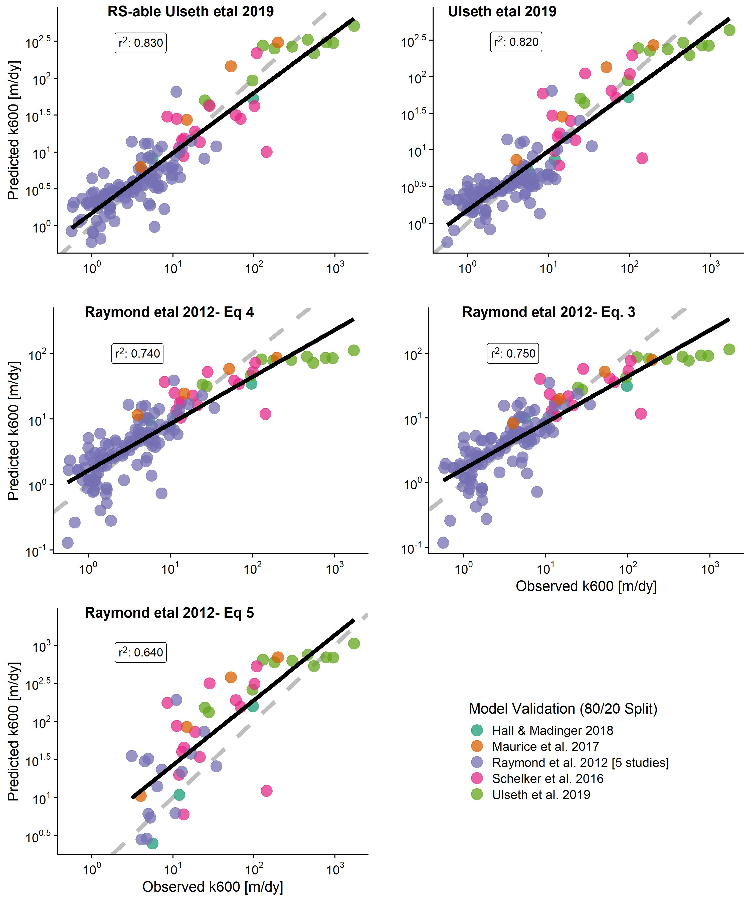
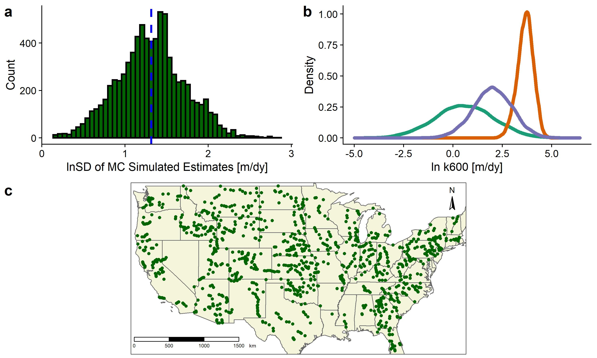
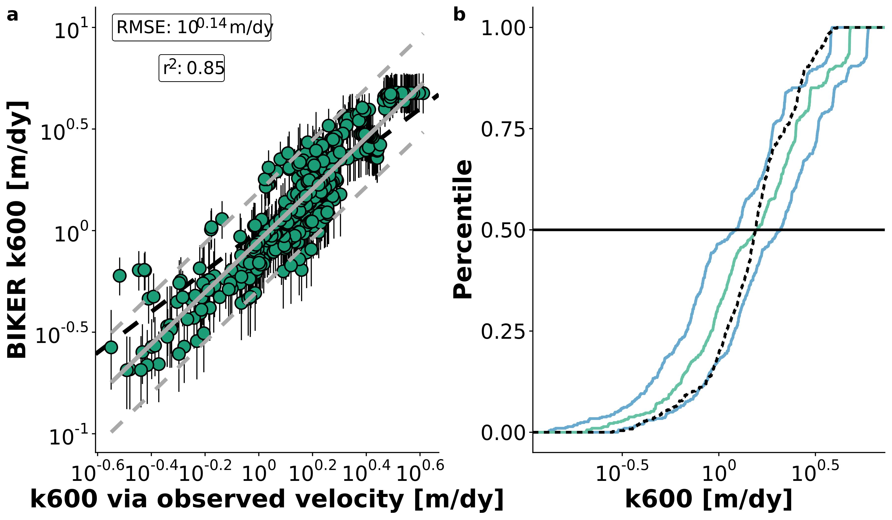

```{r setup, include=FALSE}
knitr::opts_chunk$set(echo = TRUE)
```

```{r, include=FALSE}
options(tinytex.verbose = TRUE)
```

## Background

1)	CO2 emissions from rivers are significant (duh)
2)	Estimating this flux is done by estimating in-stream CO2 and the gas transfer velocity, or ‘evasion rate’ or k600 of the river channel
3)	K600 is incredibly cumbersome to directly measure, and impractical when performing upscaling to entire river networks
4)	Previous work has stressed that this is largely a f(turbulence) driven by river hydraulics/geomorphology
    a.	Empirical scaling functions have been developed to use hydraulics to model k600 for entire river systems but are prone to significant uncertainties (Raymond et al. 2012)
5) Further, in situ data for hydraulics is often unavaible (esp. in remote rivers) and so k models are at the mercy of modeled hydraulics, themselves highly uncertain.
6)	What is needed is a simple way to observe the gas transfer velocity at large scales and high temporal resolution without relying on situ flow velocity data or modeled velocities. We argue that the upcoming SWOT mission provides exactly the data required to make this a reality (at least in large rivers) and remotely sense (RS) k600 as a function of river hydraulics.

## Research Goals

1)	Formulate a new empirical scaling model to predict k600 using only RS-able geomorphology
2)	Build algorithm to run the new empirical model using SWOT observations
3)	?????????
    a. Biogeochemists might be interested in a Merritt style test of this algorithm at field-scale (to circumvent velocity measurements…)
    b. Pepsi2-style comparisons across temporal sampling?
    c. Some sort of k600 timeseries analysis? But these are all simulated k so I dunno.
    d. MORE

## Goal 1
#### Theory
1) Raymond 2012 show that k600 can be scaled using hydraulics b/c k600 generally correlates with the turbulent dissipation rate (eD = gSV)
2) Ulseth et al 2019 show two distinct scaling regimes for k600 with eD using an expanded dataset including steeper streams than those in Raymond 2012.
3) Here, we take the Ulseth et al. 2019 dataset and develop a k600~eD scaling function that accounts for this regime shift and the fact that scaling relationships differ as a f(river size). BUT, we only use SWOT observables to determine which scaling relationship to use.
    a. i.e. river width and slope alone must be used to choose which scaling model to use.
	    i. $k_{600}=a(gSV)^{b}$ where a and b are differentially determined by river size.
	  b. Small rivers had to be broken into high/low slope to maintain all linear regression assumptions.
4) To test this, we then combine these five scaling functions into a single 'rule-based' regression model, train it on 80% of the data and validate it on the remaining 20% (below). The version ultimately implemented in our algorithm is trained on the entire dataset however.




#### Quantifying Uncertainity in Model Estimates
1) In order to remotely sense k600, we need a way to approximate flow velocity as it is not easily RS-able. We use a variant of Manning's equation, THE classic open channel flow depth~velocity relation, to do this (Durand et al. 2014; Hagemann et al. 2017 used to do the same thing from getting discharge from SWOT data).
	  a. $k_{600}=a(gSV)^{b}$ Original Model
	  b. $k_{600}=a(gS[\frac{1}{n} d^{2/3} S^{1/2}])^{b}$ Classical Manning's equation introduced
	  c. $k_{600}=a(gS[\frac{1}{n} (A_{0}+dA)^{2/3} W^{-2/3} S^{1/2}])^{b}$ Durand et al. (2014) formulation of Manning's equation. (The handling of n and A0 in a RS framework will be addressed under Goal 2).
2) We then quantified the total uncertainity implicit in the model output. Uncertainty can stem from three sources: 1) error from Manning's equation, 2) error in using a k600~eD scaling model, and 3) error implicit in our remote sensing algorithm. This third error source will be explicitly accounted for (via Bayesian inference) in the RS algorithm output, however we also wanted to quantify total uncertainty from the model being used in the RS algorithm, i.e. from the other two sources. To do this, we used Monte Carlo simulations to propogate uncertanites through the entire model.
    a. 8,000 sets of river hydraulic measurements from across the United States were taken from the Brinkerhoff etal (2019) dataset. For each one I ran a 10,000 run Monte Carlo simulation (randomly sampling from the three parameters a, b, and "Manning's velocity") and obtained 8,000 different distributions quantifying model estimate uncertainity. Log uncertainity for the "Manning's velocity"" was assigned 0.25 following Hagemann et al. (2017)'s value for Manning's equation uncertainity.



## Goal 2
1) We propose the BIGER (Bayesian Inference/Inversion of the Gas Evasion Rate) algorithm to remotely sense k600 from river width/height alone.
2) We implement the k600~eD model from Q1 as a Bayesian likelihood function following methods developed for ungauged RSQ (Hagemann et al. 2017). Below is the derivation of the likelihood function used in the Bayesian inference model.
	  a. $k_{600}=a(gS[\frac{1}{n} (A_{0}+dA)^{2/3} W^{-2/3} S^{1/2}])^{b}$
	  b. $k_{600}(\frac{1}{n}(A_0+dA)^{2/3})^{-b}=a(g W^{2/3}S^{3/2})^{b}$
	    i. Model parameters are now on left-hand side (i.e. need priors) and the data (i.e. SWOT observables) are on right-hand side. This allows us to, given the constant rhs value, sample from the left in the same manner that a traditional Bayesian sampling model samples from a set of model parameters (see Hagemann etal 2017 & Durand etal 2014). Therefore, the 'model parameters' are k600, n, and A0. In a Bayesian framework, these need priors assigned to them.
	    ii. Brinkerhoff etal 2020 priors are used for n and A0. k600 priors are obtained similarly using Ulseth etal 2019 as the training data. <b> ELABORATE </b>
3) For the sake of validating the algorithm, we assume that the scaling model is ‘truth’ and see if we can infer these values using only SWOT observables (river width and height/slope).
    a. Therefore, in the validation setup, posterior uncertainty is only Manning’s uncertainty (0.25) and not the total model uncertainty obtained in the MC simulations earlier. However, this total uncertainity would be implemented if running the algorithm for general science objectives.
    b. We validated on 10-day pepsi 2 data. Plotted are means and 95% CIs of the posterior k600 values versus the ‘observed’ k600 calculated from observed velocity and slope for all timesteps across all 32 rivers



4. Below are boxplots of performance metrics for the 32 rivers, i.e. how well do individual rivers do? NRMSE, RRMSE, and rBIAS are optimally zero while KGE is optimally 1. A KGE greater than -0.41 indicates our model outperforms a mean estimate, akin to an NSE of 0 (Knoben etal 2019). Also see Knoben et al (2019) for why NSE completely blows up for k600.


##Goal 3
Who knows! Any interesting questions you can think of?


##References
Durand, M., Neal, J., Rodríguez, E., Andreadis, K. M., Smith, L. C., & Yoon, Y. (2014). Estimating reach-averaged discharge for the River Severn from measurements of river water surface elevation and slope. Journal of Hydrology, 511, 92–104. https://doi.org/10.1016/j.jhydrol.2013.12.050

Engram, M., Walter Anthony, K. M., Sachs, T., Kohnert, K., Serafimovich, A., Grosse, G., & Meyer, F. J. (2020). Remote sensing northern lake methane ebullition. Nature Climate Change, 1–7. https://doi.org/10.1038/s41558-020-0762-8

Hagemann, M. W., Gleason, C. J., & Durand, M. T. (2017). BAM: Bayesian AMHG-Manning Inference of Discharge Using Remotely Sensed Stream Width, Slope, and Height: BAM FLOW USING STREAM WIDTH SLOPE HEIGHT. Water Resources Research, 53(11), 9692–9707. https://doi.org/10.1002/2017WR021626

Knoben, W. J. M., Freer, J. E., & Woods, R. A. (2019). Technical note: Inherent benchmark or not? Comparing Nash–Sutcliffe and Kling–Gupta efficiency scores. Hydrology and Earth System Sciences, 23(10), 4323–4331. https://doi.org/10.5194/hess-23-4323-2019
