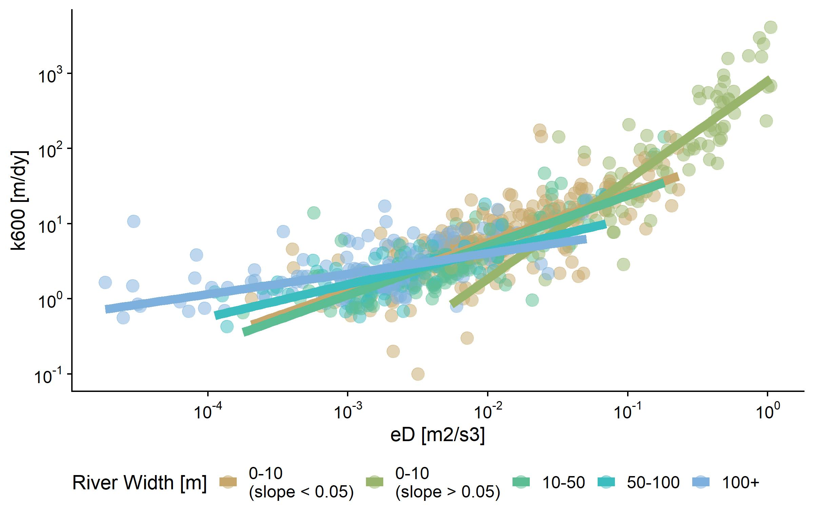
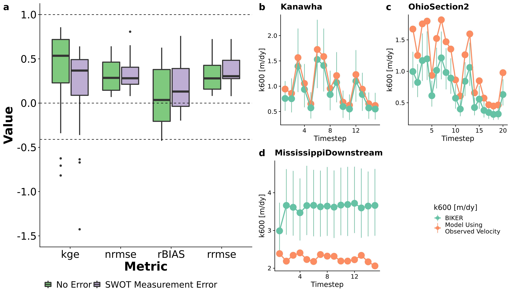

```{r setup, include=FALSE}
knitr::opts_chunk$set(echo = TRUE)
```

```{r, include=FALSE}
options(tinytex.verbose = TRUE)
```

## Background

1)	CO2 emissions from rivers are significant (duh)
2)	Estimating this flux is done by estimating in-stream CO2 and the gas transfer velocity, or ‘evasion rate’ or k600 of the river channel
3)	K600 is incredibly cumbersome to directly measure, and impractical when performing upscaling to entire river networks
4)	Previous work has stressed that this is largely a f(turbulence) driven by river hydraulics/geomorphology
    a.	Empirical scaling functions have been developed to use hydraulics to model k600 for entire river systems but are prone to significant uncertainties (Raymond et al. 2012)
    b.	They are also fundamentally dependent on modeled or measured flow velocities which themselves are prone to significant uncertainties (or poorly informed hydraulic geometry models…)
    c.	What is needed is a simple way to directly observe the gas transfer velocity at scale and high temporal resolution without needing explicit flow velocity estimates. We argue that the upcoming NASA SWOT mission provides exactly the data required to make this a reality and remotely sense (RS) k600 at unprecedented temporal resolution

## Research Goals

1)	Formulate a new empirical scaling model to predict k600 using only RS-able geomorphology
2)	Build algorithm to run the new empirical model using SWOT observations
3)	?????????
    a.	Biogeochemists might be interested in a Merritt style test of this algorithm at field-scale (to circumvent velocity measurements…)
    b.	Pepsi2-style comparisons across temporal sampling?
    c. MORE

## Goal 1
#### Theory
1) Raymond 2012 show that k600 can be scaled using hydraulics b/c k600 generally correlates with the turbulent dissipation rate (eD = gSV)
2) Ulseth et al 2019 show two distinct scaling regimes for k600 with eD using an expanded dataset including steeper streams than those in Raymond 2012.
3) Here, we take the Ulseth et al. 2019 dataset and develop a k600~eD scaling function that accounts for this regime shift but is entirely remotely sensible (i.e. not velocity dependent)
	  a. k_600=a(gSV)b where a and b are differentially determined by river size. Thus, from a river’s width and slope alone (i.e. SWOT observations) we can choose the most reasonable scaling function.
	  


4) To test this, we then combine these five scaling functions into a single 'rule-based' regression model, train it on 80% of the data and validate it on the remaining 20% (below). The version ultimately implemented in our algorithm is trained on the entire dataset however.


#### Quantifying Uncertainity in Model Estimates
1) We then quantified the total uncertainity implicit in the model output. Uncertainty can stem from three sources: 1) error in using Manning's equation to approximate flow velocity, 2) error in using a k600~eD scaling model to approximate k600, and 3) error implicit in our remote sensing algorithm. This third error source will be explicitly accounted (via Bayesian inference) in the RS algorithm output, however we also wanted to quantify total uncertainty from the model being used in the RS algorithm, i.e. from the other two sources. To do this, we used Monte Carlo simulations to propogate uncertanites through the entire model.
    a. 8,000 sets of river hydraulic measurements from across the United States were taken from the Brinkerhoff etal (2019) dataset. For each one I ran a 10,000 run Monte Carlo simulation (sampling from the three parameters a, b, and "Manning's velocity") and obtained 8,000 different distributions quantifying model estimate uncertainity. Log uncertainity for the "Manning's velocity"" was assigned 0.25 following Hagemann et al. (2017).


## Goal 2
1) We propose the BIGER (Bayesian Inference/Inversion of Gas Evasion Rate) algorithm to remotely sense k600 from river width/height alone.
2) We implement the k600~eD model from Q1 as a Bayesian likelihood function following methods developed for ungauged RSQ (Hagemann et al. 2017). Below is the derivation of the likelihood function used in the Bayesian inference model.
	  a. $k_{600}=a(gSV)^{b}$
	  b. $k_{600}=a(gS[\frac{1}{n} d^{2/3} S^{1/2}])^{b}$
	  c. $k_{600}=a(gS[\frac{1}{n} (A_{0}+dA)^{2/3} W^{-2/3} S^{1/2}])^{b}$
	  d. $k_{600}(\frac{1}{n}(A_0+dA)^{2/3})^{-b}=a(g W^{2/3}S^{3/2})^{b}$
	    i. Model parameters on left-hand side (need priors), data on right-hand side
	    ii. priors on k600, n, A0
	      -geoBAM  Brinkerhoff etal 2020
	      -k600 priors obtained similarly using Ulseth etal 2019
3) For the sake of validating the algorithm, we assume that the scaling model is ‘truth’ and see if we can infer these values using only SWOT observables (river width and height)
    a. Therefore, in the validation setup, posterior uncertainty is only Manning’s uncertainty (0.25) and not the total model uncertainty obtained in the MC simulations earlier. However, this total uncertainity would be implemented if running the algorithm for basic science objectives.
    b. We validated on 10-day pepsi 2 data. Plotted are means and 95% CIs of the posterior k600 values versus the ‘observed’ k600 calculated from observed velocity and slope for all timesteps across all 32 rivers


Below are boxplots of performance metrics for the 32 rivers, i.e. how well do individual rivers do? NRMSE, RRMSE, and rBIAS are optimally zero while KGE is optimally 1. A KGE greater than -0.41 indicates our model outperforms a mean estimate, akin to an NSE of 0 for the hydroglogists out there (Knoben etal 2019).



The result is great KGEs, NRMSEs, and RRMSEs (espically for aboslutely no in situ information) however a pretty high rBIAS. This bias is borne out in the scatterplot earlier.

##Goal 3
Who knows! Any interesting questions you can think of?