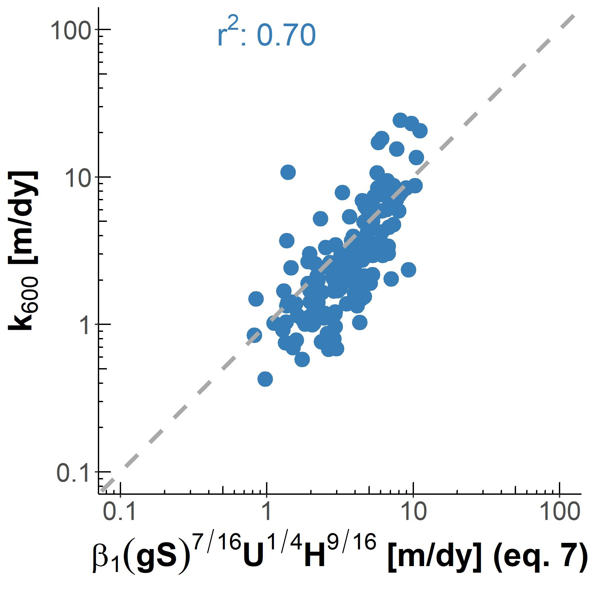
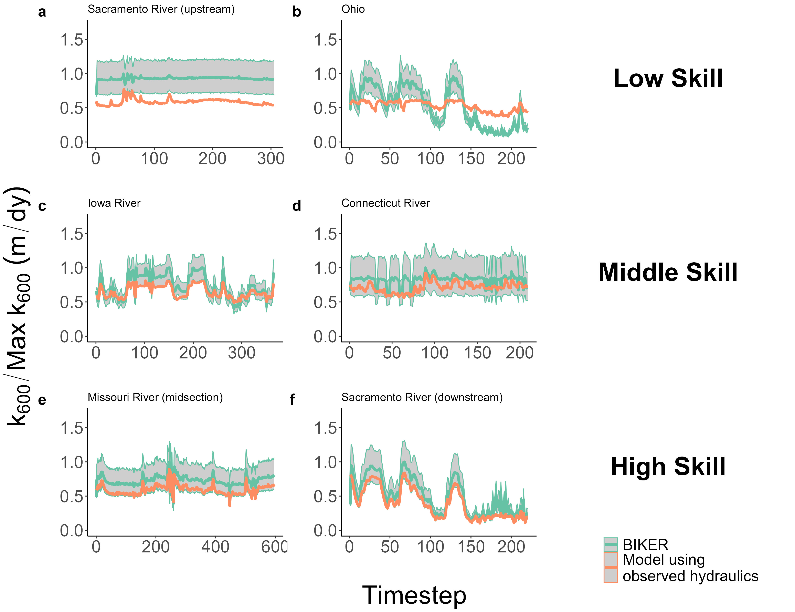

```{r setup, include=FALSE}
knitr::opts_chunk$set(echo = TRUE)
```

## Key Points

-   BIKER  (Bayesian Inference of the $K_{600}$ Evasion Rate) algorithm predicts gas exchange velocity from simulated SWOT data without calibration
-   BIKER is marginally influenced by expected SWOT measurement errors
-   BIKER and near-daily SWOT data will allow for the study of gas exchange spatiotemporal dynamics at novel temporal resolutions

## Keywords

gas exchange, fluvial geomorphology, remote sensing, open-channel flow, SWOT, biogeochemistry

## Abstract

Two decades of research has shown that the global river network emits significant amounts of greenhouse gas. Despite much progress, there is still large uncertainty in the temporal dynamics of gas exchange and thus carbon emissions to the atmosphere. Much of this uncertainty stems from a lack of existing tools for studying the spatiotemporal dynamics of gas exchange velocity $k_{600}$ (the rate of this diffusive transport). We propose that the NASA/CNES/UKSA/CSA Surface Water and Ocean Topography (SWOT) satellite can provide new insights to fluvial gas exchange modeling upon launch and subsequent data collection in 2022. Here, we exploit the distinct geomorphology of SWOT-observable rivers (> 50m wide) to develop a physical model of gas exchange that is remotely sensible and explains `r round(modelsWIDE[modelsWIDE$name == 'reynolds-eD',]$r2,2)*100`% of log-transformed variation across `r n` field measurements of $k_{600}$. We then couple this model with established inversion techniques to develop BIKER, the 'Bayesian Inference of the $k_{600}$ Exchange Rate' algorithm. We validate BIKER on `r nrow(results_k600_rivs[results_k600_rivs$errFlag == 0,])` SWOT-simulated rivers without an in-situ calibration, yielding an algorithm that predicts the $k_{600}$ timeseries solely from SWOT observations with a by-river median Kling-Gupta Efficiency of `r round(median(results_k600_rivs[results_k600_rivs$errFlag==0,]$KGE), 2)`. BIKER is better at inferring the temporal variation of gas exchange (median correlation coefficient of `r round(median(results_k600_rivs[results_k600_rivs$errFlag==0,]$r), 2)`), than reproducing the absolute rates of exchange (median normalized RMSE of `r round(median(results_k600_rivs[results_k600_rivs$errFlag==0,]$NRMSE), 2)*100`%). Finally, BIKER is robust to measurement errors implicit in the SWOT data. We suggest that BIKER will be useful in mapping global-scale fluvial gas exchange and improving $[CO_2]$ emissions estimates when coupled with river $[CO_2]$ models.

## 1 Introduction

Rivers play a critical role in the budgeting and accounting of the global carbon cycle under climate change. Following @colePlumbingGlobalCarbon2007, the global river network is recognized to emit substantial amounts of carbon to the atmosphere via evasion (gas exchange driven by diffusion and near-surface turbulence at the air/water interface), in addition to their long understood role in transporting carbon to the oceans via downstream advection. Current estimates of total carbon dioxide evasion ($[FCO_2]$) to the atmosphere from the global river network vary from 1800-2000 Tg C/yr [@liuImportanceHydrologyRouting2022; @raymondGlobalCarbonDioxide2013], with 650 Tg-C/yr and 167 Tg-C/yr coming from mid-to-large rivers [@lauerwaldSpatialPatternsCO22015] and mountain streams [@horgbyUnexpectedLargeEvasion2019], respectively. Despite rivers' small percentage of the global land surface [0.67%- @liuImportanceHydrologyRouting2022], this carbon flux is on par with the total oceanic $[CO_2]$ uptake rate [2600 Tg-C/yr- @gruberOceanicSinkAnthropogenic2019; @horgbyUnexpectedLargeEvasion2019] and the global forest carbon uptake rate [2400 Tg-C/yr- @panLargePersistentCarbon2011].

River $[CO_2]$ evasion is increasingly better constrained and is clearly a critical component of the global carbon cycle. Equation 1 represents this riverine flux given $\Delta [CO_2]$ ($[CO_{2_{water}}] - [CO_{2_{air}}]$) and the gas exchange velocity *k*. Consult Appendix A for notation used throughout this study.

$$[FCO_2]=k \Delta [CO_2] \mathbf{(1)}$$

There is a robust existing literature exploring spatiotemporal patterns in $\Delta [CO_2_{water}]$ [e.g. @ahoDistinctConcentrationdischargeDynamics2021; @ahoDifferentialResponseGreenhouse2019; @crawfordCO2TimeSeries2017; @peterScalesDriversTemporal2014; @ranDynamicsRiverineCO22017; @rocher-rosLandscapeProcessDomains2019; @raymondAtmosphericCO2Evasion2000; @liuHydrologicControlsPCO22018]. This work has lead to recent river-reach explicit modeling of $\Delta [CO_2]$ using global hydrography datasets at up to monthly temporal resolutions [@horgbyUnexpectedLargeEvasion2019; @brinkerhoffLakeMorphometryRiver2021; @saccardiImprovingPredictionsStream2021; @liuImportanceHydrologyRouting2022], but an equivalently sophisticated representation of $k_{CO_2}$ is still lacking.

The structure of Equation 1 necessitates that calculations of $[FCO_2]$ are highly sensitive to estimates of *k*. However, *k* can only be estimated via a known gas flux, eddy-covariance measurements, or tracer additions to the stream [@hallGasExchangeStreams2020]. In trying to constrain the global fluvial $[FCO_2]$ flux across millions of rivers, this calculation is impossible and necessitates the use of predictive models for *k* that are based on easily obtained river hydraulic properties. In that vein, over 20 empirical models exist to predict *k* from river hydraulics, generally using some combination of mean velocity $\bar{U}$, shear velocity $U_*$, width $W$, depth $H$, and slope $S$ as predictors [@hallGasExchangeStreams2020; @wangPhysicallyBasedScaling2021]. These models usually predict $k_{600}$, or *k* normalized by a Schmidt number (*Sc*) of 600 to remove the effect of water temperature and gas type from predictive models, as warmer waters and lower *Sc* numbers each increase gas exchange rates [@hallGasExchangeStreams2020]. Specifically, $k_{600}$ reflects the $k_{CO_{2}}$ at 20 degrees Celsius. Through this normalization, these models focus solely on physical explanations for variation in *k* [@hallGasExchangeStreams2020].

Applying these *k* models across watersheds, regions, or continents is called 'upscaling.' This upscaling allows for quantifying the difficult-to-estimate *k* term in Equation 1 for any arbitrary number of rivers, but also changes the base parameters that ultimately control the final estimate of $[FCO_2]$. That is, by making *k* a function of hydraulics, $[FCO_2_{upscaled}]$ is now a direct function of river hydraulics. This functional relationship is described in equation 2. It suggests that global $[FCO_2]$ estimates are not only at the mercy of the accuracy and spatiotemporal resolution of $\Delta [CO_2]$, but also the accuracy and resolution of our river hydraulics estimates.

$$[FCO_{2_{upscaled}}]=f(k_{CO_2}, \Delta [CO_2])=f(\bar{U}, H, S, W, \Delta [CO_2]) \mathbf{(2)}$$

Global upscaling has been performed using various techniques. @raymondGlobalCarbonDioxide2013, @lauerwaldSpatialPatternsCO22015, and @horgbyUnexpectedLargeEvasion2019 all relied on $k_{CO_2}$ values indirectly estimated using mean annual streamflow models and hydraulic scaling equations to predict the hydraulic terms used to in turn predict $k_{CO_2}$, while @borgesGloballySignificantGreenhousegas2015 used a combination of the above method and a constant $k_{CO_2}$ in space and time to upscale over Africa. More recently, @liuImportanceHydrologyRouting2022 performed a first upscaling assessment of monthly temporal dynamics in global river $[FCO_2]$, though they relied on monthly modeled streamflow and used the same model for $k_{600}$ as previous studies [@raymondGlobalCarbonDioxide2013]. In all of these foundational studies, the temporal dynamics of $k_{CO_2}$ (and thus dynamics in $[FCO_2]$) were ignored because of hydraulic data limitations. It has been shown at the field-scale that temporal dynamics of gas exchange can vary widely from site to site [@wallinSpatiotemporalVariabilityGas2011], but it has remained impractical to obtain temporally explicit $k_{CO_2}$ at continental-to-global scales.

@wangPhysicallyBasedScaling2021 recently attempted to address this global *k* problem by simulating the gas exchange velocity of dissolved oxygen ($k_{O_2}$) in 35 rivers of many sizes (widths ranging from 0.23-349m) using a stream metabolism inverse model [@applingOvercomingEquifinalityLeveraging2018] and in situ dissolved oxygen datasets to infer what $k_{O_2}$ must have been to produce their 'observations'. They then compared this simulated dataset against direct estimates of *k*, finding similar performance and parameter values for process-based models of gas evasion. However, they were still limited by a lack of direct hydraulic measurements and had to rely on hydraulic scaling equations to estimate river depth and velocity. Even though approaches like @wangPhysicallyBasedScaling2021's are incredibly useful for expanding our mechanistic understanding of gas exchange, they are less useful for global upscaling purposes as they rely on high fidelity in situ dissolved oxygen data for every river [@hallGasExchangeStreams2020].

We have established that literature has a reasonably good understanding of $\Delta [CO_2]$ and a relatively poorer understanding of $k_{600}$ (and therefore $k_{CO_2}$) across large areas and in time. In theory, the discrepancy between the quality of our $\Delta [CO_2_{water}]$ and $k_{CO_2}$ estimates could be alleviated if direct hydraulics measurements (and in turn $k_{CO_2}$ via Equation 2) were available at the global scale at a sufficient temporal resolution. Spatially and temporally dynamic hydraulic measurements in turn would also address the uncertainty regarding continental-to-global scale temporal dynamics of gas exchange noted earlier.

Conveniently, these hydraulic data will soon be available via the upcoming NASA/CNES/UKSA/CSA Surface Water and Ocean Topography (SWOT) satellite mission. SWOT is expected to launch in late 2022 and provide the world's first direct measurements of global water surface extent and elevation (and therefore water surface slope) at novel temporal resolutions. SWOT is a wide swath radar interferometer and will sample rivers every 1 to 7 days per 21 day repeat cycle, measuring rivers wider than 100m with a goal of expanding to rivers at least 50m wide [@biancamariaSWOTMissionIts2016]. Via its direct hydraulic measurements, SWOT is expected to usher in a sea change in global-scale hydrology, and could similarly influence fluvial biogeochemsitry if techniques are developed to ingest SWOT data and infer *k*. In this context, we borrow tools from fluvial geomorphology and existing SWOT algorithms to begin addressing the current knowledge gap in the spatiotemporal dynamics of gas exchange velocity. More specifically, we seek to answer the following two questions:

1)  What is the performance of a physically-based hydraulic model for $k_{600}$ unique to SWOT-observed rivers?

2)  How well can we exploit such a model to infer $k_{600}$ (and its uncertainty) solely from SWOT observations?

To answer the first question, we use hydraulic geometry- the fundamental geomorphic relationships between streamflow and channel shape [@leopoldHydraulicGeometryStream1953; @gleasonHydraulicGeometryNatural2015] to develop a process-based model for large-river $k_{600}$ (here defined as wider than 50m to align with SWOT). We then take these findings and explore the second question by implementing this hydraulic model, which defines $k_{600}$, within an algorithm named BIKER ('Bayesian Inference of the $k_{600}$ Evasion Rate') to infer $k_{600}$ solely from SWOT measurements. The goal of BIKER is to require no in situ inputs of any kind (although in situ data could be ingested and would improve results) such that it is globally implementable on any SWOT-observable river. We validate BIKER on `r nrow(results_k600_rivs[results_k600_rivs$errFlag == 0,])` SWOT-simulated rivers (as SWOT has not yet launched) and explore BIKER's robustness to the expected measurement errors implicit in the satellite's observations. Finally, we also couple BIKER's $k_{600}$ estimates with $\Delta [CO_2]$ to predict gas fluxes and compare these against established literature methods that rely on hydraulic scaling equations.

This paper is split into two distinct parts: gas-exchange theory/model development (Section 2) and BIKER algorithm development/validation (Section 3). Section 3 is fundamentally dependent on the results presented in Section 2, therefore Section 2 presents both theory and results. Both sections detail the data used. We conclude with a discussion (Section 4) that encompasses both gas exchange theory and remote sensing. Figure 1 conceptually maps out the algorithm's approach to inferring $k_{600}$ from SWOT data, while Figure S1 details the entire study's workflow.


## 2 Predicting $k_{600}$ from large-river hydraulic geometry

### 2.1 Data

We develop our hydraulic model for $k_{600}$ using multiple datasets of field-estimated $k_{600}$ and measured stream hydraulics collected from the literature. In total, we obtain 763 estimates of $k_{600}$, with 701 of these estimates previously gathered by @raymondScalingGasTransfer2012 and @ulsethDistinctAirWater2019. The remaining estimates come from @churchillPredictionStreamReaeration1964 and @owensReaerationStudiesStreams1964. See Table S1 for a complete list of the studies that collected these data. All $k_{600}$ estimates come from tracer studies and thus define $k_{600}$ at the reach scale.

The 763 estimates cover different times of year and hydrological events. They include both individual estimates and repeat estimates in over 500 river reaches across the United States, Wales, Switzerland, and Austria. They span a wide variety of environments from temperate higher-order rivers to small mountain streams and represent a full range of river flows (width ranges from 0.26m to 1,742m, discharge ranges from 8e-4 m3/s to 489 m3/s, and $k_{600}$ ranges from 0.1 m/dy to 4,118 m/dy). While there are still geographic and hydrologic biases in this dataset, it is to our knowledge the largest such dataset of field-estimated, reach-scale $k_{600}$ where hydraulic data is concurrently available.

In addition to hydraulics measured alongside $k_{600}$ and reported above, we expand our dataset of stream hydraulics using a previously published compilation of in situ hydraulic measurements [@brinkerhoffReconcilingAtaStationAtManyStations2019]. That dataset contains over 530,000 unique measurements of river channel velocity, width, and discharge from across the continental United States, originally made to calibrate United States Geological Survey (USGS) streamgauge rating curves and made public by the USGS. This dataset is used to calculate how frequently SWOT observable rivers meet our large-river hydraulic assumptions (Section 2.3).

### 2.2 Process-based hydraulic modeling of river *k*

*k* scales with near-surface turbulence in turbulent streamflows [@hallGasExchangeStreams2020], and extensive field and laboratory experiments have converged on the 'small-eddy model' for *k* as derived by @lamontEddyCellModel1970 and empirically anticipated by @calderbankContinuousPhaseHeat1961. This model scales *k* via the smallest-scale turbulent eddies and has been repeatedly empirically validated in freshwater systems [e.g. @katulStructureFunctionModel2018; @lorkeUnifiedScalingRelation2006a; @zappaEnvironmentalTurbulentMixing2007; @zappaVariationSurfaceTurbulence2003; @moogStreamReaerationNonuniform1999; @vachonRelationshipNearsurfaceTurbulence2010; @tokoroHighGastransferVelocity2008; @wangPhysicallyBasedScaling2021]. The small-eddy model is provided as Equation 3, where $\epsilon$ is the dissipation rate of near-surface turbulence, $v$ is the kinematic viscosity, and *Sc* is the Schmidt number.

$$k\propto Sc^{-1/2}(v\epsilon)^{1/4} \mathbf{(3)}$$

Some laboratory and field observations additionally suggest that open channel flows with small bed roughness do not exhibit homogeneous surface dissipation across the entire reach's air-water interface [@moogAirWaterGasTransfer1999; @talkeTurbulentKineticEnergy2013]. Given this observation, @moogAirWaterGasTransfer1999 proposed an extension to the small-eddy model, additionally scaling $k_{600}$ using a shear Reynold's number $Re_*$ formulation (equation 4, referred to as the 'Reynolds extension' model). The Reynolds extension model is hypothetically useful in low-turbulence scenarios where a relative lack of large-scale eddies effectively 'filter out' the number of small-eddies that actually reach the interface and initiate gas exchange [@talkeTurbulentKineticEnergy2013]. While scaling *k* via a shear Reynold's formulation is sometimes done to parameterize wave-breaking gas exchange models in the open ocean [e.g. @brumerWaveRelatedReynoldsNumber2017; @zhaoDependenceWhitecapCoverage2001; @zhaoEffectWindWaves2003], it is infrequently done in rivers. In the context of BIKER, we chose to test this model because large, SWOT-observable rivers are generally the smoothest, least-turbulent flows along the stream-to-ocean continuum where small eddies might not reach the surface. Further, to our knowledge, the Reynolds extension model has never been empirically tested in predicting river *k*, aside from confirming that large-scale eddies differentially move turbulence to the surface in a large river [@talkeTurbulentKineticEnergy2013].

$$k \propto Sc^{-1/2}(v\epsilon)^{1/4}(Re_*)^{3/8} \mathbf{(4)}$$

Equations 3 and 4 both rely on $\epsilon$, which is difficult to measure. When working at large scales, a commonly used $\epsilon$ model assumes that all turbulence is generated at the bed and transported to the air-water interface via the log-law-of-the-wall (Equation 5). Another approach specific to fluvial settings models *k* via 'form-drag dissipation' (Equation 6) which is equivalently the total stream power per unit mass water. This normalized stream power captures the bulk frictional resistance (and thus energy dissipation) via channel banks, meanders, bars, etc. that is unique to rivers [@moogStreamReaerationNonuniform1999]. Authors have since shown that Equation 6 can reasonably predict *k* in rivers and streams [@raymondScalingGasTransfer2012; @ulsethDistinctAirWater2019; @wangPhysicallyBasedScaling2021].

$$\epsilon = \epsilon_S = \frac{U_*^3}{H} \mathbf{(5)}$$ $$\epsilon = \epsilon_D = gS\bar{U} \mathbf{(6)}$$

### 2.3 Deriving a large-river $k_{600}$ model

Given the theoretical context provided in Section 2.2, we now turn to SWOT-observable rivers specifically. Rivers and streams change predictably along their longitudinal profile from source to sea, and we can exploit the hydraulic geometry of large rivers at the end of this continuum to estimate *k* in SWOT rivers. In general, as river size increases, channels become more rectangular, their shapes elongate (becoming wider quicker than they become deeper) and their hydraulic radii begin to approximate their mean flow depth, i.e. $R_h \approx H$ [@leopoldHydraulicGeometryStream1953], a common assumption in hydraulic and geomorphic modeling of large rivers. For example, SWOT-observable river flows have an average $\frac{R_h}{H}$ ratio of `r HG_swot$mean` and standard deviation of only `r HG_swot$sd` (n = `r HG_swot$n`; see Text S1 for how we built this dataset). We refer to these rivers as 'hydraulically-wide'.

We therefore assume that all SWOT-observable rivers are hydraulically-wide to derive a model for gas exchange. The overall goal is to reduce the equations down to their fundamental parameters, identifying which terms are SWOT observable and limiting the number of terms not directly measurable via SWOT. We first impose $\epsilon=\epsilon_D$ and $R_H=H$ on the Reynolds extension model (Equation 4) and then log-transform to maintain homogeneous variance across the orders of magnitude of $k_{600}$ to arrive at Equation 7 (with statistical coefficient $\beta_1$). Equation 7 thus defines gas exchange velocity solely as a function of slope, mean flow depth, and mean flow velocity and is theoretically valid only in a hydraulically-wide channel.

$$log(k_{600})=\beta_1 + \frac{7}{16}log(gS) + \frac{1}{4}log(\bar{U}) + \frac{9}{16}log(H) \mathbf{(7)}$$

We also test the performance of three other models for predicting *k* in hydraulically-wide channels via the other three unique combinations of Equations 3-4 and Equations 5-6. While the complete model derivations and results for all four models are provided in Text S2 and Figure S2, the final and best-performing model (Equation 7) is presented and used below.

### 2.4 Model validation

With Equation 7 derived, we now test its strength of fit in hydraulically-wide river flows. We validate on the dataset of in situ estimates of $k_{600}$, after filtering for those made in hydraulically-wide channels, which was defined as flows whose hydraulic radius was within 1% of their mean flow depth. All told, there are `r n` estimates of hydraulically-wide $k_{600}$. Equation 7 is assessed via a Bayesian linear regression model, where the theoretically-derived coefficients from equation 7 are used as reasonably informative priors for the regression coefficients. The intercept and model uncertainty both use uninformed priors. See Text S3 for the model specification. We assess the goodness-of-fit using the posterior mean coefficient of determination ($r^2$) following [@gelmanRsquaredBayesianRegression2019].



Equation 7 explains `r round(modelsWIDE[modelsWIDE$name == 'reynolds-eD',]$r2, 2) * 100`% of variation in observed (log-transformed) $k_{600}$ in hydraulically-wide rivers and accurately captures the scaling dynamics of observed $k_{600}$ as well (Figure 2). The posterior mean in natural log space for $\beta_1$ is `r round(log(10^(modelsWIDE[modelsWIDE$name == 'reynolds-eD',]$coef)),2)` (Table 1). While the individual residuals can be quite large (indicating that additional processes and/or field estimation error are presumably controlling the 50% unexplained variation in log-transformed $k_{600}$), the general scaling of $k_{600}$ with river hydraulics is strongly captured. We also tested two non-Bayes implementations of equation 7 using 1) the theoretically-derived coefficients and 2) a fully empirical line fitting approach (Table 1). Interestingly, the data exerted little-to-no influence on the theoretically-derived priors, and both the empirical and posterior coefficients were virtually identical to those obtained theoretically (Table 1), indicating that equation 7 is a good theoretical model for gas exchange in hydraulically wide flows.

*Table 1: Comparison of three regression models for $k_{600}$ model for hydraulically-wide rivers. ‘Theoretical’ refers to the model coefficients derived by imposing a hydraulically wide channel on the ‘Reynolds-extension’ model for gas exchange (section 2.3). ‘Empirical’ refers to the result of fitting the coefficients by least-squares regression. ‘Bayesian’ refers to the posterior means of the coefficients, conditional on priors informed by the ‘Theoretical’ coefficients (Text S3, Figure 2).*

| **Equation 7 results**          | **'Theoretical'**                                               | **'Empirical'**                                                 | **'Bayesian'**                                                  |
|---------------------------------|-----------------------------------------------------------------|-----------------------------------------------------------------|-----------------------------------------------------------------|
| $\alpha_1$                      |$\frac{7}{16} \approx 0.44$                                      |`r round(modelsSTATS[modelsSTATS$name == 'empirical',]$slope1,2)`|`r round(modelsWIDE[modelsWIDE$name == 'reynolds-eD',]$slope1,2)`|
| $\alpha_2$                      |$\frac{1}{4} \approx 0.25$                                       |`r round(modelsSTATS[modelsSTATS$name == 'empirical',]$slope2,2)`|`r round(modelsWIDE[modelsWIDE$name == 'reynolds-eD',]$slope2,2)`|
| $\alpha_3$                      |$\frac{9}{16} \approx 0.56$                                      |`r round(modelsSTATS[modelsSTATS$name == 'empirical',]$slope3,2)`|`r round(modelsWIDE[modelsWIDE$name == 'reynolds-eD',]$slope3,2)`|
| $\beta_1$ (natural log space)   |`r round(modelsSTATS[modelsSTATS$name == 'theoretical',]$coef,2)`|`r round(modelsSTATS[modelsSTATS$name == 'empirical',]$coef,2)`  |`r round(log(10^(modelsWIDE[modelsWIDE$name == 'reynolds-eD',]$coef)),2)`  |
| $r^2$                           |`r round(modelsSTATS[modelsSTATS$name == 'theoretical',]$r2,2)`  |`r round(modelsSTATS[modelsSTATS$name == 'empirical',]$r2,2)`    |`r round(modelsWIDE[modelsWIDE$name == 'reynolds-eD',]$r2,2)`    |

Compared to other combinations of Equations 3-6 (Figure S2), there is also a better fit using equation 7 thanks to the addition of the Reynold's number scaling for low-turbulent flows (as expected). The success of the final model in hydraulically-wide channels (provided as equation 8 using the posterior means) provides us with a physical-model for gas evasion built with SWOT in mind. The river hydraulics terms in Equation 8 ($\bar{U}$, $H$, and $S$) can either be directly measured or reasonably inferred from SWOT measurements, effectively opening the door for remotely sensing the gas exchange velocity.

$$log(k_{600})=3.89 + (0.43)log(gS) + (0.31)log(\bar{U}) + (0.52)log(H) \mathbf{(8)}$$

## 3 BIKER algorithm development and validation

### 3.1 Data

To validate BIKER, we cannot use actual SWOT measurements as SWOT has yet to launch. In the hydrology literature, it has become standard practice to benchmark SWOT-related algorithms on "SWOT-like" data [@durandIntercomparisonRemoteSensing2016; @frassonExploringFactorsControlling2021]. We use `r nrow(results_k600_rivs[results_k600_rivs$errFlag == 0,])` SWOT-simulated rivers for validation, where these simulated rivers are simply reach-averaged hydraulic model outputs where the water surface heights, slopes, and widths are labelled as RS observations and are used as the sole inputs to BIKER (Figure S1). These datasets are created using standard hydraulic models forced with known inflows and measured bathymetry to model the hydraulic response of the rivers, and then those terms visible to SWOT are extracted to produce hydraulically realistic synthetic observations. These data were published by @frassonExploringFactorsControlling2021 and @durandIntercomparisonRemoteSensing2016. See Figure S3 for a map of these river's locations along the global SWOT river network [@altenauSurfaceWaterOcean2021].

There is considerable geographic bias in our validation rivers, with rivers only present in North America, Western Europe, and Bangladesh. Further, no Arctic rivers are included. We acknowledge that this bias limits our ability to validate BIKER across many environments ahead of SWOT’s launch. However, it is a sufficient validation set for a first proof-of-concept study consistent with the hydrology literature for SWOT. Further, the data requirements to create these test cases are strict and the processing time is enormous.  Also note that SWOT water surface slope measurements will have a lower detection limit of 1.7 cm/km [@biancamariaSWOTMissionIts2016], and therefore any slope measurement in our data less than this threshold was reassigned this minimum value.

We validate BIKER under two different 'error scenarios' (section 3.2.2). While SWOT will provide river surface measurements of novel quality and resolution, as with all remote sensing products there are expected errors that will be implicit in these measurements. Here, we validate BIKER under a 'no-measurement-error' scenario that reflects an unrealistic measurement as if SWOT has perfect accuracy and precision: we use the hydraulic model of `r nrow(results_k600_rivs[results_k600_rivs$errFlag == 0,])` rivers directly as a first test of algorithm validity. `r nrow(results_k600_rivs[results_k600_rivs$errFlag == 1,])` of these rivers are then additionally validated under a 'measurement-error' scenario that more closely mimics expected SWOT by adding realistic radar errors and sampling along the satellite's future ground track. SWOT river error modeling was developed by @durandHowWillRadar2020 and then applied to these `r nrow(results_k600_rivs[results_k600_rivs$errFlag == 1,])` rivers by @frassonExploringFactorsControlling2021. This error modelling is non-trivial and computationally expensive, and so @frassonExploringFactorsControlling2021 were limited to only `r nrow(results_k600_rivs[results_k600_rivs$errFlag == 1,])` test cases with SWOT measurement errors. Likewise, we stick to these `r nrow(results_k600_rivs[results_k600_rivs$errFlag == 1,])` rivers for the same reason. These rivers are detailed in Figure S3. Given that it is only `r nrow(results_k600_rivs[results_k600_rivs$errFlag == 1,])` synthetic rivers, caution should be used in over generalizing our results beyond our proof of concept.

For $[CO_2]$ evasion and carbon emissions calculations, we use 26 bi-weekly dissolved $[CO_2]$ samples collected by @beaulieuControlsGasTransfer2012 at one location in the Ohio River (Figure S3) for one calender year from 2008-2009 (Figure S4). Note that this $[CO_2]$ data is for the Ohio River only but was applied to all rivers to provide a physically realistic signal for $[CO_2]$ fluxes with meaningful seasonality and dynamics. Therefore, the raw carbon emissions estimates presented in this paper are meaningless in the context of actually measured carbon emissions from these rivers but are better than specifying $[CO_2]$ concentrations devoid of context. These data are necessary as we are interested in the effect of BIKER $k_{600}$ errors on eventual fluxes and comparing these fluxes with published methods. Therefore, applying these 'unit' $[CO_2]$ values allows for such a comparison by providing a realistic timeseries.

### 3.2 Section 3 methods

#### 3.2.1 BIKER

To develop BIKER, we follow the work of @hagemannBAMBayesianAMHGManning2017, @brinkerhoffConstrainingRemoteRiver2020, and @durandEstimatingReachaveragedDischarge2014 to infer $k_{600}$, *H*, and $\bar{U}$ from SWOT observations. These Bayesian approaches to inverse modeling via SWOT data start from Bayes rule (Equation 9), where $\Theta$ is some set of non-remotely-sensible parameters we want to solve for (including $k_{600}$), *x* is the observed data, $f(x|\Theta)$ is the sampling model where data are conditional on the parameters, and $p(\Theta)$ is the joint prior distribution of the parameters. Therefore, we are interested in solving for $p(\Theta|x)$, or the 'posterior' distribution. Note that $p(x)$ is usually computationally intractable to integrate exactly, but Bayesian inference requires only the proportionality to be specified: $p(\Theta|x) \propto f(x|\Theta)p(\Theta)$. Sampling algorithms are then used to approximate the actual posterior distribution, as is done in BIKER.

$$p(\Theta|x) = \frac{f(x|\Theta)p(\Theta)}{p(x)} \mathbf{(9)}$$

The heart of BIKER is its reformulation of the $k_{600}$ model (Equation 8) as a Bayesian sampling model that is conditional on the non-remotely-sensed parameters (i.e. $f(x|\Theta)$). This approach is similar to the 'McFLI' (Mass-Conserved Flow Law Inversion) logic used in some SWOT remote sensing of discharge algorithms [@gleasonTrackingRiverFlows2017]. To start, we write $k_{600}$ as a function of SWOT-observables $W$ and $S$. This algebra is carried out using Equation 8 and Manning's equation for mean flow velocity ($\bar{U}=\frac{1}{n}R_h^{2/3}S^{1/2}$). Following Section 2.3, we continue to assume that the channel is hydraulically-wide ($R_h = H =\frac{A}{W}$). To leverage additional SWOT data, we use the "Durand transform" originally published by [@durandEstimatingReachaveragedDischarge2014]: the wetted channel area *A* is further split into the SWOT-unobservable portion $A_0$ and SWOT-observable portion $dA$ where $dA_{it} = \sum_{t':W_{t'}\le W_t}{W_{t'} \delta H_e_{t'}}$ for cross-section *i* and timestep *t* within a mass-conserved river reach.

All of the above algebra simplifies to Equation 10. Conveniently, $k_{600}$ as estimated by tracer additions to a stream is inherently a reach-scale quantity (in a mass-conserved reach). Therefore, Equations 7, 8, and 10 all yield a reach-scale $k_{600}$ (i.e. $k_{600_i}=k_{600}\forall i$), thus lowering the number of parameters BIKER must infer and making the problem much better constrained.

$$log(k_{600_t})=3.89+(0.4320)log(g)+(0.5862)log(S_{i,t})+(0.3084)log(\frac{1}{n_i})+(0.7282)log(\frac{A_{0_i}+dA_{i,t}}{W_{i,t}}) \mathbf{(10)}$$

Next, Equation 10 is re-written as a Bayesian sampling model $f(x|\Theta)$, in which the joint data distribution *x* (i.e. SWOT observations) is sampled from the joint parameter distribution ($\Theta$). We first rearrange equation 10 to isolate *x* from $\Theta$ (equation 11). Then, equation 12a-c re-expresses equation 11 as a normal distribution with standard deviation $\sigma_{k_600}$. The uncertainty expressed by $\sigma_{k_{600}}$ arises from uncertainties in 1) parameters in Equation 8, 2) Manning's equation, and 3) the hydraulically wide channel assumption.

$$3.89+(0.4320)log(g)+(0.5862)log(S_{i,t})-(0.7282)log(W_{i,t})=log(K_{600_t})+(0.3084)log(n_i)-(0.7282)log(A_{0_i}+dA_{i,t})\mathbf{(11)}$$

$$x=[3.89+(0.4320)log(g)+(0.5862)log(S_{i,t})-(0.7282)log(W_{i,t})]\mathbf{12a}$$
$$\Theta = [log(K_{600_t})+(0.3084)log(n_i)-(0.7282)log(A_{0_i}+dA_{i,t})]\mathbf{(12b)}$$
$$x ~ N(\Theta, \sigma_{k_600}^2)\mathbf{(12c)}$$

Equations 9 and 12 necessitate that we specify prior distributions for the parameters $A_0_i$, $k_{600_t}$, and $n_i$. Prior distributions formalize the a priori estimates and uncertainties for the non-remotely-sensed terms. More intuitively, BIKER priors represent our 'prior river knowledge' of what $A_0_i$, $k_{600_t}$, and $n_i$ probably are for some river since they cannot be directly remotely sensed. This method of hyperparameter assignment is analogous to the 'empirical Bayes approach' to Bayesian inference [@hoffFirstCourseBayesian2009]. Our goal in prior specification was to rely on absolutely no in situ information such that we could run this method on any river on Earth solely using SWOT observations. In theory, more informed priors via various a priori information about a specific river will improve BIKER performance, but here we chose to test the fully generalized algorithm. Therefore, the validation presented here is a 'worst-case scenario', wherein BIKER performance should improve with better prior information on the river. In that context, we used a variation of the prior specification method developed by @brinkerhoffConstrainingRemoteRiver2020, who developed 'geomorphic river types' with distinct prior sets for $A_0_i$ and $n_i$. These priors are assigned to a river solely using SWOT data *W* and *S*, therefore meeting our needs for complete global implementability. Prior assignment for $k_{600_t}$ was developed similarly (all prior specifications are elaborated on in Text S4).

With the sampling model described ($f(x|\Theta)$ = Equation 12a-c) and priors $p(\Theta)$ specified (Text S4), a joint posterior distribution conditional on the SWOT observations ($p(\Theta|x) \propto f(x|\Theta)p(\Theta)$) is therefore also specified. To approximate this distribution, we use a Markov Chain Monte Carlo (MCMC) algorithm implemented using the Stan probabilistic programming language. Specifically, Stan uses a Hamiltonian Monte Carlo sampler which reduces computation time relative to other sampling algorithms [@hagemannBAMBayesianAMHGManning2017].

#### 3.2.2 BIKER validation

BIKER provides a timeseries of $k_{600}$: for each SWOT observation, it yields a unique $k_{600}$. There are, to our knowledge, no datasets of $k_{600}$ over time approaching the temporal density of our simulated SWOT rivers. We therefore apply Equation 8 as validated in Figure 2 to specify $k_{600}$ given the true hydraulics of each case and compare BIKER's inversion to that value: given observed hydraulics, 'observed' $k_{600}$ comes from Equation 8. Remember that SWOT cannot observe below the water surface and therefore cannot measure $\bar{U}$ or *H* (hence the need for Equation 10), and that all SWOT observations contain errors in both space and time (hence Equation 12). We acknowledge that there is error in Equation 8 as shown in Figure 2, but this error can be explicitly parameterized in our Bayesian system (elaborated on in Text S5). Therefore, the BIKER validation presented here is an exercise to see how well the imperfect and partial SWOT observations can infer $k_{600}$ given the hydraulic assumptions in Equation 10 and uncertainty in the data itself. Note also that we have already validated Equation 7 in Figure 2 and Table 1.

We validate BIKER as a timeseries of $k_{600}$ for each river using the BIKER posterior means. Our error metrics consider the timeseries nature of the problem and are formally defined in Table S2. They consist of the correlation coefficient *r* to quantify accuracy of BIKER's temporal dynamics, the root mean square error normalized by the observed mean (NRMSE) and normalized mean absolute residual error (NMAE) to assess bias, and the Kling-Gupta Efficiency (KGE). KGE is frequently used to assess streamflow prediction and simultaneously assesses accuracy in both bias and dynamics. While a value greater than -0.41 means the model outperforms a uniform prediction of the mean [@knobenTechnicalNoteInherent2019], generally KGE scores are interpreted as being meaningful in ungauged settings if \> 0.

#### 3.2.3 Carbon emissions validation

It is one thing to accurately model the temporal dynamics of $k_{600}$ as above, but researchers are often most interested in the actual carbon emitted from river to atmosphere. Per Equation 2, emissions upscaling is done using river hydraulic models to estimate $k_{CO_2}$ and in turn $[FCO_{2_{upscaled}}]$. However, streamflow data and/or model outputs are more readily modeled at the global scale than river channel geometry, and so upscaling models usually predict $\bar{U}$ and *H* as functions of streamflow (*Q*) using hydraulic geometry scaling relationships. This workflow effectively reduces Equation 2 to Equation 13. It is worth stressing that these literature upscaling workflows rely on in situ streamflow records and/or high-quality streamflow models.

$$[FCO_{2_{upscaled}}]=f(k_{CO_2}, \Delta [CO_2])=f(Q, \Delta [CO_2]) \mathbf{(13)}$$

Conversely, BIKER represents a new way of approaching Equation 13 compared to existing literature models: BIKER has no reliance on a streamflow model nor hydraulic geometry scaling relationships and only requires that a river is SWOT-observable. We are therefore interested in how the final carbon emissions that result from BIKER compare against literature methods that use Equation 13. We have the data to test four different models for fluxes: 'BIKER', 'Raymond 2013', 'Raymond 2012', and 'Brinkerhoff 2019'. These latter three approaches all use the same philosophy for $k_{600}$: making hydraulic and geomorphic assumptions to associate $k_{600}$ with observed hydraulics before using the $[CO_2]$ data as a realistic timeseries to yield fluxes per Equation 13. In all three approaches, these observed hydraulics are streamflow, while BIKER uses only SWOT observations. Therefore, the advantage of BIKER is in its ease of application, as SWOT will observe all global rivers wider than 50m while streamflow observations are extremely geographically limited. But, BIKER is only attractive if it can produce fluxes with similar errors to published methods. Text S6 and Table S3 fully describe these three literature models.

To benchmark BIKER against these literature methods, we pair the 26 biweekly $[CO_2]$ and water temperature samples from @beaulieuControlsGasTransfer2012 (Section 3.1, Figure S4) with every 14th set of daily SWOT observations (as the $[CO_2]$ data is bi-weekly). We then calculate $[FCO_2]$ using Equation 1, an atmospheric $[CO_{2_{air}}]$ of 400 $\mu$atm, and a *Sc* estimated following Raymond et al. (2012). The *k* in Equation 1 is obtained using BIKER or the three literature models (Table S3 and Text S6). Finally, we estimate a pseudo yearly total carbon emission rate (via $[CO_2]$ evasion) by applying each river's mean $[FCO_2]$ over the river's surface area and summing all rates across rivers, remembering that we are applying 'unit' $[CO_2]$ data to all rivers.

### 3.3 Section 3 results

#### 3.3.1 BIKER

In general, the temporal dynamics of $k_{600}$ are reproduced quite well by BIKER (Figure 3). In the best performing rivers, both bias and temporal dynamics are strongly captured (Figure 3e-f). Notably, there is sometimes positive bias in the estimates (e.g. the Connecticut and Iowa rivers, Figure 3c-d). Some rivers yield the correct temporal dynamics, but the magnitude of these values is stretched relative to the observed (e.g. Ohio River and Seine River, Figure 3a-b). In these two examples, temporal trends are still reasonably inferred even though the magnitude of the estimates is quite wrong. The size of posterior uncertainty in $k_{600}$ does not appear to be associated with overall algorithm performance, with both certain and uncertain results spread across the rivers, regardless of their KGE (Figure 3, Figure S5).

![Figure 3. Representative (6 out of 47) river timeseries plots of $k_{600}$. Orange is observed, while green is BIKER posterior means and uses SWOT measurements as its sole input. The green ribbon indicates the 95% credible intervals for the BIKER posteriors. Rivers are sampled from the three tertiles of KGE scores. (a-b) are poorest performing rivers, (c-d) are in the middle, and (e-f) are the best performing rivers. Y axis is normalized by maximum observed values to compare visually. Consult Figure S5 for all 47 timeseries plots (assuming no measurement error) and Figure S6 for the 16 rivers with measurement errors.](cache/validation/fig3.jpg)

Overall, river performance across error metrics (Table S2) is reasonable given the strict validation setup we have employed (Figure 4). Median river $KGE$ is `r round(median(results_k600_rivs[results_k600_rivs$errFlag == 0,]$KGE, na.rm=T),2)` and median river *r* is `r round(median(results_k600_rivs[results_k600_rivs$errFlag == 0,]$r, na.rm=T),2)` (Figure 4). Further, `r sum(results_k600_rivs[results_k600_rivs$errFlag==0,]$KGE > -0.41)`/`r nrow(results_k600_rivs[results_k600_rivs$errFlag==0,])` rivers outperform a uniform prediction of the mean (KGE = -0.41). The correlation coefficient *r* out-performs the other metrics which assess bias (Figure 4). This result indicates strong inference of each river's temporal $k_{600}$ dynamics given that absolutely no in situ information is being used to predict $k_{600}$. NRMSE has a median score of `r round(median(results_k600_rivs[results_k600_rivs$errFlag == 0,]$NRMSE, na.rm=T),2)` (Figure 4), highlighting many rivers which have notable positive biases (Figure 3 also confirms this result visually). Median NMAE is `r round(median(results_k600_rivs[results_k600_rivs$errFlag == 0,]$NMAE, na.rm=T),2)*100`% (Figure 4). Taken in aggregate, Figures 3-4 indicate that BIKER is quite good at capturing temporal dynamics in $k_600$, however there is often positive bias in its estimates.



BIKER is robust to the measurement errors that will be implicit in SWOT's observations of river width and slope (Figure 5). BIKER performs nearly identically across all four error metrics, particularity with respect to the metrics that singularly assess bias or correlation errors (Figure 5b-d). The three very poor *KGE* rivers actually improve under the error scenario (Figure 5a), though this is likely an artifact of BIKER already not working in these rivers. Given these results, we deem that SWOT measurement error does not exert a significant influence on BIKER performance and so the results presented for the rest of the manuscript assume no measurement error in order to use all `r nrow(results_k600_rivs[results_k600_rivs$errFlag == 0,])` rivers.


Finally, errors/biases associated with the prior $k_{600}$ are correctly propagated through the posterior in an approximately 1:1 manner (which is expected), except for a subset of rivers in which posterior error actually increases relative to the prior (Figure 6a). We explore why this phenomenon happens below.


Recall that BIKER relies on a timeseries of SWOT data, and that these timeseries may not be representative of the full spectrum of $k_{600}$ values that are actually experienced in the river, therefore potentially biasing both the prior estimation methods (Text S4) and the actual Bayesian inference. Put another way, we suggest that if a SWOT timeseries does not sufficiently capture a river's temporal dynamics, it will introduce additional error to the inference results. To test this hypothesis, we subset our validation dataset by progressively higher coefficients of variation (*CV*) (> 10%, >20%, and >30%). Posterior bias drops once the temporal variability of the SWOT data is sufficiently high (Figure 6b-d), with BIKER posterior error the smallest, and much less than prior error, in Figure 6d. This result is elaborated on in Section 4.2.

#### 3.3.2 Carbon Emissions

Finally, we carry these $k_{600}$ estimates all the way to annual carbon emissions rates and compare BIKER against three established in situ techniques in the literature. It is important to remember that only BIKER is completely globally implementable, while the other three models necessarily rely on having a streamflow record or high-quality routed streamflow readily available. Therefore, the in situ methods reflect their 'best-case scenarios' while BIKER reflects its worst case scenario, where priors are set entirely from SWOT observations and are generally the least informative they will ever be. This validation setup means that BIKER's annual carbon emission estimate can only improve from what is presented here. We also stress again that the raw emissions rates here are meaningless as they are calculated from an identical $[CO_{2_{water}}]$ timeseries applied to every river. We are principally interested in relative differences between techniques employed.

Figure 7 compares the annual carbon emissions rate (via $[F_{CO_2}]$) from the rivers using BIKER posterior means and the three stream gauge-based HG models. BIKER outperforms the gauge-based approaches, nearly correctly inferring the annual carbon emissions rate (`r round(results_fco2_bulk[results_fco2_bulk$key == 'FCO2_BIKER',]$yearlyCFux, 2)` Tg-C/yr for BIKER versus `r round(results_fco2_bulk[results_fco2_bulk$key == 'FCO2_obs',]$yearlyCFux, 2)` Tg-C/yr observed). The three HG models overestimate this emissions rate: `r round(results_fco2_bulk[results_fco2_bulk$key == 'FCO2_raymond2013',]$yearlyCFux, 2)` Tg-C/yr, `r round(results_fco2_bulk[results_fco2_bulk$key == 'FCO2_raymond2012',]$yearlyCFux, 2)` Tg-C/yr, and `r round(results_fco2_bulk[results_fco2_bulk$key == 'FCO2_brinkerhoff2019',]$yearlyCFux, 2)` Tg-C/yr for 'Raymond 2013', 'Raymond 2012', and 'Brinkerhoff 2019' respectively. 'Raymond 2012' falls within the BIKER credible intervals and is reasonably close to the observed value, while 'Raymond 2013' overestimates the emission rate. 'Brinkerhoff 2019''s lower confidence interval is comparable to BIKER's higher credible interval. BIKER's relatively stronger performance than the in situ models is elaborated on in Section 4.3. Finally, BIKER's uncertainty is on par with the in situ technique (‘Brinkerhoff 2019’), despite being obtained solely from SWOT data. Taken in aggregate, BIKER provides a strong upscaling estimate of the annual carbon emission rate for the rivers and is either similar or better than established in situ techniques (Figure 7).

![Figure 7: Yearly carbon emissions rate via $[CO_2]$ evasion across all rivers. Completely remotely-sensed methods are colored in red (with 95% credible intervals), in situ methods in purple (with 95% confidence intervals when available), and the observed in orange. Consult section 3.2.3 for details on the 'observed' flux.](cache/FCO2/fig7.jpg)

## 4 Discussion

In this paper, we propose that the soon-to-launch SWOT satellite will provide enough hydraulic measurements to analyze the temporal dynamics of $k_{600}$, and therefore allow for a global-scale analysis of spatiotemporal trends in large-river $k_{600}$ once SWOT launches. In preparation for SWOT’s launch, we developed 1) a wide-river-specific hydraulic model for $k_{600}$ that explains `r round(modelsWIDE[modelsWIDE$name == 'reynolds-eD',]$r2,2)*100`% of variation in $k_{600}$ and 2) the BIKER algorithm to infer $k_{600}$ using no on-the-ground information. Validating on `r nrow(results_k600_rivs[results_k600_rivs$errFlag == 0,])` SWOT-simulated rivers, we show strong recovery of rivers’ temporal $k_{600}$ dynamics and a hypothetical total annual carbon emission rate across all `r nrow(results_k600_rivs[results_k600_rivs$errFlag == 0,])` rivers (section 3.3).

### 4.1 Gas exchange in hydraulically-wide rivers

Field studies of gas exchange in wide rivers have suggested that $k_{600}$ behaves differently in these rivers than in steeper and smaller rivers [@ulsethDistinctAirWater2019; @beaulieuControlsGasTransfer2012; @alinPhysicalControlsCarbon2011; @wangPhysicallyBasedScaling2021; @raymondGasExchangeRivers2001]. While much work has focused on the small-stream side of the stream-to-river continuum, comparatively less work has been done in large rivers. Here, we focus on the larger, 'smooth-channel' end of the continuum, using a model for gas exchange that scales $k_{600}$ by both $\epsilon_D$ and a shear Reynold's number. Scaling $k_{600}$ via a shear Reynold's number is often done to parameterize breaking-wave gas exchange models in the open ocean [@brumerWaveRelatedReynoldsNumber2017; @zhaoDependenceWhitecapCoverage2001; @zhaoEffectWindWaves2003], though these models are specific to high wind speeds in open ocean. To our knowledge, @moogAirWaterGasTransfer1999's specific setup, which imposes a space-and-time varying, fractional area surface turbulence theory on the small-eddy model, has not been empirically validated in rivers until now (Figure 2 for hydraulically wide channels). Using our full dataset of $k_{600}$, we also observe that this model breaks down when including non-hydraulically-wide rivers (as the theory would suggest). Future tests should also explore other shear Reynold's scaling relations for gas exchange in rivers.

Crucially, we are not accounting for wind-driven gas exchange, which is suggested to play an important role in wide rivers because river surface area is sufficiently large that sheltering no longer limits the influence of wind-derived turbulence [@beaulieuControlsGasTransfer2012; @wangPhysicallyBasedScaling2021; @raymondGasExchangeRivers2001]. None of the existing hydraulics-driven fluvial $k_{600}$ models account for wind-driven gas exchange either. Additionally, under higher-wind scenarios the turbulent regime will switch from hydraulically-driven to wind-driven turbulence [@zappaEnvironmentalTurbulentMixing2007] and the assumptions under-pinning BIKER will likely break down. BIKER's outputs can therefore be interpreted as the '$k_{600}$ under low-wind conditions' when surface turbulence is dominated by hydraulics rather than wind. That said, BIKER's flexible implementation is a good start towards eventually coupling hydraulics-driven gas exchange with wind-driven gas exchange under moderate-to-high wind scenarios.

### 4.2 Towards remote sensing of global spatiotemporal dynamics of $k_{600}$ in large rivers

To date, the studies exploring the spatiotemporal dynamics of riverine gas exchange have arguably been held back by a lack of data. A few studies have investigated these dynamics, but they have been limited to individual rivers and/or limited field seasons [@hallAirWaterOxygen2012; @sand-jensenCO2DynamicsDanish2012]. For example, @wallinSpatiotemporalVariabilityGas2011 performed a preliminary analysis in northern Sweden relating cross-section specific temporal variability in gas exchange with channel slope, but they were limited to a mean of only 8 measurements per river in a single watershed. While these studies are a good start, they are insufficient for further developing process-level understandings of gas exchange at the global-scale.

Therefore, inferring $k_{600}$ from SWOT data is an attractive option to address this problem of limited data. For reference, 95% of the SWOT-visible rivers globally (202,811) will have sufficient SWOT observations along the river to run BIKER at least once every 21 days, with most of the temperate and Arctic rivers having 3+ observations per 21-day cycle [@altenauSurfaceWaterOcean2021]. While BIKER will not directly measure $k_{600}$, it does robustly infer temporal trends in $k_{600}$ and reasonably infers the absolute magnitude of $k_{600}$ (Figures 4-6). This many data will provide a novel dataset of $k_{600}$ on a scale never before possible.

However, SWOT’s relatively coarse spatial resolution limits BIKER’s use to large rivers. This limitation means SWOT cannot see the vast majority of the global river network (which are too narrow for SWOT), though it is likely to observe much of its air/water interface at which gas exchange occurs (rivers wide enough for SWOT to observe). To confirm this hypothesis, we obtained the global estimates for SWOT-observable surface area and length [at mean annual streamflow- @altenauSurfaceWaterOcean2021] and compared them to the most recent estimates of global river surface area and length [@liuImportanceHydrologyRouting2022- Table S4]. We found that `r round(global_swot_coverage[global_swot_coverage$model == 'swot',]$sa_km2 / global_swot_coverage[global_swot_coverage$model == 'total',]$sa_km2 * 100,0)`% of the global riverine surface area is SWOT-observable, while only `r round(global_swot_coverage[global_swot_coverage$model == 'swot',]$length_km / global_swot_coverage[global_swot_coverage$model == 'total',]$length_km * 100,2)`% of the network length is SWOT-observable. While small streams in aggregate exert a significant influence on GHG emissions from river networks [@liuImportanceHydrologyRouting2022]; @raymondGlobalCarbonDioxide2013], BIKER will still be capable of inferring k600 for much of the global freshwater air/water interface.

With that said, there is a substantial range of BIKER performance across rivers (Figures 3, 4, S4, S5). These differences in performance are likely due to the representativeness of the priors, which makes sense as Section 2.3 and section 3.2.1 have effectively reduced $k_{600}$ to a function of hydraulics that are nearly all directly measurable by SWOT. Any resulting bias in BIKER's predictions is likely attributable to either bias in the priors used for the non-remotely sensed terms (Equation 12b) or in the $k_{600}$ model itself (Equation 8, including the aforementioned wind errors). For SWOT discharge algorithms, authors have repeatedly shown that the 'quality' of prior river knowledge plays a large role in the success of discharge inversions [@frassonExploringFactorsControlling2021; @andreadisConstrainingAssimilationSWOT2020; @brinkerhoffConstrainingRemoteRiver2020; @tuozzoloEstimatingRiverDischarge2019] and our results here further corroborate this finding.

Furthermore, there is likely a minimum sufficient variability in SWOT observations that is necessary to strongly infer a $k_{600}$ timeseries (Figure 6). 'Hydraulic visibility', i.e. the ability of a remote sensor to identify a hydrological response in the river [@garamboisHydraulicVisibilityUsing2017] is applicable here. If we apply hydraulic visibility to a sensor's ability to identify temporal variations in $k_{600}$, our results suggest a 'minimally sufficient' hydraulic variability in SWOT measurements is needed to improve upon the prior (in Figure 6b, suggested to be approximately >20% *CV* for this sample of rivers). This finding will be important once SWOT launches and BIKER is implemented at the global-scale. Although it is presently impossible to know whether SWOT will achieve ‘sufficient hydraulic visibility’ over its lifetime, recent similar work using the Landsat archive suggests that most rivers’ full flow regime will be observed by the SWOT satellite: @allenTimingLandsatOverpasses2020 found that the Landsat record observed 97% of streamflow percentiles in 90% of United States streamgauges. Landsat has an average temporal resolution of 16 days, which is approximately similar to the repeat cycle for SWOT. Further, SWOT will penetrate clouds and provide even more data on cloudy days (unlike Landsat's optical sensor). With that said, the nominal lifespan of SWOT is only three years, within which certain streamflow magnitudes may not be experienced and reduce the chance that ‘sufficient hydraulic visibility’ is achieved.

Finally, because of its reliance on Manning’s equation and hydraulic geometry (section 3.2.1.), BIKER cannot invert overbank flow events, similar to many SWOT discharge algorithms. This concept is an important distinction that must be accounted for when BIKER is run on actual SWOT data, though future work should also look to couple floodplain flow laws with BIKER to capture gas exchange in seasonally-inundated floodplains.

### 4.3 Coupling BIKER with upscaling workflows

BIKER will likely be useful for informing annual upscaled carbon emissions estimates from river networks when coupled with $[CO_2]$ data (Figure 7). This encouraging result has two main implications for future work.

First, it implies that BIKER will be useful when coupled with large-scale $[CO_{2_{water}}]$ models, provided these models are accurate. The models would give time and space varying gas exchange. @liuImportanceHydrologyRouting2022 and @saccardiImprovingPredictionsStream2021 each propose models that robustly predict reach-scale dissolved $[CO_2]$ concentrations using two different approaches- machine learning for @liuImportanceHydrologyRouting2022 and process-based reactive transport modeling for @saccardiImprovingPredictionsStream2021- but both models yield $[CO_2]$ estimates that would be spatially and temporally consistent with BIKER's output. Our promising results suggest that BIKER could provide additional (and directly inferred) measurements of $k_{CO_2}$ to these models, thereby better informing model results through direct observations. This modeling would likely be accomplished via data assimilation which has proven useful in using remotely-sensed discharge to improve streamflow routing models [@fengRecentChangesArctic2021; @ishitsukaCombiningOpticalRemote2020], and of which the @saccardiImprovingPredictionsStream2021 $[CO_2]$ model takes a similar form.

Second, our experiments allow us to directly compare the influence of geomorphic assumptions on total carbon emission rates from river networks (Figure 7), as all other calculations and parameters were held constant across our four tested models (Text S6). Therefore, we highlight a potentially large source of uncertainty in current river $[CO_2]$ upscaling estimates: the geomorphic models employed to scale river channel hydraulics with streamflow (Figure 7). In this case, the only difference between the three literature models and the observed estimate is the specific HG model employed to predict river depth and velocity (Text S6, Table S3), and yet the eventual carbon emissions estimates are quite different (Figure 7). Further, recall that the BIKER results in Figure 7 reflect a worst-case scenario (relatively uniformed priors), while the three in-situ methods represent best case scenarios (perfect streamflow records). We suggest future work should perform a formal sensitivity analysis for these HG parameters.

## 5 Conclusions

This proof-of-concept study verifies that BIKER can provide meaningful information on the spatiotemporal dynamics of gas exchange solely from SWOT data and functionally opens the door for a global-scale analysis of riverine gas exchange upon SWOT’s launch (and data collection). Although BIKER results are often biased in magnitude, they strongly capture the temporal dynamics of gas exchange velocity and will provide an unprecedented amount of new information on global riverine gas exchange that should be essential for better constraining existing river $[CO_2]$ models.

## 6 Acknowledgements
C.B. Brinkerhoff was funded by a NASA Future Investigators in Earth and Space Science Fellowship (80NSSC21K1591). C.J. Gleason was supported by a NASA SWOT Science Team grant (80NSSC20K1141). We thank Renato Frasson, Michael Durand, Amber Ulseth, and Jake Beaulieu for generously making their data available for this study. We also thank the entire SWOT discharge algorithm working group for their decade-plus body of work which inspired this study.

## 7 Data availability statement
Datasets required for this research are available from @ulsethDistinctAirWater2019 (<https://doi.org/10.1038/s41561-019-0324-8>), @brinkerhoffReconcilingAtaStationAtManyStations2019 (<https://doi.org/10.1029/2019GL084529>), @frassonExploringFactorsControlling2021 (<https://zenodo.org/record/3817817>), @churchillPredictionStreamReaeration1964 (<https://pubs.usgs.gov/pp/0737/report.pdf>), @owensReaerationStudiesStreams1964 (<https://pubs.usgs.gov/pp/0737/report.pdf>), @beaulieuControlsGasTransfer2012 (<https://doi.org/10.1029/2011JG001794>), and @durandIntercomparisonRemoteSensing2016 (<https://doi.org/10.1002/2015WR018434>). All code to generate results and figures is archived at <https://zenodo.org/record/6914119>.

## 8 Software availability statement
The BIKER algorithm remains in active development and is available at <https://github.com/craigbrinkerhoff/BIKER>. The specific version of BIKER used in this study is archived at <https://zenodo.org/record/6914064>.

## 9 Appendix A

*Table A1: Variable description and notation for this study. Unit quantities are as follows: M for mass, L for length, T for time, P for pressure, and E for energy.*

| **Notation**           | **Description**                                                                 | **Calculation (if necessary)**                              | **Units**                    |
|------------------------|---------------------------------------------------------------------------------|-------------------------------------------------------------|------------------------------|
| $A$                    | Channel cross-sectional area                                                    |                                                             | $[L^2]$                      |
| $A_0$                  | Non-SWOT-observable cross-sectional area                                        |                                                             | $[L^2]$                      |
| $A_p$                  | Active zone fraction (Moog & Jirka 1999)                                        |$A_p \propto Re_*^{1/2}$(Moog & Jirka 1999)                  | $dimensionless$              |
| $[CO_2]$               | Carbon dioxide concentration                                                    |                                                             | $[\frac{M}{L^3}]$            |
| $[CO_{2_{water}}]$     | Water-side $[CO_2]$ concentration                                               |                                                             | $[\frac{M}{L^3}]$            |
| $[CO_{2_{air}}]$       | Atmospheric-side $[CO_2]$ concentration                                         |                                                             | $[\frac{M}{L^3}]$            |
| $dA$                   | change in cross-sectional area                                                  | $\sum_{t':W_{t'}\le W_t}{W_{t'} \delta H_e_{t'}}$           | $[L^2]$                      |
| $D_m$                  | Molecular diffusion coefficient                                                 |                                                             | $[\frac{L^2}{T}]$            |
| $\epsilon$             | Dissipation rate of near-surface turbulence                                     |                                                             | $[\frac{E}{M*T}]$            |
| $\epsilon_S$           | log-law-of-the-wall model for $\epsilon$                                        | $\frac{U_*^3}{H}$                                           | $[\frac{E}{M*T}]$            |
| $\epsilon_D$           | Form-drag model for $\epsilon$                                                  | $gS\bar{U}$                                                 | $[\frac{E}{M*T}]$            |
| $[FCO_2]$              | $[CO_2]$ evasion flux from river to atmosphere                                  |                                                             | $[\frac{M}{L^2T}]$           |
| $[FCO_{2_{upscaled}}]$ | Upscaling estimate of the global $[CO_2]$ evasion flux from river to atmosphere |                                                             | $[\frac{M}{L^2T}]$           |
| $g$                    | gravitational acceleration                                                      | 9.8                                                         | $[\frac{L}{T^2}]$            |
| $H$                    | Mean flow depth                                                                 | $\frac{A}{W}$                                               | $[L]$                        |
| $H_e$                  | Water surface elevation                                                         |                                                             | $[L]$                        |
| $i$                    | Cross-section discretization within a mass-conserved river reach                |                                                             |                              |
| $k_z$                  | gas exchange velocity for gas *z*                                               |                                                             | $[\frac{L}{T}]$              |
| $k_{600}$              | gas exchange velocity normalized to $Sc=600$                                    | $(\frac{600}{Sc})^{-0.5}k$                                  | $[\frac{L}{T}]$              |
| $n$                    | Manning's roughness coefficient                                                 | $\frac{R_h^{2/3}S^{1/2}}{\bar{U}}$                          | $[\frac{T}{L^3}]$            |
| $\uprho$               | Density of water                                                                |                                                             | $[\frac{M}{L^{1/3}}]$        |
| $Q$                    | River discharge                                                                 | $WH\bar{U}$                                                 | $\frac{L^3}{T}$              |
| $R_h$                  | Hydraulic radius                                                                | $\frac{AW}{2H+W}$                                           | $[L]$                        |
| $Re_*$                 | Shear Reynold's number                                                          | $\frac{U_*H}{v}$                                            | $dimensionless$              |
| $S$                    | River slope                                                                     |                                                             | $dimensionless$              |
| $Sc$                   | Schmidt number                                                                  | $\frac{v}{D_m}$                                             |                              |
| $t$                    | timestep discretization within river reach                                      |                                                             |                              |
| $\Theta$               | Bayesian parameter set                                                          |                                                             |                              |
| $\bar{U}$              | Cross-sectional average velocity                                                | $\frac{Q}{A}$                                               | $[\frac{L}{T}]$              |
| $U_*$                  | Shear velocity                                                                  | $\sqrt{gSR_h}$                                              | $[\frac{L}{T}]$              |
| $\mu$                  | Viscosity                                                                       |                                                             | $[P*T]$                      |
| $v$                    | kinematic viscosity                                                             | $\frac{\mu}{\uprho}$                                        | $[\frac{L^2}{T}]$            |
| $W$                    | Flow width                                                                      |                                                             | $[L]$                        |
| $x$                    | Bayesian data set                                                               |                                                             |                              |

*Table A2: Bayesian parameter and hyperparameter notation for this study.*

| **Notation**       | **Description**                                                                                       |
|--------------------|-------------------------------------------------------------------------------------------------------|
| *x*                | Joint data distribution for BIKER                                                                     |
| $\Theta$           | Joint parameter distribution for BIKER                                                                |
| $\Theta_\mu$       | Mean hyperparameter for BIKER prior distributions                                                     |
| $\Theta_\sigma$    | Standard deviation hyperparameter for BIKER prior distributions                                       |
| $\Theta_\gamma$    | Upper bound hyperparameter for BIKER prior distributions                                              |
| $\Theta_\lambda$   | Lower bound hyperparameter for BIKER prior distributions                                              |
| $\sigma_{k_{600}}$ | 'Uncertainty' hyperparameter for BIKER likelihood distribution                                        |
| $\alpha_n$         | Coefficient parameter distributions for k600 scaling relations, where n = independent variable number |
| $\beta_1$          | Intercept parameter distribution for k600 scaling relations                                           |
| $\sigma_{LM}$      | Uncertainty parameter distribution for k600 scaling relations                                         |

## References
