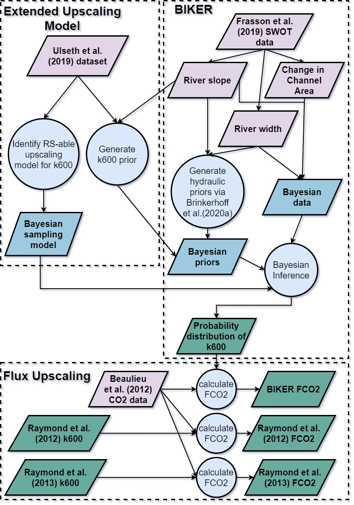
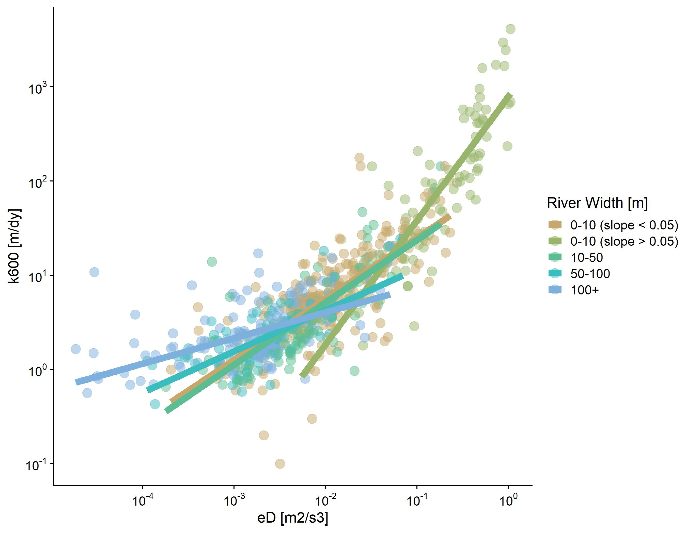
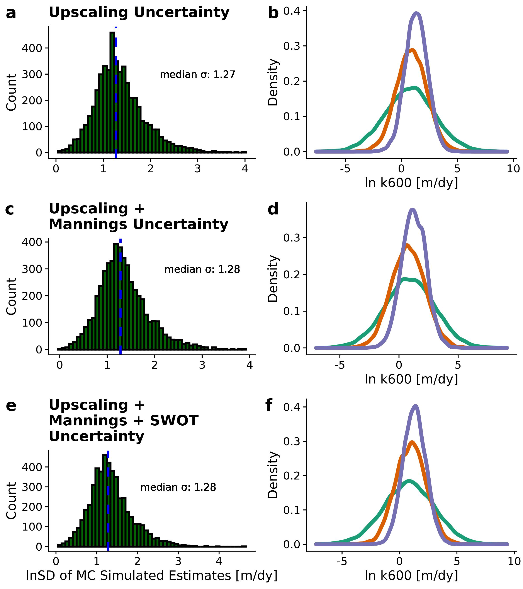

```{r setup, include=FALSE}
knitr::opts_chunk$set(echo = TRUE)
```

##Key Points (85 characters each)
- We introduce the BIKER algorithm to remotely sense riverine gas exchange using the SWOT satellite
- BIKER reproduces estimates of $CO_2$ fluxes when coupled with in situ gas concentration data
- Expected SWOT measurement errors exert a marginal influence on BIKER's estimates
- BIKER's accuracy is limited by process-level uncertainties and not by its algorithmic setup

##Abstract
Go BIKER!!
max 400 words
x
x
x
x
x
x
x
x
x

##1 Introduction
The inland water drainage network both transports and transforms various constiutents as they move from the landscape to the ocean [@colePlumbingGlobalCarbon2007a]. As a result, rivers and lakes are usually supersaturated with dissolved greenhouse gases (GHGs) and present a significant flux of these gases from water to air [@raymondGlobalCarbonDioxide2013a]. This flux $[M/L^2T]$ is calculated as equation 1 for the gas concentration gradient between the water $C_{water} [M/L^3]$ and the air $C_{air} [M/L^3]$ and the gas exchange velocity $k [L/T]$. Note that *k* is generally studied as normalized by a Schmidt number of 600 ($k_{600}$) to be gas and temperature agnostic [see @hallGasExchangeStreams2020 for a thorough review of gas exchange in rivers].

$$Flux=k(C_{water}-C_{air}) \mathbf{(1)}$$

It is infeasible to measure $k_{600}$ directly when working at the drainage-network-scale and so ‘upscaling functions’ are used that predict $k_{600}$ from readily available river geomorphology [e.g. @oconnorMechanismReaerationNatural1958; @palumboAssessingPerformanceReaeration2014; @raymondScalingGasTransfer2012a]. Many upscaling functions are based on the basic theory that *k* is empirically correlated with the turbulent energy dissipation *e* at the air-water interface [@zappaEnvironmentalTurbulentMixing2007]. This is convenient for upscaling because in rivers and streams *e* can be equated to the turbulent energy dissipation rate *eD* $[L^2/T^3]$ [@ulsethDistinctAirWater2019a; @raymondScalingGasTransfer2012a], which is estimated using easily calculated hydraulic parameters: $eD \approx gSV$ where *g* is gravitational acceleration $[L/T^2]$, *S* is channel slope, and *V* is average flow velocity $[L/T]$ [@tsivoglouTracerMeasurementReaeration1976]. Because *S* is readily available in any hydrographic data product, most efforts to upscale $k_{600}$ to drainage networks are limited by the quality of their estimates of the velocity of the river channel. This is exasperated in ungauged basins where velocity models cannot be trained because no in situ hydraulic information is available and fieldwork is impractical [@gleasonRemoteSensingRiver2020].

To circumvent this problem in ungauged basins/at drainage-network-scales, to date researchers have used ‘global-scope’ hydraulic geometry (HG) models: simple power law relations between hydraulic properties and discharge [@leopoldHydraulicGeometryStream1953a] that are trained on extensive hydraulics datasets. This is the approach used in upscaling *V* to continental/global river networks and has proven useful in those settings [e.g. @borgesVariabilityGasTransfer2004; @horgbyUnexpectedLargeEvasion2019; @lauerwaldSpatialPatternsCO22015; @raymondGlobalCarbonDioxide2013a]. However, it has long been established that HG parameters exhibit high spatial variability across landscapes and vary significantly from river to river [@parkWorldwideVariationsHydraulic1977; @rhodesBfmDiagramGraphical1977]. Because of this, a large body of geomorphology work has attempted to parse out process-based explanations for HG parameters [e.g. @dingmanAnalyticalDerivationAtastation2007b; @parkerPhysicalBasisQuasiuniversal2007b; @singhTHEORIESHYDRAULICGEOMETRY2003a; @fergusonHydraulicsHydraulicGeometry1986a] and an open research question is how to best prescribe a set of HG parameters to a given river (particularly at the global scale). A potential alternative to this approach is to directly estimate a river’s hydraulic properties using remote sensing (RS) data.

Remote hydraulic estimation is itself a burgeoning subfield within remote sensing of hydrology and an analogue to the problem presented here is the remote sensing of river discharge (RSQ- see @gleasonRemoteSensingRiver2020 for a thorough review). There are many ways to perform RSQ, from calibrating RS data to local channel hydraulics [e.g. @brakenridgeOrbitalMicrowaveMeasurement2007; @pavelskyUsingWidthbasedRating2014; @pavelskyRemoteSensingSuspended2009; @tarpanelliEstimationRiverDischarge2013] to calibrating hydraulic/hydrologic models with both in situ and RS data [e.g. @bjerklieEstimatingDischargeRivers2005; @chandanpurkarSatelliteReanalysisBasedMass2017; @linGlobalReconstructionNaturalized2019a; @nealDataAssimilationApproach2009] to methods that use no in situ information in their hydraulic/hydrologic models (termed 'ungauged approaches'). Many, but not all, of these ungauged approaches were developed in the context of the upcoming NASA/CNES/UKSA/CSA Surface Water and Ocean Topography (SWOT) satellite mission. **I don't know if introducing SWOT via RSQ is the best idea. Maybe I should just introduce SWOT on its own?**

SWOT will launch in 2022 and provide the world’s first global measurements of water surface extent and elevation at novel temporal resolutions. SWOT is a wide swath Ka-band radar interferometer and will sample rivers every 1 to 7 days per 21 day repeat cycle. It will measure rivers wider than 100m with a goal of expanding this to rivers at least 50m wide [@biancamariaSWOTMissionIts2016]. In the context of RSQ, a decade of SWOT work has explored the multi-parameter problem of estimating roughness and bathymetry to produce the SWOT discharge product [e.g. @andreadisConstrainingAssimilationSWOT2020d; @brinkerhoffConstrainingRemoteRiver2020; @durandEstimatingReachaveragedDischarge2014a; @garamboisInferenceEffectiveRiver2015; @gleasonRetrievalRiverDischarge2014a; @garamboisVariationalEstimationEffective2020; @hagemannBAMBayesianAMHGManning2017a; @larnierRiverDischargeBathymetry2020a; @oubanasDischargeEstimationUngauged2018]. A specific subset of these ungauged RSQ methods are termed ‘McFLIs’ or ‘Mass Conserved Flow Law Inversion’ algorithms [e.g. @andreadisConstrainingAssimilationSWOT2020d; @brinkerhoffConstrainingRemoteRiver2020; @hagemannBAMBayesianAMHGManning2017a; @durandEstimatingReachaveragedDischarge2014a]. They use basic geomorphic theories, rather than full hydrologic and/or hydraulic models, and the concept of ‘prior river knowledge’ to estimate discharge from RS data where not all hydraulic terms are RS-able [@gleasonRemoteSensingRiver2020; @gleasonTrackingRiverFlows2017]. While the raw performance of McFLIs is lower than the more sophisticated approaches mentioned above, they are globally flexible, easily implementable in any river that SWOT can sample, and improve our hydrological understandings of ungauged rivers when little to no information was previously available [@brinkerhoffConstrainingRemoteRiver2020; @durandIntercomparisonRemoteSensing2016b]. Recently, McFLIs have also shown promise in providing additional and beneficial information to traditional hydrologic modeling via data assimilation [@ishitsukaCombiningOpticalRemote2020].

McFLIs often employ Bayesian inference. Bayesian techniques have been previously used to estimate $k_{600}$ concurrently with stream metabolism from dissolved oxygen ($O_2$) datasets [@applingOvercomingEquifinalityLeveraging2018; @graceFastProcessingDiel2015; @holtgrieveSimultaneousQuantificationAquatic2010]. While this approach requires detailed field data and is thus not applicable to $k_{600}$ estimation in ungauged rivers, it does suggest that Bayesian techniques could be useful for estimating $k_{600}$ when parameter equifinality is a problem (as it is with McFLIs).

In this context, we hypothesize that SWOT data will improve our understanding of riverine GHG fluxes in ungauged basins and/or at drainage-network-scales after techniques have been developed to ingest SWOT's novel measurements of water surface width and height. Therefore, we sought to develop a method to estimate $k_{600}$ using only SWOT measurements and no in situ information. We hypothesize that remote sensing $k_{600}$ is possible by coupling Bayesian remote sensing techniques (in a manner similar to McFLI) and SWOT data with hydraulic geometry and gas exchange theory. More specifically, this manuscript aims to answer two questions: <br>
	1) is ungauged RS of the gas exchange velocity possible using soon-to-be-available SWOT river measurements? <br>
	2) how might this algorithm influence upscaled estimates of riverine carbon efflux to the atmosphere?

To answer these questions, we develop a RS algorithm that ingests SWOT data and produces $k_{600}$ estimates and associated uncertainties that requires only water surface width and slope and therefore no in situ information about a river’s hydraulic properties. We validate the algorithm on simulated SWOT data for 22 rivers (as SWOT has yet to launch, simulated data is necessary- Section 2.3). We also quantify the sensitivity of our algorithm to the expected measurement errors implicit in SWOT measurements. Finally, we compare our algorithm against published methods for estimating carbon dioxide evasion ($FCO_2$) from rivers: we use previously published dissolved $CO_2$ data to compare the bulk carbon efflux (via $CO_2$ evasion) from the 22 rivers as calculated using both our new algorithm and published gauge-based techniques.

##2 Methods
We name the RS of $k_{600}$ algorithm BIKER, or the ‘Bayesian Inversion of the $k_{600}$ Rate’ algorithm. To build BIKER, two steps are taken: first, we develop a $k_{600}$ upscaling model that relies on no a priori knowledge of river hydraulics (section 2.1) and then we couple that upscaling model with remote sensing techniques to build BIKER (section 2.2). Following these methods, the validation setup is described (section 2.3), as is the workflow for comparing estimated bulk carbon effluxes from a suite of average flow velocity models (section 2.4). A flowchart detailing the entire study is included (Figure 1).



###2.1 Developing an RS-able $k_{600}$ upscaling model
@raymondScalingGasTransfer2012a first used river hydraulics and the theoretical relationship between *eD* and gas exchange to upscale $k_{600}$ from average flow velocity and channel slope. This extended earlier work predicting the reaeration coefficient in a similar manner [e.g. @oconnorMechanismReaerationNatural1958; @tsivoglouTracerMeasurementReaeration1976]. Later, @ulsethDistinctAirWater2019a built upon @raymondScalingGasTransfer2012a by expanding their dataset to include measurements from steeper rivers and finding that two distinct upscaling regimes exist in low and high energy rivers. More specifically, @ulsethDistinctAirWater2019a scale $k_{600}$ using *eD*, where the resulting upscaling model parameters are significantly different whether *eD* is high or low. Their upscaling function is reprinted as equation 2.

$$ln(k_{600})=3.10 + 0.35ln(eD) if eD < 0.02  \mathbf{(2)}$$
$$ln(k_{600})=6.43+1.18ln(eD) if eD > 0.02$$

While equation 2 would be ideal for the goal of this manuscript and provides best-to-date predictive accuracy for upscaling $k_{600}$, it requires an a priori knowledge of *eD* to assign its differential model parameters. We do not have this a priori knowledge in an ungauged, RS-based setting and only have access to SWOT-observed river widths and heights (and therefore water surface slopes). Thus, we need to extend the [@ulsethDistinctAirWater2019a] model to assign the two model parameters using only RS-able hydraulics. To do this, we use the basic premise that the $k_{600}\sim eD$ scaling relationship is different for different river sizes. We use river width to define river size and train different upscaling functions for different groups of data with similar river sizes [Figure 2, using the data from @ulsethDistinctAirWater2019a]. In doing so, we find that narrow rivers (< 10m wide) need to be further broken into low energy (slope < 0.05) and high energy (slope > 0.05) regimes in order to meet the assumptions necessary to fit a linear regression model (specifically, normally distributed residuals of the predictions).
 


We combined these five regression models into a ‘rule-based regression model’ (equation 3) for river size *i* and model parameters *a* and *b*. Per Figure 2, there are five possible sets of *a* and *b* parameters, as defined for rivers 10-50m wide, 50-100m wide, 100+m wide, low energy rivers 0-10m wide (slope < 0.05), and high energy rivers 0-10m wide (slope > 0.05).

$$k_{600}=a_i(eD)^{b_i} \mathbf{(3)}$$

This model therefore assigns $a_i$ and $b_i$ a priori using just SWOT measurements of water surface width and slope to define *i*. Another implication of this extension of the @ulsethDistinctAirWater2019a model is that we now use *a* and *b* parameters that implicitly reflect the distinct geomorphology of different rivers.

Finally, we tested whether this model can reasonably estimate $k_{600}$ relative to the original @ulsethDistinctAirWater2019a model, with the goal of at least replicating their performance. We compared it against the various *eD*-based upscaling models from @raymondScalingGasTransfer2012a that are commonly used in the literature. This was done by training all upscaling functions on 80% of the @ulsethDistinctAirWater2019a data and comparing their performance on the remaining 20% of the data. Because the @raymondScalingGasTransfer2012a models were originally trained on a subset of this dataset, we deemed it fairer to refit their parameters to this expanded dataset (but keep model structure identical).

###2.2 Developing the BIKER algorithm
With a validated upscaling model that requires no a priori knowledge of *eD* (results presented in section 3.1) we turn to developing the algorithm to remotely sense $k_{600}$. The approach used here is strongly informed by @hagemannBAMBayesianAMHGManning2017a’s algorithm for ungauged RSQ via Bayesian inference. Consult that paper for the logic behind conceptualizing the equation for discharge as a Bayesian inference problem, which we largely follow here to conceptualize remote sensing $k_{600}$ as a Bayesian inference problem that can be solved using SWOT data.

SWOT will provide river width and height (and thus water surface slope $S_h$) at nodes/cross-sections along a set of river reaches. Thus, our ‘data’ for the Bayesian inference are SWOT measurements of river width and water surface slope while all other terms are treated as statistical parameters. We also obtain a ‘change in channel area’ from the river height and width and assuming a rectangular channel geometry.

In order to use Bayesian inference to solve for $k_{600}$, we need to derive a sampling model/likelihood function. Following @tsivoglouTracerMeasurementReaeration1976, $eD \approx gS_hV$ for unsteady flow conditions (channel slope $S_0 \neq S_h$- see text S1 for this model derivation and why assuming non-uniform flow is convenient for an algorithm ingesting SWOT data). Using this, as well as Manning’s equation to relate average flow velocity to channel geometry, we rewrite equation 3 as equation 4. In equation 4, we use the Manning’s formulation from Hagemann et al. (2017) which formulates depth via river width and area (in order to use SWOT-observables). $k_{600}$ is now defined as a function of $S_h$, channel roughness n $[T/L^{\frac{1}{3}}]$, channel width *W* [L], and channel area $A_0+dA [L^2]$ (discretized via the change in channel area *dA* and median channel area $A_0$). It is also defined by the upscaling parameters $a_i$ and $b_i$.

$$k_{600}=a_i(gS_h^{\frac{3}{2}}\frac{1}{n}(A_0+dA)^\frac{2}{3}W^\frac{-2}{3})^{b_i} \mathbf{(4)}$$

Equation 4 is then reworked into a Bayesian sampling model with the ‘data’ on the left-hand side sampled from the unknown model parameters on the right-hand side (equation 5). Note that in the formal likelihood specification both sides of equation 5 are ln-transformed to produce the normal sampling model presented here, however they are written here without that transformation for succinctness. The $σ_{upscale}^2$ parameter refers to the uncertainty inherent in the upscaled $k_{600}$ estimates themselves (equation 4).

$$a_i^{-1}(gS_h^\frac{-3}{2}W^\frac{2}{3})^{b_i} \sim normal(k_{600}^{-1}\frac{1}{n}(A_0+dA)^\frac{2}{3})^{b_i}, \sigma^2_{upscale})  \mathbf{(5)}$$

Equation five necessitates that Bayesian priors be assigned to model parameters *n*, $A_0$, and $k_{600}$. Bayesian priors formularize the a priori estimates (and uncertainties) for these parameters. Or more intuitively for these physcial quantities, they represent our ‘prior river knowledge’ of what *n*, $A_0$, and $k_{600}$ probably are for some river given that they cannot be remotely sensed. All priors are formalized within the model as truncated normal distributions of the ln-transformed terms such that $ln(X) \sim N(\mu, \sigma^2)$ for $\lambda < X < \epsilon$, using prior hyperparameters mean ($\mu$), standard deviation ($\sigma$), and upper ($\epsilon$) and lower bounds ($\lambda$) for parameter *X*. In order to avoid relying on in situ information, we assign prior hyperparameters using SWOT data only. *n* and $A_0$ prior hyperparameters were assigned following the method developed by @brinkerhoffConstrainingRemoteRiver2020. They developed a set of river channel prior hyperparameters for McFLI algorithms that are entirely RS-able and reflect differential channel hydraulics as a function of river geomorphology. With this method, they showed substantial improvement in the accuracy of their ungauged RSQ estimates with no changes to the algorithms or data used. We assigned the $k_{600}$ prior hyperparameters using a simple slope regression model trained on the @ulsethDistinctAirWater2019a dataset to assign $\mu$ (equation 6). $σ^2$ was set to the standard error of equation 6: 1.023. λ and ε were set to -3 and 2.7, respectively.

$$\mu_{k600}=3.22+0.347ln(S_h) if ln(S_h) < -4.634   \mathbf{(6)}$$
$$\mu_{k600}=6.85+1.13ln(S_h) if ln(S_h)>-4.634$$

Finally, we estimate $σ_{upscale}^2$ using Monte Carlo (MC) methods to approximate total uncertainty from equation 4. Specifically, we explore three uncertainty scenarios to assess the realtive inlfuences of the different sources of uncertainity. Uncertainty in equation 4 can stem from three sources: 1) error baked into the upscaling model ($a_i$ and $b_i$ parameter uncertainty), 2) error in Manning’s approximation of the average flow velocity, and 3) measurement error. Our interest is using BIKER for satellite remote sensing and so we consider measurement errors from SWOT-derived water surface slopes. To do this, we run 15,000 unique MC simulations on 5,000 sets of field measurements of river channel hydraulics [@brinkerhoffReconcilingAtaStationAtManyStations2019] under three different uncertainty scenarios. Each MC simulation is itself 10,000 runs, sampling from the normal distributions for $a_i$ and $b_i$ (uncertainty scenario 1), $a_i$, $b_i$, and ln-transformed velocity (uncertainty scenario 2), and $a_i$, $b_i$, ln-transformed velocity, and water surface slope (uncertainty scenario 3). Estimate uncertainty for velocity followed @hagemannBAMBayesianAMHGManning2017a, who estimated ln-transformed Manning’s equation error to be 0.25. The slope-error model that we used is explained in detail in Section 2.3 and relies on a recent analysis of SWOT slope measurement errors [@durandHowWillRadar2020a]. This results in three sets of 5,000 discrete distributions for $k_{600}$ from which the median uncertainty term for each  scenario is extracted and used for $σ_{upscale}^2$.

With the sampling model (equation 5), prior distributions, and the $σ_{upscale}^2$ parameter described, a joint posterior distribution conditional on the SWOT data is obtained. To approximate this distribution, BIKER uses a Markov Chain Monte Carlo (MCMC) algorithm. Because it is written in the Stan probabilistic programming language, BIKER’s MCMC of choice is a Hamiltonian Monte Carlo which reduces computation time relative to other sampling algorithms (https://mc-stan.org/docs/2_26/reference-manual/hamiltonian-monte-carlo.html).

###2.3 BIKER validation setup
We validated BIKER on 22 rivers using observed $V$ and observed $S_h$ First, we detail the 22 rivers, and then we detail how ‘observed’ $k_{600}$ is calculated.

Because SWOT has yet to launch, it is standard practice to benchmark SWOT-related algorithms on ‘SWOT-like data’. There are three current types of SWOT-like data: 1) AirSWOT, which is an airborne Ka-band inSAR currently limited to five rivers globally, 2) simulated rivers that mimic the type of data SWOT will provide, and 3) the SWOT simulator, which introduces measurement errors to these simulated rivers. Because we are principally interested in algorithm performance, we limit our validation setup to simulated rivers in order to benchmark across as many rivers as possible. These simulated rivers are simply reach-averaged hydraulic model outputs where the water surface heights and widths are labelled as ‘RS observations’ and are used as the sole inputs to the BIKER algorithm. Simulated rivers mimic perfect measurement conditions (i.e. no measurement errors). Here, we use the 22 rivers archived by @frassonCompilationHydraulicModels2019a and used by @rodriguezObservingRiversVarying2020 to develop reach-averaged Saint Vernant equations for the SWOT mission. We omitted the Arial Khan river in Bangladesh due to known problems with that hydraulic model (**is that sufficient to say?**) and we further sampled the models for only the observations every 11 days to mimic the average SWOT overpass frequency (this also approximately aligns the SWOT observations with the bi-weekly $CO_2$ data used later in this study- Section 2.4). All told, this yielded 503 sets of SWOT observations to validate BIKER with.

We also introduced measurement error into these simulated SWOT observations to assess BIKER's performance degradation due to errors inherent in SWOT measurements. Error in SWOT measurements will come from both the error tolerances intrinsic in the satellite data product as well as radar layover error. Here, we assume errors in river width are negligible [@durandHowWillRadar2020a] and solely focus on measurement errors in river height and slope. Layover error is the phenomenon when radar returns from different places arrive at the sensor at the same time, leading to taller landscape features appearing closer to the sensor than shorter landscape features that are the same horizontal distance from the sensor. This will occur when the landscape slope is steeper than the radar's incidence angle [@durandHowWillRadar2020a] and so generally occurs in areas of high topographic variation [@reesPhysicalPrinciplesRemote2013].

To explore the effect of SWOT measurement errors on BIKER, the SWOT simulator mentioned above is the ideal tool. However, it is cumbersome to run on many rivers and so here we coarsely model measurement error using the results from a recent global anlaysis of SWOT water surface slope/height errors [@durandHowWillRadar2020a]. They developed a first-principles model for layover error from SWOT observations and, using global hydrography, quantified SWOT measurement error from both error tolerances and radar layover for 220,924 river reaches. The 68th percentiles of these reach-scale errors were 1.7cm/km and 10.4cm for water surface slope and height, respectively. To apply this model to our 22 rivers, we generate new river heights and water surface slopes by sampling every observation from normal distributions following equations 7 and 8 for node *i* and timestep *t*. Because BIKER ingests *dA*, rather than *H*, reach-scale height errors were converted to *dA* errors, again following [@durandHowWillRadar2020a] and our rectangular channel assumptions: $\sigma_{dA} \approx W\sigma_H\sqrt{2}$. Note that equation 7 is also used to define slope measurement error in the MC analysis (section 2.2).

$$S_{err_{i,t}} \sim normal(S_{obs_{i,t}}, 0.000017^{2}) \mathbf{(7)}$$

$$H_{err_{i,t}} \sim normal(H_{obs_{i,t}}, 0.104^{2}) \mathbf{(8)}$$

Regardless of the validation data used, we do not have observed $k_{600}$ data for these rivers, and to our knowledge no field dataset of $k_{600}$ exists in the type of temporal and spatial frequency that SWOT (and therefore the BIKER algorithm) provides. Further, we are principally interested in our ability to reproduce upscaled $k_{600}$ from RS observations and are less concerend with the actual accuracy of the upscaling model itself [which can be validated using existing datasets like previously done by @raymondScalingGasTransfer2012a and @ulsethDistinctAirWater2019a]. Therefore, we take the best performing upscaling model from sections 2.1 and 3.1 and use that to calculate the ‘observed’ $k_{600}$ that BIKER is validated against. This is done using equation 9, where $V_{obs} [L/T]$ is observed river discharge divided by observed channel area. With this setup, we can directly explore BIKER's ability to infer observed *V* and $k_{600}$ from river width and height alone. It also means that, for a fair validation scheme, $\sigma_{upscale}^2$ must be set to reflect only error from Manning’s equation (and not $a_i$ and $b_i$). **MIGHT NEED TO ACCOUNT FOR SLOPE UNCERTAINITY TOO? I can probably justify not doing this though**. Thus, $\sigma_{upscale}^2$ is set to 0.25 for this validation. However in practice, it should reflect the total uncertainty calculated in section 2.2 from all three sources.

$$k_{600, obs}=a_i(gS_hV_{obs})^{b_i} \mathbf{(9)}$$

Validation metrics take two forms (and are detailed in Table 1). To validate across all rivers and timesteps, we used the coefficient of determination $r^2$ and the root mean square error (RMSE). Four normalized metrics were used for by-river validation: RRMSE and NRMSE are normalized root mean square errors that have been normalized by the observed value and the mean observed value (respectively) to compare across rivers. rBIAS is a measure of prediction bias that is normalized by the mean observed value to compare across rivers. KGE is a standard metric used in streamflow prediction with an intuitive basis: a value greater than 0 is often interpreted as a useful prediction in ungauged settings, and a value greater than -0.41 indicates a model outperforms a uniform prediction of the mean value [@knobenTechnicalNoteInherent2019a].

*Table 1: Validation metrics used in this study, where r is the correlation coefficient, Nt is number of observations and i is the specific observation. σ refers to the variance of the sample and μ refers to the mean of the sample.*

|**Description**|**Acronym**|**Definition**|**Ideal Score**|**Possible Range**|**Validation Scheme**|
|-----------|-------|----------|-----------|--------------|-----------------|
|Coefficient of determination|$r^2$| $1-(\frac{\sum\limits_{i=1}^{N_t}{(k_{600, i}-\hat{k_{600}})^2}}{\sum{(k_{600, i}-\bar{k_{600}})^2}})$ |1|0 to 1|	All rivers and all timesteps|
|Root-mean-square-error|RMSE| $\sqrt{\frac{1}{N_t}\sum\limits_{i=1}^{N_t}(\hat{k_{600, i}}-k_{600, i})^2}$ |0|0 to ∞|All rivers and all timesteps|
|Relative root-mean-square error|RRMSE| $\sqrt{\frac{1}{N_t}\sum\limits_{i=1}^{N_t}(\frac{\hat{k_{600, i}}-k_{600, i}}{k_{600, i}})^2}$ |0|0 to ∞|By river|
|Normalized root-mean-square error|NRMSE| $\sqrt{\frac{1}{N_t}\sum\limits_{i=1}^{N_t}(\frac{\hat{k_{600, i}}-k_{600, i}}{\bar{k_{600, i}}})^2}$ |0|0 to ∞|By river|
|Relative bias|rBIAS| $\frac{1}{N_t}\sum\limits_{i=1}^{N_t}(\frac{\hat{k_{600, i}}-k_{600, i}}{\bar{k_{600, i}}})$ |0|-∞ to ∞|By river|
|Kling-Gupta efficiency|KGE| $1-\sqrt{(r-1)^2 + (\frac{\hat{\sigma_{k600}}}{\sigma_{k600}}-1)^2 + (\frac{\hat{\mu_{k600}}}{\mu_{k600}}-1)^2}$ |1|-∞ to 1|	By river|

###2.4 Upscaling to CO2 evasion and bulk carbon efflux
It is one thing to to predict $k_{600}$, but researchers are usually more interested in the gas fluxes from rivers and ultimately the bulk carbon efflux from river to atmosphere. Therefore, we explored 1) the ability of BIKER to reproduce hypothetical carbon dioxide evasion fluxes ($FCO_2 [M/L^2T]$) from these 22 rivers, and 2) the sensitivity of the estimated bulk carbon efflux $[M/T]$ (via $CO_2$ evasion) to the method used to estimate reach averaged flow velocity.

First, we calculated $FCO_2$. To do this, we paired the modeled $k_{CO2}$ values (obtained from the $k_{600}$ estimates) with field-measurements of water-side $CO_2$ concentrations and water temperatures. 26 bi-weekly samples were made by @beaulieuControlsGasTransfer2012a- Figure S1) at one location in the Ohio River for one calender year from 2008-2009. We paired these 26 values with each 11-day-repeat set of SWOT observations by date, ignoring the timesteps beyond 26 (only ~15% of the SWOT observations were ignored here and this was deemed acceptable). Not all of the SWOT rivers have observations for a full year, and when simulation dates were not available they were assumed to start on January 1st. Note that this $CO_2$ data is for the Ohio River only but was applied to all 22 rivers (which includes multiple sections of the Ohio River). Because we are exclusively interested in the relative differences between $FCO_2$ estimates and not the raw fluxes themselves, any $CO_2$ data representative of SWOT-observable rivers was deemed acceptable. Atmospheric $CO_2$ was assumed 390 uatm. The Schmidt number, used to obtain $k_{CO2}$ from $k_{600}$, was calculated following @raymondScalingGasTransfer2012a and @wanninkhofRelationshipWindSpeed1992a.

Then, we estimated bulk carbon efflux using four models for average flow velocity:  BIKER and three gauge-based HG models previously used for $CO_2$ upscaling [@lauerwaldSpatialPatternsCO22015; @raymondGlobalCarbonDioxide2013a; @raymondScalingGasTransfer2012a]. See Table S1 for their definitions. It is worth stressing that the @lauerwaldSpatialPatternsCO22015 model was developed as one of two components of the @raymondGlobalCarbonDioxide2013a model, and so was actually developed by the latter’s authors. The names used here refer to the specific implementation used in each study. For our study, all HG methods use the in-situ discharge record while BIKER does not. This allows us to explore the relative differences in bulk carbon efflux estimates if implementing a wholly ungauged method (BIKER) versus gauged methods (all three HG models). Finally, we express the bulk carbon efflux as the average mass flow rate of carbon (via $CO_2$ evasion) per year from the 22 rivers after accounting for total river surface area.

##3 Results
First, we present the results from the $k_{600}$ upscaling experiment (section 3.1). We then take the best performing upscaling function, implement it within BIKER, and validate it on the 22 SWOT rivers (section 3.2). Finally, we use $k_{600}$ as modeled by both BIKER and gauge-based HG models to compare $FCO_2$ and bulk carbon efflux estimates made using gauged and ungauged methods (section 3.3).

###3.1 Validating the $k_{600}$ upscaling model
Figure 3 plots the validations for the five upscaling functions tested. Both the original @ulsethDistinctAirWater2019a model and our RS-able extension perform the best on this independent set of validation data, with near identical performance. The RS-able @ulsethDistinctAirWater2019a model achieves an $r^2$ of `r results_3_1[results_3_1$Model == 'RS-able',]$r2` and an RMSE of `r results_3_1[results_3_1$Model == 'RS-able',]$rmse` m/day, which is just marginally better than the original @ulsethDistinctAirWater2019a model (`r results_3_1[results_3_1$Model == 'Ulseth',]$r2` and `r results_3_1[results_3_1$Model == 'Ulseth',]$rmse` m/day, respectively). The two power-law based @raymondScalingGasTransfer2012a models (equations 4 and 3 in that study) achieve slightly worse performance, with $r^2$ in the 0.70s and their RMSE scores slightly higher (`r results_3_1[results_3_1$Model == 'Raymond_2',]$rmse` and `r results_3_1[results_3_1$Model == 'Raymond_3',]$rmse` m/day, respectively). @raymondScalingGasTransfer2012a equation 5, which is linear in structure, worked well on their dataset but fails to capture the non-linear relationship evident in this expanded and more geomorphically diverse dataset. In fact, it predicts negative $k_{600}$ values and error metrics cannot be calculated because the prediction residuals are not normally distributed. **SHOULD I INCLUDE THIS MODEL or not mention it??** Because we successfully reproduced the @ulsethDistinctAirWater2019a model, the rest of this manuscript deals exclusively with this RS-able variant of the model.
 


Uncertainties were then propagated through the RS-able @ulsethDistinctAirWater2019a model via MC simulations for the three uncertainity scenarios (section 2.2) 5,000 times. Figures 4a, 4c, and 4e plot histograms of the 5,000 uncertainty terms extracted from those distributions (Figures 4b, 4d, and 4f plot three of the distributions used to build the histograms as examples). Across the 5,000 tests for the fullest error scenario (Figure 4e), we quantified median ln-transformed uncertainty in equation 4 to be `r round(results_3_1_MC$medianSigma,2)` (~`r round(exp(results_3_1_MC$medianSigma), 2)` m/day- dashed blue line in Figure 4a). While the cases when estimate uncertainity is extremely high get larger under the fullest uncertainity scenario (Figure 4e right-hand tail), median uncertainty solely from the upscaling model is also 1.27, confirming that functionally all uncertainity in the equation 4 estimates is due to upscaling and not due to the assumptions made for BIKER. Figures 4b, 4d, and 4f are also functionally identical, further corroborating this result.



###3.2 Validating the BIKER algorithm
Figure 5a plots the validation results for $k_{600}$ (with no measurement error) across all 22 rivers and all timesteps. For BIKER, the points are the posterior means while the black lines are the 95% confidence intervals (CIs) for the predictions. $k_{600}$ is strongly correlated with the $k_{600}$ predicted by BIKER. BIKER captures the general magnitude of the predictions and most points fall on or near the 1:1 line. However, the 95% prediction intervals (dashed grey lines) highlight reasonably large residuals for many predictions. Regardless, the RMSE for the BIKER predictions is only `r round(results_3_2_all$rmse,2)` (or `r round(10^results_3_2_all$rmse,2)`) m/day across all predictions. Again, this is substantially less than the RMSEs for the upscaling models (Figure 3) and the MC-propogated uncertainties (Figure 4).


Figure 5a suggests a flip in the bias of the $k_{600}$ predictions, which is confirmed in Figure 5b. Figure 5b plots the cumulative density functions (CDFs) of observed and predicted $k_{600}$ where the green line is the CDF of the BIKER posterior means and the blue lines are the CDFs of the BIKER posterior 95% CIs. We see, more clearly than in Figure 5a, that the posterior mean is systematically underestimated for values less than the median $k_{600}$ and systemically overestimated for values above the median $k_{600}$. However, the uncertainty in these estimates captures $k_{600}$ very well: nearly the entire observed CDF falls between, on, or just outside of the 95% CIs (Figure 5b). This highlights one benefit of using Bayesian inference to fully propagate all prior uncertainties through to the posterior. While these CIs are large and thus BIKER estimates are reasonably uncertain, we do improve upon our baseline understanding of $k_{600}$ in these rivers. Put another way, we reasonably capture $k_{600}$ with no in situ information about the river while simultaneously and explicitly accounting for the reasonably large uncertainties inherent in our $k_{600}$ estimates.

Figure 6a plots validation metrics calculated for each river with and without SWOT measurement error (i.e. the boxplots are composed of scores for the 22 rivers- see Table 1 for metric definitions). SWOT measurement uncertainties slightly degrade performance in KGE, neglibily degrade rBIAS and RRMSE, and actually improve performance in NRMSE (Figure 6a). Aside from the modest decrease in KGE, SWOT measurement error does not exert a significant influence on BIKER and so the results presented for the rest of the manuscript assume no measurement error. Median rBIAS is `r round(median(results_3_2_rivs[results_3_2_rivs$errFlag == 0,]$rBIAS, na.rm=T),2)`, indicating nearly no bias in most rivers’ predictions. However, some rivers are substantially biased in both directions, further supporting the visual evidence in Figure 5 that sometimes BIKER is substantially under/overestimating $k_{600}$ and that this is river-specific. Median KGE is `r round(median(results_3_2_rivs[results_3_2_rivs$errFlag == 0,]$kge, na.rm=T),2)`, which is excellent given that absolutely no in situ information is being used to predict $k_{600}$. NRMSE and RMSE have median scores of `r round(median(results_3_2_rivs[results_3_2_rivs$errFlag == 0,]$nrmse, na.rm=T),2)` and `r round(median(results_3_2_rivs[results_3_2_rivs$errFlag == 0,]$rrmse, na.rm=T),2)`, respectively. While median KGE and rBIAS scores were strong, the ranges of these scores were somewhat large (standard deviation for KGE of `r round(sd(results_3_2_rivs[results_3_2_rivs$errFlag == 0,]$kge, na.rm=T),2)` and for rBIAS of `r round(sd(results_3_2_rivs[results_3_2_rivs$errFlag == 0,]$rBIAS, na.rm=T),2)`).


Figure 6b-d are representative timeseries plots of predicted and observed $k_{600}$ for three rivers chosen randomly from those with ‘good’ KGE scores (b), ‘okay’ KGE scores (c), and ‘bad’ KGE scores (d). See the Figure 6 caption for how this was calculated. For the Kanawha River, the entire timeseries of $k_{600}$ is correctly predicted, while in the Ohio Section 2 River there is a negative bias in the estimates. However, temporal dynamics are still correctly recovered. In the downstream Mississippi River, there is significant bias in the estimates as well as significant uncertainty (per the 95% CIs). The temporal dynamics are also incorrectly predicted.

###3.3 Influences on carbon efflux estimates
Finally, we explore our ability to 1) use BIKER-produced $k_{600}$ to estimate $FCO_2$ and 2) estimate bulk carbon efflux from $CO_2$ evasion (section 2.4).

In Figure 7a, there is a strong fit to the observed $FCO_2$ data, with an RMSE of `r round(10^results_3_3_all$rmse,2)` $g/m^2dy$. The $r^2$ is identical to that for $k_{600}$ (Figure 7a). There is also less underestimation bias for the smallest of the observed $FCO_2$ than in the $k_{600}$ predictions (Figure 5a). This is presumably due to the structure of the $FCO_2$ equation, which reduces the relative importance of errors in the gas exchange values given that the $CO_2$ data is measured in situ. $FCO_2$ prediction intervals also have a similar relative magnitude to those presented in Figure 5. Figure 7b-d includes subplots for the same rivers as Figure 4b-d, however with $FCO_2$ instead of $k_{600}$. There is functionally perfect recovery of $FCO_2$ in the Kanawha River, very good recovery (with some positive bias in peak evasion events) for the Ohio Section 2 River, and far less negative bias in the Downstream Mississippi river than is present in the $k_{600}$ estimates (Figure 5b). Again, the temporal dynamics are accurately modeled in the Kanawha and Ohio Rivers, however there is some bias in the magnitude of the predictions. This suggests that the BIKER model can easily estimate the changing dynamics of gas exchange but is at the mercy of the prior on $k_{600}$ to accurately estimate the magnitude of the evasion.


We then compare the $FCO_2$ and bulk carbon efflux (via $CO_2$ evasion) from the 22 rivers using BIKER posterior means and three gauge-based HG models (Figure 8). Figure 8a are barplots of the bulk carbon efflux (via $CO_2$ evasion) across all rivers in gigagrams of carbon per year. The BIKER bulk carbon efflux (`r round(results_3_3_bulk[results_3_3_bulk$key == 'FCO2_BIKER',]$sumFCO2, 0)` gG-C/yr) is slightly overestimated relative to to the bulk carbon efflux calculated using observed velocity (`r round(results_3_3_bulk[results_3_3_bulk$key == 'FCO2_ulset',]$sumFCO2, 0)` gG-C/yr). However, it is a better estimate than those using a streamgauge and HG models (`r round(results_3_3_bulk[results_3_3_bulk$key == 'FCO2_raymond2012',]$sumFCO2, 0)`, `r round(results_3_3_bulk[results_3_3_bulk$key == 'FCO2_raymond2013',]$sumFCO2, 0)`, and `r round(results_3_3_bulk[results_3_3_bulk$key == 'FCO2_Lauerwald2015',]$sumFCO2, 0)` gG-C/yr for ‘Raymond 2012’, ‘Raymond 2013’, and ‘Lauerwald 2015’, respectively). Thus, BIKER reasonably captures the estimated efflux from these rivers purely from RS data, and surprisingly outperforms the gauge-based approaches when assessiung bulk flux properties (Figure 8a).


Figure 8b plots the by-river performance scores for $FCO_2$. For KGE, 'Lauerwald 2015' is the best performing (median KGE: `r round(median(results_3_3_rivs[results_3_3_rivs$key=='FCO2_Lauerwald2015',]$kge, na.rm=T),2)`) while BIKER (median KGE: `r round(median(results_3_3_rivs[results_3_3_rivs$key=='FCO2_BIKER',]$kge, na.rm=T),2)`) slightly outperforms the other two gauge-based methods (median KGEs: `r round(median(results_3_3_rivs[results_3_3_rivs$key=='FCO2_raymond2013',]$kge, na.rm=T),2)` and `r round(median(results_3_3_rivs[results_3_3_rivs$key=='FCO2_raymond2012',]$kge, na.rm=T),2)` for 'Raymond 2013' and 'Raymond 2012', respectively). However, all four scores are very similar. For rBIAS, BIKER indicates the least bias in some rivers and similar bias to the other models in other rivers, as indicated by the scores' inter-quartile range (`r round(IQR(results_3_3_rivs[results_3_3_rivs$key=='FCO2_BIKER',]$rBIAS, na.rm=T),2)`) and median (`r round(median(results_3_3_rivs[results_3_3_rivs$key=='FCO2_BIKER',]$rBIAS, na.rm=T),2)`). Meanwhile, all three rating curves uniformly produce significant negative bias in their estimates (median scores of `r round(median(results_3_3_rivs[results_3_3_rivs$key=='FCO2_Lauerwald2015',]$rBIAS, na.rm=T),2)`, `r round(median(results_3_3_rivs[results_3_3_rivs$key=='FCO2_raymond2013',]$rBIAS, na.rm=T),2)`, and `r round(median(results_3_3_rivs[results_3_3_rivs$key=='FCO2_raymond2012',]$rBIAS, na.rm=T),2)` for 'Lauerwald 2015', 'Raymond 2013', and 'Raymond 2012', respectively). BIKER has similar NRMSE and RRMSE performance, which is generally worse than the rating curves. But, BIKER NRMSE is only slightly worse than 'Raymond 2013 and 'Raymond 2012' but BIKER RRMSE (median RRMSE: `r round(median(results_3_3_rivs[results_3_3_rivs$key=='FCO2_BIKER',]$rrmse, na.rm=T),2)`) is significantly worse than the gauge-based approaches. RRMSE is highly sensitive to prediction errors in small values and so this suggests that BIKER performs poorly when predicting small $CO_2$ fluxes. In summary, BIKER performance for KGE, NRMSE, and rBIAS is either better, similar, or negligibly worse than the gauge-based upscaling approaches tested here and notably worse for RRMSE. This is despite relying on absolutely no in situ information like all three other models do.

##4 Discussion
###4.1 Towards remote sensing global spatiotemporal dynamics of $k_{600}$
To date, most field-scale studies of riverine gas exchange have focused on 1) its relationship with wind speed [e.g @beaulieuControlsGasTransfer2012a; @borgesVariabilityGasTransfer2004; @zappaEnvironmentalTurbulentMixing2007], 2) average flow velocity [e.g. @alinPhysicalControlsCarbon2011; @beaulieuControlsGasTransfer2012a; @schelkerCO2EvasionSteep2016a], 3) discharge [e.g. @robertsMultipleScalesTemporal2007; @uehlingerEcosystemMetabolismDisturbance1998], or 4) oxygen diel curves [where gas exchange is still assumed constant in time- e.g. @applingOvercomingEquifinalityLeveraging2018; @demarsStreamMetabolismOpen2015]. However, the spatiotemporal dynamics of riverine gas exchange are still weakly constrained. A few studies have investigated these dynamics, but they have been limited to individual rivers and/or limited field seasons [@hallAirWaterOxygen2012; @sand-jensenCO2DynamicsDanish2012]. @wallinSpatiotemporalVariabilityGas2011 performed a preliminary analysis in northern Sweden relating river specific (‘at-a-station’) temporal variability in gas exchange with channel slope, but they were limited to an average of only 8 measurements per river in a single watershed. This limited knowledge of large-scale $k_{600}$ spatiotemporal dynamics is due both to a lack of process-level understanding [@hallGasExchangeStreams2020] but also a lack of measurements. Authors have argued that the key to explaining the large residual variation in upscaling models is to explore at-a-station temporal variability in $k_{600}$ [@hallGasExchangeStreams2020].

Therefore, estimating $k_{600}$ from SWOT data is an attractive option for exploring the spatiotemporal dynamics of $k_{600}$ at fine temporal resolution and at the global-scale. SWOT will provide daily hydraulic measurements for a 3 month fast sampling period for calibration and validation and sampling thereafter between 1 and 7 days per 21 day repeat cycle [@biancamariaSWOTMissionIts2016]. BIKER's success in 1) infering $k_{600}$ using simulated SWOT data over a wide range of rivers (Figures 5 and 6) and 2) being robust to measurement errors internal to the SWOT data (Figures 4 and 6a) bode well for BIKER's eventual implementation on real SWOT observations.  The results presented here suggest that daily estimation of riverine gas exchange globally could be possible once SWOT launches.

###4.2 Estimating bulk carbon efflux using the SWOT satellite
Section 3.3 confirms that BIKER is successful at 1) reproducing $FCO_2$ without any in situ river information for $k_{600}$ (Figure 7) and 2) reproducing the bulk carbon efflux without any in situ information for $k_{600}$ (Figure 5.8). This encouraging result has two main implications for future work. First, section 2.4 confirms that we can couple BIKER and SWOT with in situ gas concentration loggers to produce $FCO_2$ estimates at novel temporal resolution in SWOT-observable rivers. This is particualry useful given recent advances in high temporal resoultion in situ gas concentration loggers **get citations from Kelly**. BIKER can likely also be ran at the field scale using arrays of pressure transducers to estimate water surface slope following recent work doing the same using the @hagemannBAMBayesianAMHGManning2017a RSQ algorithm [@harlanDischargeEstimationDense].

Secondly, it is important to stress that unlike BIKER, the HG models in Figure 8 rely on an in situ streamgauge. This means that Figure 8 represents the best performance that those models could ever have; if ran using modeled discharge their accuracy would necessarily decrease, though this decrease would not be too much due to the generally good performance of those data. Thus, these results suggest that BIKER will be useful in two settings: 1) upscaling in ungauged rivers as hypothesized, but also in 2) potentially improving our bulk efflux understandings at gauged sites. Future work should systematically quantify prediction error from coupling global-scope HG models with modeled discharge, as is the default workflow used in recent upscaling studies [e.g. @lauerwaldSpatialPatternsCO22015, @horgbyUnexpectedLargeEvasion2019]. **I assume Shaoda's paper will still be in review and can't cite here...**

Figure 8 also confirms that the training data used for HG models exerts a significant influence on upscaled carbon emissions from rivers. The 'Lauerwald 2015' model, which was trained on larger rivers than the data used in either the 'Raymond 2013' or 'Raymond 2012' models, should perform best on SWOT-observable rivers (which are greater than 50m wide). Figure 8 confirms this. Meanwhile, BIKER has no similar reliance on hydraulic parameters trained on different river sizes and only assumes that Manning's equation is viable in the river [which is generally the case in rivers wide enough to be SWOT-observable- @fergusonTimeAbandonManning2010]. Upon SWOT's launch, the BIKER approach to estimating gas exchange could be coupled with existing upscaling workflows to improve riverine gas flux predictions where gauges are unavailable but SWOT measurements are.

###4.2 Sources of BIKER uncertainty: process-level or remote sensing?
Throughout the BIKER validation, we have assumed no parameter uncertainity in the upscaling parameters $a_i$ and $b_i$. We have shown that BIKER estimate uncertainty is significantly less than $a_i$ and $b_i$ uncertainity (Figures 4 and 5). BIKER provides similar estimates of $k_{600}$ to those produced by current upscaling models and most of the total uncertainity stems from the upscaling model itself (Figure 4). We argue that BIKER's estimate uncertainity is therefore limited by our current process-level understanding of $k_{600}$ upscaling and not by BIKER or SWOT, suggesting that BIKER's predictive performance can only improve from advancing our understandings of the physical processes governing gas exchange from SWOT-observable rivers. Developing and validating the BIKER algorithm has provided a unique lense through which we can study riverine gas exchange theory. In that context, we next explore some considerations for future work on $k_{600}$ upscaling in SWOT-observable rivers.

####4.2.1 Gas exchange under uniform and non-uniform flow conditions
Section 2.2 highlights that most upscaling studies to date have assumed uniform flow conditions (i.e. $S_h \neq S_0$) in order to train upscaling models using readily available slope data. However, the first-principles model previously used by @ulsethDistinctAirWater2019a and @raymondScalingGasTransfer2012a to define *eD* [@tsivoglouTracerMeasurementReaeration1976] does not make this simplifying assumption. Therefore, it is an open research question whether parameterizing $k_{600}$ upscaling models via $S_h$ can account for some of the unexplained residual variation in current upscaling models [@hallGasExchangeStreams2020]. Conveniently, SWOT will explicitly measure $S_h$ at unprecendeted spatial and temporal resolutions and will be spatially joined to hydrography that provides $S_0$. Thus, future researchers can use BIKER and SWOT in conjunction to directly answer this question.

####4.2.2 Bed roughness and gas exchange in SWOT rivers
Channel bed roughness affects riverine gas exchange mostly in high energy streams where slope is sufficiently steep for bubble-induced gas exchange to occur [@hallGasExchangeStreams2020]. @ulsethDistinctAirWater2019a showed bed roughness loosely scales with $k_{600}$ in steep Alpine streams. However, they coarsely estimated bed roughness from arial imagery and to date most similar work has focused on labratory exercises [e.g. @chansonStreamReaerationNonuniform; moogStreamReaerationNonuniform]. We argue that bed roughness is not controlling gas exchange in SWOT-observable rivers because they are so large and therefore flat. Instead, gas exchange in SWOT-observable rivers is presumably dominated by water-column, rather than bed friction, turbulence. We show in Figure S2 with the @ulsethDistinctAirWater2019a data that the 'effective bed roughness height' scales with $k_{600}$ only in extremely steep streams (see Text S2 for the calculation of this bed roughness term). This relationship fundamentally breaks down in less steep rivers, and such steep slopes are functionally impossible in SWOT-observable rivers that are over 50m wide. This promising initial result indicates bed roughness controls some aspects of gas exchange and should be explicitly explored in future work. This is particularly important because small, steep rivers dominate global river networks and their GHG evasion due to the fractal nature of river systems [@horgbyUnexpectedLargeEvasion2019; @tarbotonFractalNatureRiver1988].

####4.2.3 Wind-driven gas exchange in SWOT rivers
In wide rivers like those that SWOT will observe, wind begins to exert a non-trivial influence on gas exchange. It is well established that in lakes and the ocean, wind controls near-surface turbulence and thus gas exchange [@beaulieuControlsGasTransfer2012a; @readLakesizeDependencyWind2012]. Authors have argued that large rivers are a hybrid of the hydraulics-driven turbulence in small rivers and the wind-driven turbulence in lakes [@beaulieuControlsGasTransfer2012a]. As SWOT will measure only rivers wider than 50m, it follows that wind is likely exerting some influence on gas exchange in SWOT-observable reaches. Here, we opted to ignore wind effects in our upscaling model and in BIKER to favor global scalability and implementability for two reasons: 1) current upscaling efforts do not account for wind in their estimation of $k_{600}$ either and 2) it is infeasible to parameterize every set of SWOT measurements with local wind data. Further, relying on an in situ understanding of wind defeats the purpose of BIKER for ungauged settings. Future work should explore the feasibility of assigning a Bayesian prior on wind speed for BIKER.

##5 Conclusions
Efforts to upscale gas exchange velocities from river networks generally do so using river channel slope and average flow velocity. Therefore, gas evasion estimates are sensitive to available data on average flow velocity. In ungauged basins, this poses a problem because a velocity~discharge rating curve can not be built. To circumvent this problem, we propose using established techniques from the ungauged remote sensing of river discharge literature and applying them to gas exchange velocity in ungauged rivers. This is formalized as the BIKER algorithm and uses data from the upcoming SWOT satellite to remotely sense gas exchange velocity solely from river width and water surface height. We validate BIKER on 22 'rivers' of simulated SWOT data [@frassonCompilationHydraulicModels2019a], obtaining an RMSE of `r round(10^results_3_2_all$rmse,2)` after accounting for upscaling parameter uncertainity. When generalized to estimate bulk carbon efflux from these 22 rivers, BIKER reasonably captures the observed efflux (`r round(results_3_3_bulk[results_3_3_bulk$key == 'FCO2_BIKER',]$sumFCO2, 0)` gG-C/yr versus `r round(results_3_3_bulk[results_3_3_bulk$key == 'FCO2_ulset',]$sumFCO2, 0)` gG-C/yr, respectively). Further, BIKER's $FCO_2$ estimates across the 22 rivers are only modestly worse than those made using a streamgauge and the global-scope HG models frequently used in the literature. This suggests that BIKER will be useful not only for upscaling in ungauged rivers, but also in potentially improving our understandings in gauged rivers too. As drainage network models of GHG evasion gain in sophistication and continue to ingest higher and higher temporal resolution data, BIKER and SWOT should prove useful in providing such information.

##6 Acknowledgements
C.B. Brinkerhoff was funded on xxxxxxxxxxxxx. BIKER is available at https://github.com/craigbrinkerhoff/BIKER. All code to build and generate results, figures, and the manuscript is available at https://github.com/craigbrinkerhoff/RSK600. Data used in this study was made generously available by the authors of Frasson et al. (2019), Ulseth et al. (2019), and Beaulieu et al. (2012). This manuscript benefitted extensively from the decade plus body of work generated by the SWOT Discharge Algorithm Working Group.

## References