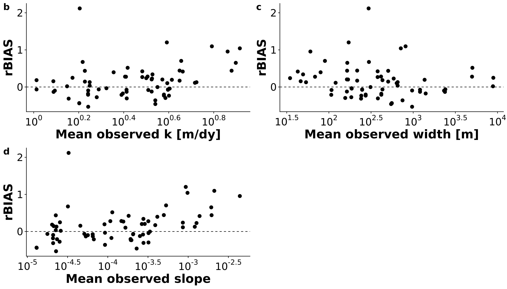

```{r setup, include=FALSE}
knitr::opts_chunk$set(echo = TRUE)
```

##Highlights (3-5 points, 85 characters each w/ spaces)
- The BIKER algorithm indirectly remotely senses riverine gas exchange velocity
- Predicted gas exchange velocities compare well with in-situ methods
- BIKER predicts $CO_2$ fluxes when coupled with in situ gas concentration data
- Expected SWOT measurement errors exert a marginal influence on BIKER's estimates
- Errors are dominated by process-level uncertainties, not parameter inversion

##Keywords
gas exchange, SWOT, remote sensing, carbon, ungauged basin, biogeochemistry

##Abstract
Go BIKER!!
*Note: this is for Remote Sensing of Environment (I think). So 400 words here.*

##1 Introduction
The Earth's carbon cycle transports and manipulates carbon between the atmosphere, geosphere, hydrosphere, and biosphere via a complex set of interconnected biogeochemical processes. The primary connection between the terrestrial and oceanic biospheres is the global river network, which exports much carbon from the continents to the oceans [@colePlumbingGlobalCarbon2007a]. However en route to the oceans, this river network additionally transports and transforms sediments, nutrients, organic matter, dissolved gases, and other constituents. Organic matter and inorganic nutrients are also produced and/or consumed within rivers via ecosystem metabolism [@odumPrimaryProductionFlowing1956]. The net effect of all of this is the global river network is usually supersaturated with dissolved gases and evades substantial amounts of carbon from its water surface to the atmosphere [@colePlumbingGlobalCarbon2007a].

Current estimates of total carbon dioxide ($CO_2$) evasion to the atmosphere vary from 650-1800 Tg C/yr [@lauerwaldSpatialPatternsCO22015; @raymondGlobalCarbonDioxide2013a], with 167 Tg-C/yr coming from mountain streams alone [@horgbyUnexpectedLargeEvasion2019]. Further, in-river metabolism is increasingly understood to contribute to this flux [@hotchkissSourcesProcessesControlling2015]. Equation 1 represents this flux for any sparingly soluble gas $[M/L^2T]$ given the gas concentration gradient between the water $C_{water} [M/L^3]$ and the air $C_{air} [M/L^3]$ and the gas exchange velocity $k [L/T]$. Given the structure of equation 1, calculations of this flux are highly sensitive to our measurements/estimates of *k*. Note that *k* is different for different gases and water temperatures [see @hallGasExchangeStreams2020 for a thorough review of gas exchange in rivers].

$$Flux=k(C_{water}-C_{air}) \mathbf{(1)}$$

*k* is also vital to understanding freshwater ecology through bulk river metabolism [gross primary production and ecological respiration- @bernhardtMetabolicRegimesFlowing2018]. The general mass-balance equation for river metabolism (*M* $[M/L^2T]$) is provided as equation 2, where *DO* is the dissolved oxygen concentration $[M/L^3]$, *D* is river depth [L], and $k_{o_2}$ is *k* for oxygen at some temperature. When viewing equations 1 and 2 in aggregate, it is clear that *k* plays a critical role in two of the fundamental biogeochemical processes that occur in river networks. Therefore, both closing the global carbon cycle and further understanding freshwater ecology rely on accurate and high-fidelity assessments of *k*.
$$\frac{dDO}{dt}=\frac{M}{D}+\frac{k_{o_2}}{D}(DO_{air}-DO_{water}) \mathbf{(2)}$$
Researchers use a range of methods to measure *k*, from floating domes to eddy covariance towers to measure at a specific point in the river. They also inject tracer gases to estimate reach-scale gas exchange [@hallGasExchangeStreams2020]. These approaches are ideal but are infeasible when working at the river network scale across potentially tens of thousands of rivers. So, predictive models are used to estimate *k* from readily available river geomorphology [e.g. @oconnorMechanismReaerationNatural1958; @palumboAssessingPerformanceReaeration2014; @raymondScalingGasTransfer2012a]. These models often, though not alwyas, predict $k_{600}$, or *k* that has been normalized to a Schmidt number of 600 ($CO_2$ at 20 degrees Celsius or $O_2$ at 17.5 degrees).

There is a long tradition of water quality engineers and biogeochemists developing predictive models for different forms of *k*, going back to at least the 1950s [@hallGasExchangeStreams2020] and extending the original work of @streeterMeasuresNaturalOxidation1935 and @phelpsStudiesSelfPurificationStreams1914. The goals of these models vary, from predicting oxygen reaeration coefficients to predicting $CO_2$ gas transfer velocities. Most of these models operate under the basic assumption that river channel hydraulics govern gas exchange and so simple statisical relationships can be generated between *k* and hydraulic properties. However, many of them are not based on fundamental mass transport theory and rather are simple empirical relations. This means that those models' parameters are sensitive to the training data used [@wangPhysicallyBasedScaling2021].

Multiple predictive models are based on the observation that *k* is generally correlated with both the turbulent energy dissipation rate *eD* $[L^2/T^3]$ [@ulsethDistinctAirWater2019a; @raymondScalingGasTransfer2012a] and the water surface surface shear velocity $U_\star [L/T]$ [@wangPhysicallyBasedScaling2021; @katulStructureFunctionModel2018]. This is convenient because both *eD* and $U_\star$ are calculated using easily estimated hydraulic parameters: $eD \approx gS_hV$ [@tsivoglouTracerMeasurementReaeration1976] and $U_\star=\sqrt{gS_hR_h}$, where *g* is gravitational acceleration $[L/T^2]$, $S_h$ is water surface slope $[L/L]$, *V* is average flow velocity $[L/T]$ and $R_h$ is the hydraulic radius [L] (which often approximates *D*). Because slope is readily available in any hydrographic data product, most efforts to predict *k* across thousands of rivers are thereby limited by the quality of the final parameters *V* or $R_h$. Since both must be measured in the field or themselves estimated by other empirical methods, uncertainty in *V* or $R_h$ must dominate any errors in *k* estimates. This is exacerbated in ungauged basins that cover large areas, especially in the carbon-rich Arctic inland waters, as no in situ hydraulic information is available and fieldwork is impractical [@gleasonRemoteSensingRiver2020].

To circumvent this problem in ungauged basins and across thousands of rivers, researchers have used 'global-scope' hydraulic geometry (HG) models that extend HG beyond its traditional use. Traditional HG models are simple power law relations between streamflow and channel width, depth, or velocity at a specific cross-section in a river [@leopoldHydraulicGeometryStream1953a] and a large body of geomorphology work has attempted to parse out process-based explanations for observed HG parameters [e.g. @dingmanAnalyticalDerivationAtastation2007b; @parkerPhysicalBasisQuasiuniversal2007b; @singhTHEORIESHYDRAULICGEOMETRY2003a; @fergusonHydraulicsHydraulicGeometry1986a]. This has been extended to 'downstream HG' which relates a characteristic streamflow (i.e. mean annual or bankful discharge) to characterisitc hydraulics along a specific river's course [@leopoldHydraulicGeometryStream1953a].

For the purposes of predicting *k* from *V* or $R_h$, biogeochemists have further extended HG models by training them on large hydraulics datasets for thousands of rivers and under all streamflow conditions [e.g @borgesGloballySignificantGreenhousegas2015a; @horgbyUnexpectedLargeEvasion2019; @lauerwaldSpatialPatternsCO22015; @raymondGlobalCarbonDioxide2013a]. However, it has long been established that HG parameters are either cross-section specific and highly variable from river to river (traditional HG) or they are discharge specific [downstream HG- @gleasonHydraulicGeometryNatural2015; @parkWorldwideVariationsHydraulic1977; @rhodesBfmDiagramGraphical1977]. This means that the 'global-scope' HG models that are usually used are highly reliant on their training data and can potentially yield pretty different hydraulics for the same streamflow. It is currently not well understood how sensitive global estimates of riverine gas evasion are to the specific 'global-scope' HG model that is employed by the worker.

A potential alternative to this 'global-scope' HG approach is to directly estimate a river's hydraulic properties from remote sensing (RS) data. Remote sensing of river hydraulics is a burgeoning subfield within remote sensing of hydrology, often in service of remote sensing of river discharge (RSQ- see @gleasonRemoteSensingRiver2020 for a recent review). There are many ways to perform RSQ, from calibrating RS data to local channel hydraulics [e.g. @brakenridgeOrbitalMicrowaveMeasurement2007; @pavelskyUsingWidthbasedRating2014; @pavelskyRemoteSensingSuspended2009; @tarpanelliEstimationRiverDischarge2013] to calibrating hydraulic/hydrologic models with both in situ and RS data [e.g. @bjerklieEstimatingDischargeRivers2005; @chandanpurkarSatelliteReanalysisBasedMass2017; @linGlobalReconstructionNaturalized2019a; @nealDataAssimilationApproach2009] to methods that use no in situ information in their hydraulic/hydrologic models (termed 'ungauged approaches' and detailed below). Many, but not all, of these ungauged approaches were developed in the context of the upcoming NASA/CNES/UKSA/CSA Surface Water and Ocean Topography (SWOT) satellite mission.

SWOT is expected to launch in 2022 and provide the world's first global measurements of water surface extent and elevation at novel temporal resolutions. SWOT is a wide swath Ka-band radar interferometer and will sample rivers every 1 to 7 days per 21 day repeat cycle. This yields an average sampling resolution of 11 days. It will measure rivers wider than 100m with a goal of expanding this to rivers at least 50m wide [@biancamariaSWOTMissionIts2016]. A decade of SWOT work has explored the multi-parameter problem of estimating the river hydraulic parameters of roughness and bathymetry from remote sensing to produce the SWOT discharge product [e.g. @andreadisConstrainingAssimilationSWOT2020d; @brinkerhoffConstrainingRemoteRiver2020a; @durandEstimatingReachaveragedDischarge2014a; @garamboisInferenceEffectiveRiver2015; @gleasonRetrievalRiverDischarge2014a; @garamboisVariationalEstimationEffective2020; @hagemannBAMBayesianAMHGManning2017a; @larnierRiverDischargeBathymetry2020a; @oubanasDischargeEstimationUngauged2018]. A specific subset of these ungauged methods are termed McFLIs or 'Mass Conserved Flow Law Inversion' algorithms [e.g. @andreadisConstrainingAssimilationSWOT2020d; @brinkerhoffConstrainingRemoteRiver2020a; @hagemannBAMBayesianAMHGManning2017a; @durandEstimatingReachaveragedDischarge2014a]. These use basic geomorphic theories and the concept of 'prior river knowledge' to estimate discharge from RS data where not all hydraulic terms are RS-able [@gleasonRemoteSensingRiver2020; @gleasonTrackingRiverFlows2017]. McFLIs are readily implemented in any river that SWOT can observe and improve our hydrological understandings of ungauged rivers when little to no information was previously available [@brinkerhoffConstrainingRemoteRiver2020a; @durandIntercomparisonRemoteSensing2016b]. Recently, McFLIs have also shown promise in providing additional and beneficial information to traditional hydrologic modeling via data assimilation of McFLIs into a traditional hydrologic model [@ishitsukaCombiningOpticalRemote2020].

While all McFLIs to date have been developed in the context of RSQ, there is no reason their logic cannot be used to estimate *k*, particularly as McFLIs often employ Bayesian inference for equifinal inverse problems. Equifinality refers to an under-constrained mathematical system that has essentially infinite parameter combinations that can produce the same result: there are in essence more unknowns than equations [@garamboisInferenceEffectiveRiver2015], and this problem is common to both RSQ and RS of *k*. Bayesian techniques have been previously used to concurrently solve for *k* and *M* in equation 2 [@applingOvercomingEquifinalityLeveraging2018; @graceFastProcessingDiel2015; @holtgrieveSimultaneousQuantificationAquatic2010]. While these studies are field based, require high-fidelity in situ data, and are not applicable to *k* estimation in ungauged rivers, they suggest that Bayesian techniques could be useful for remotely sensing *k* when parameter equifinality is a problem. This matches McFLI logic [@andreadisConstrainingAssimilationSWOT2020d].

In this context, we hypothesize that a combination of SWOT data, a Bayesian McFLI paradigm, and gas exchange theory can successfully estimate *k*. This would in turn improve our understanding of riverine gas fluxes in ungauged basins (equation 1), as well as potentially help in parameterizing stream metabolism models (equation 2). Therefore, this manuscript aims to answer two questions:

- Is ungauged RS of the gas exchange velocity (*k*) possible using soon-to-be-available SWOT river measurements?
- If possible, how will this RS method effect estimates of riverine carbon efflux from rivers?

To answer these questions, we developed a new McFLI algorithm that ingests SWOT data and produces $k_{o_2}$ estimates and its explicit Bayesian uncertainity that requires no in situ inputs of any kind (although in situ data can be ingested and will improve results). We name the RS of $k_{o_2}$ algorithm BIKER, or the 'Bayesian Inversion of the $k_{o_2}$ Evasion Rate'. We validate BIKER on simulated SWOT data for 49 SWOT-observable rivers from around the world, using hydraulic models  to produce SWOT-like data as SWOT has not yet launched. This is standard practice in the SWOT community [@frassonExploringFactorsControlling2021; @durandIntercomparisonRemoteSensing2016b]. We also quantify BIKER's sensitivity to the expected SWOT measurement errors on 17 of those rivers: while SWOT data represent a sea change in inland water monitoring, SWOT is expected to have an approximately 10cm error in water surface elevation [@biancamariaSWOTMissionIts2016], as well as river width errors [@frassonExploringFactorsControlling2021]. Finally, we use previously published dissolved $CO_2$ data to compare the bulk carbon efflux (via $CO_2$ evasion) from the 49 rivers as calculated using BIKER and previously published 'global-scope' HG models to compare BIKER with established in situ techniques.

##2 Methods
To build BIKER, we join a process-based model for $k_{o_2}$ (section 2.1) with a McFLI framework for inverting SWOT measurements (section 2.2). Following the description of that process, we describe the validation (section 2.3) and the workflow for comparing estimated bulk carbon effluxes from a suite of 'global-scope' HG models (section 2.4). A flowchart detailing the entire study is provided as Figure 1.


###2.1 Choosing a predictive model for *k*
To predict k from just the SWOT observables,river width *W* and water surface elevation *H*, a physical model for *k* is first selected. As mentioned in section 1, there are nearly two dozen predictive models for *k* that have been devolped since the 1950s [@wangPhysicallyBasedScaling2021; @hallGasExchangeStreams2020]. Recently, many of these models were reexplored in rivers and streams by @wangPhysicallyBasedScaling2021. They significantly expanded the existing training datasets of field-measured $k_{o_2}$ by using inverse modeling of DO timeseries. This approach was also briefly mentioned in section 1. These methods calibrate $k_{o_2}$, along with *M* (discretized as seperate respiration and gross primary production terms), to high-fidelity, in situ datasets of DO with the goal of minimizing the difference between the observed DO and the modeled DO [e.g. @applingOvercomingEquifinalityLeveraging2018; @chapraDeltaMethodEstimating1991]. @wangPhysicallyBasedScaling2021 used the *streamMetabolizer* technique [@applingOvercomingEquifinalityLeveraging2018] at 35 rivers across the United States and showed that $k_{o_2}$ models deduced from the classic, process-based 'thin-film' and 'surface renewal' theories for mass transport yield approximately identical parameters when fit to field measurements or this new dataset of simulated $k_{o_2}$. They also showed through cross-validation that these models are robust to overfitting on specific sets of data (a concern with many of the aforementioned predictive models- section 1). This suggests that there are uniform scaling realtionships between certain hydraulic properties and $k_{o_2}$ that exist regardless of the training data used. See @hallGasExchangeStreams2020 and @wangPhysicallyBasedScaling2021 for more in-depth explanations of the thin-film and surface renewal theories with respect to rivers. In short, these are the standard physical models for conceptualizing gas exchange in various aquatic environments from lakes to estuaries to rivers. The better fit, and more parsimonious, of the two models from @wangPhysicallyBasedScaling2021 is reprinted as equation 3(with reported coefficients of determination $r^2$) where $\alpha$ is the fitted parameter in the linear regression. Equation 3, 2nd line was fit to 588 field measurements of $k_{o_2}$ while equation 3, third line was fit to 3,919 simulated $k_{o_2}$ values at 35 rivers.
$$\begin{eqnarray} k_{o_2} &=& \alpha U_\star \mathbf{(3)} \\ &=& 47.67U_\star (r^2:0.53) \\ &=& 49.71U_\star (r^2: 0.76)  \end{eqnarray}$$

We implement this model within BIKER (using 48 as a reasonable value for $\alpha$ given equation 3) for a few reasons. First, as suggested earlier @wangPhysicallyBasedScaling2021 provides compelling evidence that an $\alpha$ of approximately 48 is uniform across rivers and streams, regardless of the training data used. This is encouraging for use within BIKER as BIKER is specifically designed to be as river-agnostic as possible and so we sought a fully generalized equation. Second, it yields a simple linear relationship across all rivers, regardless of their size or steepeness. This is not necessairly true of other *k* models, for example those based on *eD* (section 1). Recent work has shown that *k* does not scale with *eD* via the same statistical parameters across all river geomorphologies [@ulsethDistinctAirWater2019a]. We further explored the relationship presented in that paper and found that the $k \sim eD$ relationship fundamentally breaks down in rivers with low *eD*, which corresponds to nearly all rivers that SWOT will observe (**supp figure, need to do**). Therefore, an *eD* based predictive model is less useful in SWOT rivers. Third, we sought to explicitly predict $k_{o_2}$, as its use extends beyond constraining gas fluxes from rivers and into parameterizing river metabolism models (equation 2).

We stress that most other predictive models for *k* could be implemented within BIKER. However, our goal of using BIKER on any river that is observable by SWOT necessitates that we pick an equation that is applicable across as many rivers as possible. Future work should look at using a river-specific *k* equation to pseudo-calibrate BIKER to a specific river.

###2.2 Developing BIKER
With a predictive model for $k_{o_2}$ chosen, we now implement it within the McFLI framework. The approach used here is informed by the @hagemannBAMBayesianAMHGManning2017a McFLI algorithm for ungauged RSQ, further explored in more recent work [@brinkerhoffConstrainingRemoteRiver2020a]. These papers conceptualize discharge as a Bayesian remote sensing problem, which we largely follow here to conceptualize $k_{o_2}$ as a Bayesian remote sensing problem that can be solved using SWOT data.

BIKER and Bayesian inference in general starts from Bayes rule, after acknowleding that it needs only to be specified as a proportionality to approximate the full posterior distribution (equation 4). In equation 4, $\Theta$ is some set of parameters we want to solve for (including $k_{o_2}$), *x* is the observed data, $f(x|\Theta)$ is the 'likelihood function' or sampling model conditional on the parameters, and $p(\Theta)$ is the joint prior distribution of the parameters. For BIKER, *x* is the SWOT-observables *W* and *H*. First, we detail the likelihood specification and then the prior specifications.

$$p(\Theta|x) \propto f(x|\Theta)p(\Theta) \mathbf{(4)}$$

####2.2.1 BIKER likelihood
To concieve of equation 3 as a likelihood function, $k_{o_2}$ first needs to be written as a function of SWOT-observables *W* and *H* (which provides water surface slope $S_h$). This algebra is carried out in equation 5, where we assume that $R_h \approx \frac{A}{W}$ where *A* is wetted channel area. *A* is further split into the SWOT-observable portion *dA* and the unobservable portion $A_0$ following @durandEstimatingReachaveragedDischarge2014a. *dA* is estimated by assuming a rectangular river channel so that $dA \approx \delta H*W$.

*COLIN COMMENT ABOUT DA: sensitivity analysis? "We investigated the sensitivity of BIKER to this rectangular assumption and found it negligible (xxx section x.x if appropriate xxx)".*

$$\begin{eqnarray} k_{o_2} &=& 48\sqrt{gR_hS_h} \mathbf{(5)} \\ &=& 48g^{1/2}S_h^{1/2}(\frac{A_0+dA}{W})^{1/2} \end{eqnarray}$$

Next, equation 5 is written as a Bayesian sampling model to have all of the SWOT observations on the left-hand side sampled from the unknown model parameters ($A_0$ and $k_{o_2}$) on the right-hand side. This is equation 6. The $\sigma_{k_{o2}}^2$ parameter refers to the uncertainty inherent in equation 5's estimates. This will be explained in detail below. Note that in the formal model specification, equation 6 is written as a normal distribution of its log-transformed quantities.

$$ f(x|\Theta) = \left[48^{-1}(\frac{W}{gS_h})^{1/2}\right] \sim lognormal\left(\left[k_{o2}^{-1}(A_0+dA)^{1/2}\right], \sigma^2_{k_{o2}}\right)  \mathbf{(6)}$$

####2.2.2 Prior Specifications
Equation 6 necessitates that we specify prior distributions for parameters $A_0$, $k_{o_2}$. Prior distributions formalize the a priori estimates (and uncertainties) for the non-remotely-sensed parameters. More intuitively, BIKER priors represent our 'prior river knowledge' of what $A_0$ and $k_{o_2}$ probably are for some river since they cannot be remotely sensed. All priors are formalized within the model as truncated normal distributions of the log-transformed terms such that $log(X) \sim N(\mu, \sigma^2)$ for $\lambda < X < \epsilon$, using prior hyperparameters mean ($\mu$), standard deviation ($\sigma$), and upper ($\epsilon$) and lower bounds ($\lambda$) for any parameter *X*. In order to avoid relying on in situ information, as is the goal of BIKER and SWOT, we assign prior hyperparameters using SWOT data only. $A_0$ prior hyperparameters were assigned following the method developed by @brinkerhoffConstrainingRemoteRiver2020a They developed a set of river channel prior hyperparameters for McFLI algorithms that are entirely RS-able and reflect differential channel hydraulics as a function of river geomorphology. They used an extensive database of field measurements and machine learning to identify patterns that associate the river width with river geomorphic properties, so prior hyperparameters may be assigned to rivers using only the existing remotely sensed data. This leaves the $k_{o_2}$ hyperparameters to be defined. We assigned those using a simple slope regression model trained on an available subset of the @raymondScalingGasTransfer2012a dataset of field-measured $k_{o_2}$: equation 7 assigns $\mu$ while $\sigma^2$ was set to equation 7's standard error: 0.77. $\lambda$ and $\epsilon$ were set to log(0.0001) and log(60), respectively.

$$\mu_{k_{o_2}}=3.3492 +0.3661ln(S_h)   \mathbf{(7)}$$

Finally, we estimate $\sigma_{k_{o_2}}^2$ using Monte Carlo (MC) methods to approximate total uncertainty in equation 5's estimates. Uncertainty in equation 5 can stem from 1) parameter uncertainty in $\alpha$ or 2) error in the assumption that $R_h \approx \frac{A}{W}$. Total equation 5 uncertainty is a function of both uncertainity sources, so we need to propogate those uncertanties through the algebra of equation 5. We use MC simulations to do this. MC simulations repeately sample from parameter distributions defined by their individual means and uncertainities to produce a distribution of model predictions from which an uncertainity term can be extracted. See **supp figure** for a flowchart of the entire methodology, but in short we run 8,000 different MC simulations on 8,000 sets of field measurements of river channel hydraulics taken from the @brinkerhoffReconcilingAtaStationAtManyStations2019 dataset and use the median uncertainity term across those 8,000 distributions as $\sigma_{k_{o_2}}$. Each of the 8,000 simulations are themselves 10,000 runs, sampling from the normal distributions for $\alpha$ and $R_h$. We defined the distribution of the $R_h$ prediction again using the @brinkerhoffReconcilingAtaStationAtManyStations2019 dataset (n = 500,000+): we fit a linear regression between $R_h$ and $\frac{A}{W}$ and use that model's log-transformed standard error as the uncertainity in the MC simulations. The resulting value was 0.15 and we further inflated it to 0.20 to account for potential errors in assuming $dA \approx \delta H*W$.

With the sampling model (equation 6), prior distributions, and the $\sigma_{k_{o_2}}^2$ parameter described, a joint posterior distribution conditional on the SWOT observations is specified. To approximate this distribution, we use a Markov Chain Monte Carlo (MCMC) algorithm implemented using the Stan probabilistic programming language. Specifically, BIKER uses a Hamiltonian Monte Carlo sampler which reduces computation time relative to other sampling algorithms.

###2.3 BIKER validation setup
We validated BIKER on 49 rivers using observed $R_h$ and observed $S_h$ First, we detail the 49 rivers, and then we detail how observed $k_{o_2}$ is 'measured'.

Because SWOT has yet to launch, it is standard practice to benchmark SWOT-related algorithms on SWOT-like data. There are three current types of SWOT-like data: 1) AirSWOT, which is an airborne Ka-band inSAR currently limited to five rivers globally [e.g. of its use: @tuozzoloEstimatingRiverDischarge2019], 2) simulated rivers that mimic the type of data SWOT will provide, and 3) the SWOT simulator, which introduces measurement errors to these simulated rivers [e.g. of its use: @oubanasDischargeEstimationUngauged2018]. Because we are principally interested in algorithm performance, we limit our validation setup to simulated rivers in order to benchmark across as many rivers as possible. These simulated rivers are simply reach-averaged hydraulic model outputs where the water surface heights and widths are labelled as RS observations and are used as the sole inputs to BIKER. Here, we use the 49 rivers collected by @frassonExploringFactorsControlling2021 and @durandIntercomparisonRemoteSensing2016b. These are the two benchmarking studies that have explored RSQ algorithm performance for the SWOT mission. Please consult both of those papers for all of the the rivers' locations as well as hydraulic model specifications. Ultimately, the 49 rivers are spread across the United States, France, Italy, the United Kingdom, and Bangladesh. We omit both models for the Saint Lawrence River, Canada from @durandIntercomparisonRemoteSensing2016b because they lack enough hydraulic information to calculate $U_\star$.

We also assess the influence of measurement error on BIKER's performance. Error in SWOT measurements will come from both the error tolerances intrinsic in the satellite data product as well as radar layover error and width measurement error. Layover error is the phenomenon when radar returns from different places arrive at the sensor at the same time, leading to taller landscape features appearing closer to the sensor than shorter landscape features that are the same horizontal distance from the sensor. This will occur when the landscape slope is steeper than the radar's incidence angle [@durandHowWillRadar2020a] and so generally occurs in areas of high topographic variation [@reesPhysicalPrinciplesRemote2013]. For river heights and slopes, we use the error model devolped by @durandHowWillRadar2020a and implemented on 17/49 of the rivers by @frassonExploringFactorsControlling2021. Width errors were derived using a model built by @frassonExploringFactorsControlling2021 based on SWOT-simulator runs for the Sacramento river, California [@frassonAutomatedRiverReach2017b] and the Po river, Italy [@domeneghettiCharacterizingWaterSurface2018]. Those two simulations allowed for explicit characterization of width errors that were then extrapolated onto the other 15 rivers. Width errors due to poor water classification are ignored as they were by @frassonExploringFactorsControlling2021. Please consult @frassonExploringFactorsControlling2021 for the specifics of how these realistic errors were incorporated into the hydraulic models. Ultimately, we reran BIKER on these 17 rivers with the SWOT error model corrupting the SWOT-observables *W* and *H*.

Regardless of the validation data or SWOT error budget used, we do not have observed $k_{o_2}$ data for these rivers, and to our knowledge no field dataset of $k_{o_2}$ exists in the type of temporal and spatial frequency that SWOT (and therefore the BIKER algorithm) provides. Further, we are principally interested in BIKER's ability to reproduce $k_{o_2}$ from SWOT observations and are less concerned with the actual accuracy of the predictive model itself, which can be validated using existing datasets as has been previously done [e.g. @wangPhysicallyBasedScaling2021; @ulsethDistinctAirWater2019a; @raymondScalingGasTransfer2012a]. Therefore, we take the model outlined in section 2.1 and use that to calculate the observed $k_{o_2}$ that BIKER is validated against. This is done using equation 8, where $R_{h, obs} [L/T]$ is observed river channel area divided by observed channel width. With this setup, we can directly explore BIKER's ability to infer observed $U_\star$ and $k_{o_2}$ from *W* and *H* alone. It also means that, for a fair validation scheme, $\sigma_{k_{o_2}}^2$ must be set to reflect only error from our assumptions about $R_h$ and not the parameter uncertainity inherent in $\alpha$ (the 48 in equation 8). Thus, $\sigma_{k_{o_2}}^2$ is set to 0.20 for this validation as suggested in section 2.2. However once SWOT launches, it should reflect the total uncertainty calculated in section 2.2 from both sources.

$$k_{o_2, obs}=48\sqrt{gS_hR_{h, obs}} \mathbf{(8)}$$

Validation is performed using the BIKER posterior means. Validation metrics take two forms (and are detailed in Table 1). To validate across all rivers and timesteps, we used the coefficient of determination $r^2$ and the root mean square error RMSE. Four normalized metrics were used for by-river validation: RRMSE and NRMSE are normalized root mean square errors that have been normalized by the observed value and the mean observed value (respectively). rBIAS is a measure of prediction bias that is normalized by the mean observed value. KGE is a standard metric used in streamflow prediction with an intuitive basis: a value greater than 0 is often interpreted as a useful prediction in ungauged settings, and a value greater than -0.41 indicates a model outperforms a uniform prediction of the mean observed value [@knobenTechnicalNoteInherent2019a].

*Table 1: Validation metrics used in this study, where r is the correlation coefficient, Nt is number of observations and i is the specific observation. σ refers to the variance of the sample and μ refers to the mean of the sample. As is standard, a carrot accent indicates the predicted value.*

|**Description**|**Acronym**|**Definition**|**Ideal Score**|**Possible Range**|**Validation Scheme**|
|-----------|-------|----------|-----------|--------------|-----------------|
|Coefficient of determination|$r^2$| $1-(\frac{\sum\limits_{i=1}^{N_t}{(k_{600, i}-\hat{k_{600}})^2}}{\sum{(k_{600, i}-\bar{k_{600}})^2}})$ |1|0 to 1|	All rivers and all timesteps|
|Root-mean-square-error|RMSE| $\sqrt{\frac{1}{N_t}\sum\limits_{i=1}^{N_t}(\hat{k_{600, i}}-k_{600, i})^2}$ |0|0 to ∞|All rivers and all timesteps|
|Relative root-mean-square error|RRMSE| $\sqrt{\frac{1}{N_t}\sum\limits_{i=1}^{N_t}(\frac{\hat{k_{600, i}}-k_{600, i}}{k_{600, i}})^2}$ |0|0 to ∞|By river|
|Normalized root-mean-square error|NRMSE| $\sqrt{\frac{1}{N_t}\sum\limits_{i=1}^{N_t}(\frac{\hat{k_{600, i}}-k_{600, i}}{\bar{k_{600, i}}})^2}$ |0|0 to ∞|By river|
|Relative bias|rBIAS| $\frac{1}{N_t}\sum\limits_{i=1}^{N_t}(\frac{\hat{k_{600, i}}-k_{600, i}}{\bar{k_{600, i}}})$ |0|-∞ to ∞|By river|
|Kling-Gupta efficiency|KGE| $1-\sqrt{(r-1)^2 + (\frac{\hat{\sigma_{k600}}}{\sigma_{k600}}-1)^2 + (\frac{\hat{\mu_{k600}}}{\mu_{k600}}-1)^2}$ |1|-∞ to 1|	By river|

###2.4 Upscaling to CO2 evasion and bulk carbon efflux
It is one thing to accurately predict $k_{o_2}$, but researchers are often most interested in the actual gas fluxes from rivers and ultimately the carbon emitted from river to atmosphere. Therefore, we explore 1) the ability of BIKER to reproduce carbon dioxide evasion fluxes ($FCO_2$ $[M/L^2T]$) from these 49 rivers, and 2) the sensitivity of the carbon efflux efflux $[M/T]$ due to the chosen method to approximate $R_h$ and ultiamtely $U_\star$.

First, we calculate $FCO_2$. To do this, we pair the modeled $k_{CO_2}$ values (obtained from $k_{O_2}$ and equation 9) with field-measurements of water-side $CO_2$ concentrations and water temperatures. In equation 9, 530 is the Schmidt number for oxygen at 20 degrees Celsius (which BIKER predicts) and *Sc* is the Schmidt number at one's desired temperature for some dissolved gas. 26 bi-weekly dissolved $CO_2$ samples were made by @beaulieuControlsGasTransfer2012a (Figure S1) at one location in the Ohio River for one calender year from 2008-2009. We paired these 26 values with every 11th SWOT observation by date, ignoring the timesteps beyond 26 (only ~15% of the SWOT observations were ignored here and we deemed this acceptable). We chose to sample every 11 days as this is the average sampling resolution for SWOT. Not all of the SWOT rivers have observations for a full year, and when simulation dates were not available they were assumed to start on January 1st. Note that this $CO_2$ data is for the Ohio River only but was applied to all 49 rivers (which includes multiple sections of the Ohio River). Because we are exclusively interested in the relative differences between $FCO_2$ estimates and not the raw fluxes themselves, any $CO_2$ data representative of SWOT-observable rivers was deemed acceptable. Atmospheric $CO_2$ was assumed 390 uatm. The Schmidt number, used in equation 9, was calculated following @raymondScalingGasTransfer2012a and @wanninkhofRelationshipWindSpeed1992a.

$$k_{GHG, temp}=k_{02}*(Sc/530)^{-1/2} \mathbf{(9)}$$

Next, we estimate bulk carbon efflux using four models for average channel depth (used to calculate $U_\star$):  BIKER's posterior means and three gauge-based HG models previously used for $CO_2$ upscaling [@lauerwaldSpatialPatternsCO22015; @raymondGlobalCarbonDioxide2013a; @raymondScalingGasTransfer2012a]. See Table S1 for their definitions. It is worth stressing that the @lauerwaldSpatialPatternsCO22015 model is simply one of two components of the @raymondGlobalCarbonDioxide2013a model, and so was actually developed by the latter's authors. The names used here refer to the specific implementation used in each study. For this study, all HG methods use the in-situ discharge record while BIKER does not. This allows us to assess whether BIKER's estimates (wholly unguaged) are comparable to gauged methods (all three HG models). Finally, we express the bulk carbon efflux as the average mass flow rate of carbon (via $CO_2$ evasion) per year from the 49 rivers after accounting for total river surface area.

##3 Results
First, we present the results from the BIKER validation on 49 SWOT rivers (section 3.1). Next, we compare BIKER inversion errors to the errors inherent in equations 2 and 3, as well as the rivers' hydraulic properties (section 3.2). Finally, we use 4 different models for $k_{CO_2}$ to compare $FCO_2$ and bulk carbon efflux estimates made using gauged and ungauged methods (section 3.3).

###3.1 Validating the BIKER algorithm
Figure 2a plots the validation results for $k_{o_2}$ (with no SWOT measurement error) across all 49 rivers and all timesteps. The points are the posterior means while the black lines are the 95% confidence intervals (CIs) for the predictions. $k_{o_2}$ is strongly correlated with the $k_{o_2}$ predicted by BIKER. BIKER captures the general magnitude of the predictions and most points fall on or near the 1:1 line. However, the 95% prediction intervals (dashed grey lines) highlight a slight underestimation bias for many predictions and a handful of predictions that are significanyl underestimated. The RMSE for the BIKER predictions is only `r round(results_3_2_all$rmse,2)` m/day) across all predictions.


Figure 2a highlights a handful of values that are grossly underestimated by BIKER, which is confirmed in Figure 2b. Figure 2b plots the cumulative density functions (CDFs) of observed and predicted $k_{o_2}$ where the green line is the CDF of the BIKER posterior means, the blue lines are the CDFs of the BIKER posterior 95% CIs, and the dashed black line is the CDF of observed $k_{o_2}$. We see, more clearly than in Figure 2a, that BIKER captures $k_{o_2}$ very well: most of the  observed CDF falls between the 95% CIs or on the posterior mean (Figure 2b). If we define a 'hit rate' as the oberved value following between the CIs, BIKER yields a hit rate of **get hit rate**. Most of the  **get inverse of hit rate**% are extremes: the uppermost quartile is systematically overestimated by BIKER, and a handful of the smallest $k_{o_2}$ in this data are underestimated. This highlights one benefit of using Bayesian inference to fully propagate prior and model uncertainties through to the posterior. In summary, Figure 2 confirms that we improve upon our baseline understanding of $k_{o_2}$ in these river: we accurately capture $k_{o_2}$ with no in situ information about the river while simultaneously and explicitly accounting for the uncertainties inherent in our $k_{o_2}$ estimates.

Figure 3a plots validation metrics calculated for each river with and without SWOT measurement error (green and purple, respectively). The boxplots are composed of scores for either the 49 or 17 rivers- see Table 1 for metric definitions. SWOT measurement uncertainties slightly degrade performance across all four error metrics (Figure 3a), though caution should be used in over-interepting boxplots with n = 17. Therefore, we deem that SWOT measurement error does not exert a significant influence on BIKER and so the results presented for the rest of the manuscript assume no measurement error in order to use all 49 rivers.

Median KGE is `r round(median(results_3_2_rivs[results_3_2_rivs$errFlag == 0,]$kge, na.rm=T),2)`, which is excellent given that absolutely no in situ information is being used to predict $k_{o_2}$. `r sum(results_3_2_rivs[results_3_2_rivs$errFlag == 0,]$kge > -0.41, na.rm=T)`/49 rivers score a KGE > -0.41 and `r sum(results_3_2_rivs[results_3_2_rivs$errFlag == 0,]$kge > 0, na.rm=T)`/49 are greater than 0, indicating that BIKER performs better than an estimate of the mean $k_{0_2}$. Median rBIAS is `r round(median(results_3_2_rivs[results_3_2_rivs$errFlag == 0,]$rBIAS, na.rm=T),2)`, indicating nearly no bias in most rivers' predictions. However, some rivers are substantially biased in both directions (particuarly positive bias, where `r sum(results_3_2_rivs[results_3_2_rivs$errFlag == 0,]$rBIAS > 1, na.rm=T)` rivers have scores > 1). This further supports the visual evidence in Figure 2 that sometimes BIKER is substantially under/overestimating the magnitude of $k_{o_2}$ and that this is river-specific. NRMSE and RMSE have median scores of `r round(median(results_3_2_rivs[results_3_2_rivs$errFlag == 0,]$nrmse, na.rm=T),2)` and `r round(median(results_3_2_rivs[results_3_2_rivs$errFlag == 0,]$rrmse, na.rm=T),2)`, respectively. While median KGE and rBIAS scores were strong, the ranges of these scores were somewhat large (standard deviation for KGE of `r round(sd(results_3_2_rivs[results_3_2_rivs$errFlag == 0,]$kge, na.rm=T),2)` and for rBIAS of `r round(sd(results_3_2_rivs[results_3_2_rivs$errFlag == 0,]$rBIAS, na.rm=T),2)`).


Figure 3b-d are representative timeseries plots of predicted and observed $k_{o_2}$ for three rivers chosen randomly from those with 'good' KGE scores (b), 'okay' KGE scores (c), and 'bad' KGE scores (d). See the Figure 3 caption for how this was determined. For the Missouri Downstream River, the entire timeseries of $k_{o_2}$ is correctly predicted, while in the Ohio Section 8 River there is a positive bias in the later estimates. Interestingly, there is near perfect recovery of $k_{o_2}$ for the first approximately 150 days. In the Connecticut River, there is significant positive bias in the estimates as well as large uncertainty (per the 95% CIs) and temporal dynamics are largely missing from BIKER's predicitions.

###3.2 BIKER performance versus *k* model performance
Next, we compare error introduced by BIKER's Bayesian inversion to error introduced by the use of $\alpha$ in equations 2 and 3. Recall that the BIKER validation has already had parameter error accounted for (section 2.3) and so BIKER errors reflect error introduced only from Bayesian inference and not from the use $\alpha$. Figure 4 compares BIKER's performance per river (via NRMSE) to the reported cross-validated model performance for equations 2 and 3 [@wangPhysicallyBasedScaling2021]. Note that in that paper they use the same metrics but refer to it as 'relative error' and so we do too in Figure 4.  43/49 rivers have lower inversion errors than the cross-validated error in equations 2 and 3 (~57%), with most rivers' scores far less than 57%. Recall that the median NRMSE is `r round(median(results_3_2_rivs[results_3_2_rivs$errFlag == 0,]$nrmse, na.rm=T),2)` which is less than 1/2 of the reported error for $\alpha$. For the six rivers which inversion errors greater than the parameter error, 4/6 are approaching or over 100% error. This means that BIKER fundamentally does not work in these rivers, while in all the other rivers the inversion errors are nearly always much less than the parameter error. It should also be stressed that NRMSE is one of the worst perfoming metrics for BIKER (figure 3a) and so a similar comparison using KGE or rBIAS would likely yield even stronger results. Therefore, BIKER introduces a small amount of additional error into the physical model for $k_{o_2}$ and any errors in the final $k_{o_2}$ estimates are dominated by process-level uncertainity in predicting $k_{o_2}$ rather than uncertainity in inverting SWOT observations to estimate $k_{o_2}$.


Figure 4 shows that BIKER performs very poorly on a small subset of these 49 rivers. So, we also compared BIKER performance against river hydraulic properties, specifically mean observed $k_{o_2}$, *W*. and $S_h$. We found no clear patterns between these properties and KGE, NRMSE, or RRMSE (Figures Sx, Sy, Sz respectively). However, Figure 5 plots the patterns betwwen these hydraulic properties and rBIAS. There is an apparent uniform and positive bias in BIKER's predicitions in the narrowest and steepest of these 49 rivers. For these 49 rivers, these are approximately those with slopes > 0.001 (Figure 5c) and widths < 100m (Figure 5b). Following basic gas exchange theory [@ulsethDistinctAirWater2019a], these are also the rivers with the greatest $k_{o_2}$ values (Figure 5a).



###3.3 Influences on carbon efflux estimates
Finally, we explore our ability to 1) use BIKER-produced $k_{o_2}$ to estimate $FCO_2$ and 2) estimate bulk carbon efflux from $CO_2$ evasion (section 2.4).

In Figure 6a, there is a strong fit to the observed $FCO_2$ data, with an RMSE of `r round(10^results_3_3_all$rmse,2)` $g/m^2dy$. The $r^2$ is slightly lower than $k_{o_2}$ (Figure 6a), likely due the the handful of extremely underestimated $FCO_2$ predictions. Overall, there is less systematic bias in the predicitons across all 49 rivers than in the $k_{o_2}$ predictions (Figure 3a). This is presumably due to the structure of the $FCO_2$ equation, which reduces the relative importance of errors in *k* given that the $CO_2$ data is measured in situ. $FCO_2$ prediction intervals are wider than those presented in Figure 2a. Figure 6b-d includes subplots for the same rivers as Figure 3b-d, however with $FCO_2$ plotted instead of $k_{o_2}$. There is very good recovery of $FCO_2$ in both the Missouri Downstream River and the Ohio Section 8 river (Figures 6b and 6c), with both magnitude and temporal dynamics modeled quite well. The Connecticut river is systematically over estimated (Figure 6d), though BIKER's CIs do reflect reasonably uncertain estimates and the temporal dynamics are not far from the observed dynamics. This suggests that BIKER can easily estimate the changing dynamics of gas exchange but is at the mercy of the prior on $k_{o_2}$ to accurately estimate the magnitude of the evasion.


Finally, we compare $FCO_2$ and bulk carbon efflux (via $CO_2$ evasion) from the 49 rivers using BIKER posterior means and three gauge-based HG models (Figure 7). Figure 7a are barplots of the bulk carbon efflux (via $CO_2$ evasion) across the 49 rivers in gigagrams of carbon per year. The BIKER bulk carbon efflux (`r round(results_3_3_bulk[results_3_3_bulk$key == 'FCO2_BIKER',]$sumFCO2, 0)` gG-C/yr) is nearly identical to that predicted by the 'raymond 2013' model(`r round(results_3_3_bulk[results_3_3_bulk$key == 'FCO2_raymond2013',]$sumFCO2, 0)`), though both are somewhat overestimated relative to the observed flux (`r round(results_3_3_bulk[results_3_3_bulk$key == 'FCO2_ulset',]$sumFCO2, 0)`). The 'raymond 2012' model is the closest (`r round(results_3_3_bulk[results_3_3_bulk$key == 'FCO2_raymond2012',]$sumFCO2, 0)`), while the 'Lauerwald 2015' model grossly overestimates this bulk efflux (`r round(results_3_3_bulk[results_3_3_bulk$key == 'FCO2_Lauerwald2015',]$sumFCO2, 0)`). Thus, despite BIKER using absolutely no in situ data, it provides similar estimates of the carbon efflux to two of the in-situ approaches and surprisingly outperforms the 3rd in-situ method (Figure 7a).


Figure 7b plots the by-river performance scores for $FCO_2$. In line with the Figure 7a results, 'Lauerwald 2015' is the worst performing (median KGE: `r round(median(results_3_3_rivs[results_3_3_rivs$key=='FCO2_Lauerwald2015',]$kge, na.rm=T),2)`) while BIKER (median KGE: `r round(median(results_3_3_rivs[results_3_3_rivs$key=='FCO2_BIKER',]$kge, na.rm=T),2)`) is only slightly worse than the other two in-situ methods (median KGEs: `r round(median(results_3_3_rivs[results_3_3_rivs$key=='FCO2_raymond2013',]$kge, na.rm=T),2)` and `r round(median(results_3_3_rivs[results_3_3_rivs$key=='FCO2_raymond2012',]$kge, na.rm=T),2)` for 'Raymond 2013' and 'Raymond 2012', respectively). For rBIAS, BIKER indicates the least bias in some rivers and similar bias to the other models in other rivers, as indicated by the scores' inter-quartile range (`r round(IQR(results_3_3_rivs[results_3_3_rivs$key=='FCO2_BIKER',]$rBIAS, na.rm=T),2)`) and median (`r round(median(results_3_3_rivs[results_3_3_rivs$key=='FCO2_BIKER',]$rBIAS, na.rm=T),2)`). Meanwhile, both 'Lauerwald 2015' and 'Raymond 2013' produce significant positive bias in their estimates (median scores of `r round(median(results_3_3_rivs[results_3_3_rivs$key=='FCO2_Lauerwald2015',]$rBIAS, na.rm=T),2)` and `r round(median(results_3_3_rivs[results_3_3_rivs$key=='FCO2_raymond2013',]$rBIAS, na.rm=T),2)`, respectively). Again, the 'Raymond 2012' model performs the best with virtually no bias (`r round(median(results_3_3_rivs[results_3_3_rivs$key=='FCO2_raymond2012',]$rBIAS, na.rm=T),2)`). BIKER and 'Lauerwald 2015' have similar performance for NRMSE and RRMSE, which is generally worse than the other two models. In summary, BIKER performance across all four metrics is either similar or slightly worse than two of the in-situ approaches tested here and better than the 'Lauerwald 2015' model. This is despite relying on absolutely no streamgauge data like all three other models do.

##4 Discussion
###4.1 Towards remote sensing of global spatiotemporal dynamics of *k*
To date, most field-scale studies of riverine gas exchange have focused on 1) its relationship with wind speed [e.g @beaulieuControlsGasTransfer2012a; @borgesVariabilityGasTransfer2004; @zappaEnvironmentalTurbulentMixing2007], 2) average flow velocity [e.g. @alinPhysicalControlsCarbon2011; @beaulieuControlsGasTransfer2012a; @schelkerCO2EvasionSteep2016a], or 3) discharge [e.g. @wangPhysicallyBasedScaling2021; @robertsMultipleScalesTemporal2007; @uehlingerEcosystemMetabolismDisturbance1998]. However, the spatiotemporal dynamics of riverine gas exchange are still weakly constrained. A few studies have investigated these dynamics, but they have been limited to individual rivers and/or limited field seasons [@hallAirWaterOxygen2012; @sand-jensenCO2DynamicsDanish2012]. @wallinSpatiotemporalVariabilityGas2011 performed a preliminary analysis in northern Sweden relating cross-section specific temporal variability in gas exchange with channel slope, but they were limited to an average of only 8 measurements per river in a single watershed. This limited knowledge of large-scale *k* spatiotemporal dynamics is due both to a lack of process-level understanding [@hallGasExchangeStreams2020] but also a lack of measurements. Authors have argued that the key to explaining the large residual variation in upscaling models is to explore at-a-station temporal variability in *k* [@hallGasExchangeStreams2020].

Therefore, estimating *k* from SWOT data is an attractive option for exploring its spatiotemporal dynamics at fine temporal resolution and at the global-scale. SWOT will provide daily hydraulic measurements for a 3 month fast sampling period for calibration and validation and sampling thereafter between 1 and 7 days per 21 day repeat cycle [@biancamariaSWOTMissionIts2016]. BIKER's success in 1) infering $k_{o_2}$ using simulated SWOT data over a wide range of rivers (Figures 2 and 3) and 2) being robust to measurement errors internal to the SWOT data (Figures 2) bode well for BIKER's eventual implementation on real SWOT observations.  The results presented here suggest that daily estimation of riverine gas exchange globally could be possible once SWOT launches.

###4.2 Estimating bulk carbon efflux using SWOT
Section 3.3 confirms that BIKER is successful, without any in situ information, at predicting 1) $FCO_2$ (Figure 6) and 2) the bulk carbon efflux (Figure 7). This encouraging result has two main implications for future work coupling remote sensing via SWOT and in situ data. First, section 3.3 confirms that we can couple BIKER and SWOT with in situ gas concentration loggers to produce $FCO_2$ estimates at novel temporal resolution in SWOT-observable rivers. This is particualry useful given recent advances in high temporal resolution in situ gas concentration measurements [@ahoHighestRatesGross2021]. BIKER can likely also be ran at the field scale using arrays of pressure transducers to estimate water surface slope (rather than using RS techniques) following recent work doing the same using the @hagemannBAMBayesianAMHGManning2017a RSQ algorithm [@harlanDischargeEstimationDense].

Secondly, it is important to stress that unlike BIKER, the HG models in Figure 7 rely on an in situ streamgauge. This means that Figure 7 represents the best performance that those models could ever have; if ran using modeled discharge their accuracy would necessarily decrease. Thus, these results suggest that BIKER will be useful in two settings: 1) upscaling in ungauged rivers as hypothesized, but also in 2) potentially improving our carbon efflux understandings at gauged sites. Future work should systematically quantify prediction error from coupling global-scope HG models with modeled discharge, as is the default workflow used in recent upscaling studies [e.g. @lauerwaldSpatialPatternsCO22015; @horgbyUnexpectedLargeEvasion2019]. **I assume Shaoda's paper will still be in review and can't cite here but this is exactly what they do...**

Figure 7 also confirms that the training data used for HG models exerts a significant influence on upscaled carbon emissions from rivers. The 'Lauerwald 2015' model, which was trained on larger rivers than the data used in either the 'Raymond 2013' or 'Raymond 2012' models, should perform best on SWOT-observable rivers (which are greater than 50m wide). Figure 8 confirms this. Meanwhile, BIKER has no similar reliance on hydraulic parameters trained on different river sizes and only assumes that the channel's hydraulic radius can be approximated by mean flow depth (which is generally the case in rivers large enough to be SWOT-observable- text Sx and Table Sx). Upon SWOT's launch, the BIKER approach to estimating *k* could be coupled with ethier existing upscaling workflows or even explicit $CO_2$ transport models [@brinkerhoffLakeMorphometryRiver2021; **Saccardi & Winnick in review**] to improve riverine gas flux predictions where gauges are unavailable but SWOT measurements are. This coupling could potentially be done using data assimilation techniques, which have proven very useful for similar objectives in recent RSQ work [@ishitsukaCombiningOpticalRemote2020].

###4.2 Sources of BIKER uncertainty: process-level or remote sensing?
Throughout the BIKER validation, we have assumed no parameter uncertainity in the upscaling parameters $\alpha$. We have shown that BIKER estimate uncertainty is almost always less than $\alpha$ uncertainity, and usually far less (Figure 4). Implicit measurement errors in SWOT data also exert a trivial influence on BIKER accuracy (Figure 2). Therefore, most of the total BIKER uncertainity stems from the predictive model itself. We argue that BIKER's total uncertainity is therefore limited by current process-level understanding of riverine *k* and not by SWOT measurement errors or the BIKER inversion process. This suggests that BIKER's predictive performance can only improve as we continue advancing our understandings of the physical processes governing gas exchange from SWOT-observable rivers.

We speculate that for BIKER to be useful on actual SWOT data post-launch, we will need to begin 'closing the gap' on process-level uncertainitites in predicting *k* from river hydraulics. Future work should focus on two areas. First, we must expand theoretical work on predicting *k* from hydraulics in large, SWOT-observable rivers where wind exerts a non-trivial influence on *k* [@beaulieuControlsGasTransfer2012a]. While the predictive models for *k* that have been discussed in this manuscript are useful, they are limited by their inability to account for wind-induced turbulence that is common in large rivers and the primary controller of *k* in lakes and estuaries. Second, future work must compare BIKER-generated *k* values to field measured values to explicitly validate the algorithm. This will be possible once SWOT launches and those data are available.

##5 Conclusions
Efforts to predict gas exchange velocities from river networks generally do so using river channel hydraulics. Therefore, gas evasion estimates are sensitive to available in situ hydraulics data. In ungauged basins, this poses a problem because hydraulics~discharge relationships can not be built. To circumvent this problem, we propose using established techniques from the ungauged remote sensing of river discharge literature and applying them to gas exchange velocity in ungauged rivers. This is formalized as the BIKER algorithm, which uses data from the upcoming SWOT satellite to remotely sense gas exchange velocity (for dissolved oxygen) solely from river width and water surface height. We validate BIKER on 49 'rivers' of simulated SWOT data [@frassonExploringFactorsControlling2021; @durandIntercomparisonRemoteSensing2016b], obtaining an RMSE of `r round(10^results_3_2_all$rmse,2)`/day after accounting for upscaling parameter uncertainity. When generalized to estimate bulk carbon efflux (via $CO_2$ evasion) from these 49 rivers, BIKER reasonably captures the observed efflux (`r round(results_3_3_bulk[results_3_3_bulk$key == 'FCO2_BIKER',]$sumFCO2, 0)` gG-C/yr versus `r round(results_3_3_bulk[results_3_3_bulk$key == 'FCO2_ulset',]$sumFCO2, 0)` gG-C/yr, respectively). Further, BIKER's estimates across the 49 rivers are only modestly worse than those made using a streamgauge and the hydraulic geometry models frequently used in the literature. This suggests that BIKER will be useful not only for upscaling in ungauged rivers, but also in potentially improving our understandings in gauged rivers too. As drainage network models of GHG evasion gain in sophistication and continue to ingest higher and higher temporal resolution data, BIKER and SWOT should prove useful in providing such information.

##6 Acknowledgements
C.B. Brinkerhoff was funded on **FINESST babyyyy**. BIKER is available at https://github.com/craigbrinkerhoff/BIKER. All code to build and generate results, figures, and the manuscript is available at https://github.com/craigbrinkerhoff/RSK600. Data used in this study was generously made available by the authors of @frassonExploringFactorsControlling2021, @wangPhysicallyBasedScaling2021, @beaulieuControlsGasTransfer2012a, @ulsethDistinctAirWater2019a, and @raymondScalingGasTransfer2012a. This manuscript benefitted extensively from the decade plus body of work generated by the SWOT Discharge Algorithm Working Group.

## References