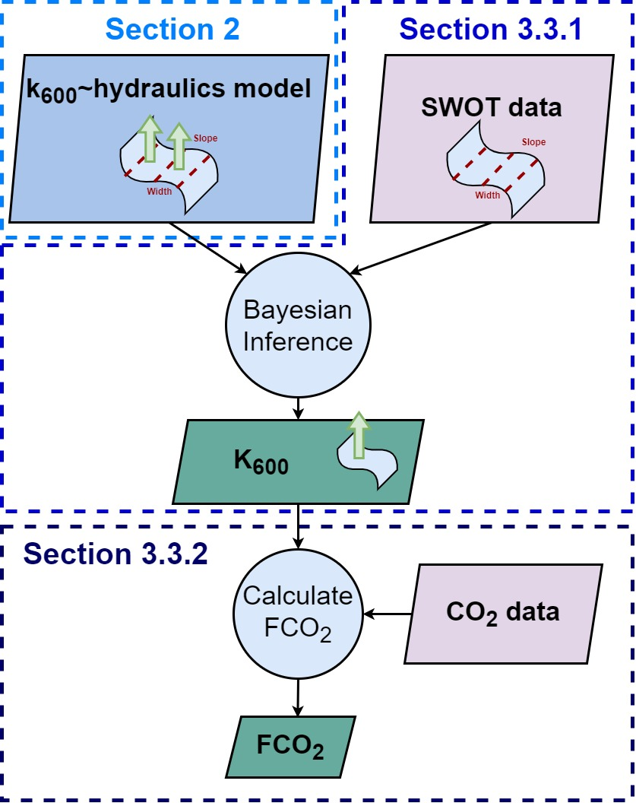
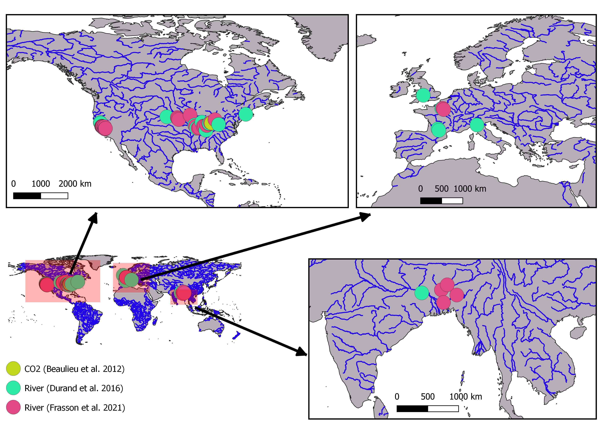
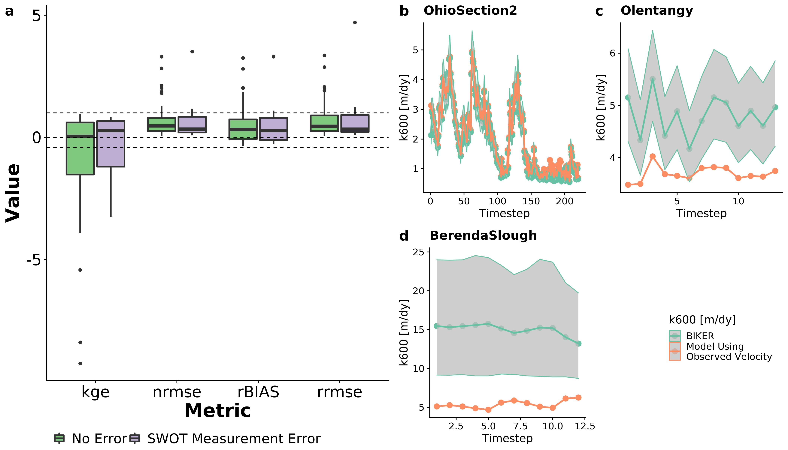
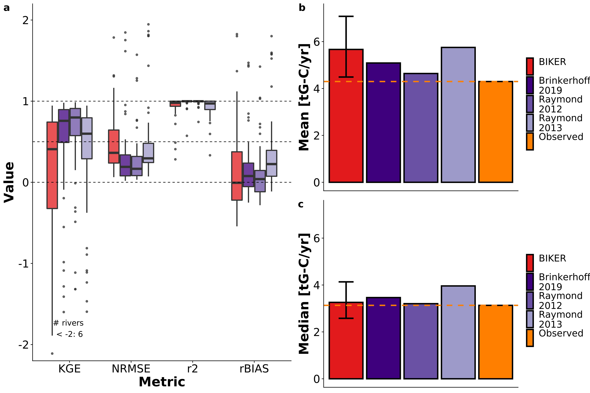

```{r setup, include=FALSE}
knitr::opts_chunk$set(echo = TRUE)
```

## Key Points
- The BIKER (Bayesian Inference of the $k_{600}$ Exchange Rate) algorithm predicts gas exchange velocity and $CO_2$ fluxes solely from simulated SWOT data without calibration
- BIKER is robust to measurement errors implicit in SWOT river measurements
- BIKER will allow for novel study of gas exchange spatiotemporal dynamics after SWOT's launch

## Keywords
gas exchange, fluvial geomorphology, remote sensing, open-channel flow, SWOT, biogeochemistry

## Abstract
Extensive research over the past two decades has shown that the global river network emits significant amounts of greenhouse gas via gas exchange. Despite much progress, there is still large uncertainty in the temporal dynamics of gas exchange and thus carbon emissions to the atmosphere. Much of this uncertainty stems from uncertainty in gas exchange velocity $k_{600}$ (the rate of this diffusive transport). We propose that the NASA/CNES/USKA/CSA SWOT satellite, set to usher in a new age of hydrology research at the global scale, can provide similarly transformative insights to fluvial gas exchange modeling upon launch in 2022. Here, we present work inferring $k_{600}$ from synthetic future SWOT observations without in situ calibration. We exploit the unique geomorphology of SWOT-observable rivers to develop a physical model of gas exchange that is remotely sensible and explains `r round(modelsWIDE[modelsWIDE$name == 'reynolds-eD',]$r2,2)*100`% of variation in $k_{600}$ We then couple this model with established Bayesian inference techniques to develop BIKER, the 'Bayesian Inference of the $k_{600}$ Exchange Rate' algorithm. We validate BIKER on `r nrow(results_k600_rivs[results_k600_rivs$errFlag == 0,])` SWOT-simulated rivers and 166 discrete measurements of river gas exchange, yielding an algorithm that predicts the $k_{600}$ timeseries solely from SWOT observations with a by-river median Kling-Gupta Efficiency of `r round(median(results_k600_rivs[results_k600_rivs$errFlag==0,]$KGE), 2)`. **get more impressive skill score than KGE** Similar to Bayesian remote sensing algorithms for SWOT, BIKER is better at reproducing the temporal dynamics of gas exchange (median correlation coefficient of `r round(median(results_k600_rivs[results_k600_rivs$errFlag==0,]$r), 2)`), than the absolute rates of exchange (median relative bias of `r round(median(results_k600_rivs[results_k600_rivs$errFlag==0,]$rBIAS), 2)*100`%). Finally, we show BIKER is robust to measurement errors implicit in the SWOT data. With SWOT set to launch in late 2022, we suggest that BIKER will be useful in mapping the global-scale spatiotemporal dynamics of fluvial gas exchange in large rivers.

## 1 Introduction
Natural systems play a critical role in the budgeting and accounting of the global carbon cycle under climate change. Following @colePlumbingGlobalCarbon2007, the global river network is recognized to emit substantial amounts of carbon to the atmosphere via evasion (gas exchange driven by a diffusion gradient and near-surface turbulence), in addition to their long understood role in transporting carbon to the oceans via downstream advection. Current estimates of total carbon dioxide evasion ($FCO_2$) to the atmosphere from the global river network vary from 650-2000 Tg C/yr [*Liu accepted*; @lauerwaldSpatialPatternsCO22015; @raymondGlobalCarbonDioxide2013], with 167 Tg-C/yr coming from mountain streams alone [@horgbyUnexpectedLargeEvasion2019]. Despite rivers' incredibly small percentage of the global land surface [0.67%- *Liu accepted*], this C flux is on par with the total oceanic $CO_2$ uptake rate [@gruberOceanicSinkAnthropogenic2019; @horgbyUnexpectedLargeEvasion2019] and the global forest carbon uptake rate [@panLargePersistentCarbon2011].

River $CO_2$ evasion is increasingly better constrained and is clearly a critical component of the global carbon cycle. Equation 1 represents this riverine flux given $\delta CO_2$ (the gas concentration gradient between the water $CO_{2_{water}}$ and the air $CO_{2_{air}}$) and the gas exchange velocity *k*. Consult Appendix A for variable nomenclature used throughout this study.

$$FCO_2=k* \delta CO_2 \mathbf{(1)}$$

There is a robust existing literature exploring spatiotemporal patterns in $\delta CO_2_{water}$ [e.g. @ahoDistinctConcentrationdischargeDynamics2021; @ahoDifferentialResponseGreenhouse2019; @crawfordCO2TimeSeries2017; @peterScalesDriversTemporal2014; @ranDynamicsRiverineCO22017; @rocher-rosLandscapeProcessDomains2019; @raymondAtmosphericCO2Evasion2000; @liuHydrologicControlsPCO22018a]. This work has lead to recent river-reach explicit modeling of $\delta CO_2$ using global hydrography datasets at up to monthly temporal resolutions [@horgbyUnexpectedLargeEvasion2019; @brinkerhoffLakeMorphometryRiver2021; @saccardiImprovingPredictionsStream2021; *Liu accepetd*], but an equivalently sophisticated representation of $k_{CO_2}$ is still lacking. As equations 1 and 2 dictate, $\delta CO_2_{water}$ and $k_{CO_2}$ share the burden of calculating $FCO_2$ and therefore these next-generation models will have to contend with this discrepancy, which is directly dictated by the lack of direct measurements of global river hydraulics.

The structure of equation 1 necessitates that calculations of $FCO_2$ are highly sensitive to measurements/estimates of *k*. However, *k* can only be directly calculated via a known gas concentration gradient, eddy-covariance measurements, or tracer additions to the stream [@hallGasExchangeStreams2020]. In trying to constrain the global fluvial $FCO_2$ flux across millions of rivers, this calculation is impossible, and necessitates the use of predictive models for *k* that are based on easily obtained river hydraulic properties. In that vein, there have been over 20 empirical models developed to predict *k* from river hydraulics, generally using some combination of mean velocity $\bar{U}$, shear velocity $U_*$, width $W$, depth $H$, and slope $S$ as predictors [@hallGasExchangeStreams2020; @wangPhysicallyBasedScaling2021]. These models usually predict $k_{600}$, or *k* normalized by a Schmidt number (*Sc*) of 600. This is to remove the effect of water temperature and gas type from predictive models, as warmer waters and lower *Sc* numbers both increase gas exchange rates [@hallGasExchangeStreams2020]. Specifically, $k_{600}$ reflects the $k_{CO_{2}}$ at 20 degrees Celsius. Through this normalization, these models focus solely on geormorphic explanantions for variation in *k* [@hallGasExchangeStreams2020].

Applying these *k* models across watersheds, regions, or continents is called ‘upscaling.’ This upscaling gives the impossible-to-measure *k* term in Equation 1 for any arbitrary number of rivers, but also changes the base parameters that ultimately control the final estimate of $FCO_2$. That is, by making *k* a function of hydraulics, $FCO_2_{upscaled}$ is now a direct function of river hydraulics. This functional relationship is described in equation 2. It suggests that $FCO_2$ estimates are not only at the mercy of the accuracy and spatiotemporal resolution of $\delta CO_2$, but also the accuracy and resolution of our river hydraulics estimates.

$$FCO_{2_{upscaled}}=f(k_{CO_2}, \delta CO_2)=f(\bar{U}, H, S, W, \delta CO_2) \mathbf{(2)}$$

Global upscalng has been attempted inthe literature. @raymondGlobalCarbonDioxide2013, @lauerwaldSpatialPatternsCO22015, and @horgbyUnexpectedLargeEvasion2019 all relied on $k_{CO_2}$ values indirectly estimated using mean annual streamflow models and hydraulic scaling equations to predict the hydraulic terms to in turn predict $k_{CO_2}$, while @borgesGloballySignificantGreenhousegas2015 used a combination of the above method and a constant $k_{CO_2}$ in space and time to upscale over Africa. In all of these foundational studies, the temporal dynamics of $k_{CO_2}$ (and thus dynamics in $FCO_2$) were ignored because of hydraulic data limitations. It has been shown at the field-scale that temporal dynamics of gas exchange can vary widely from site to site [@wallinSpatiotemporalVariabilityGas2011], but it has remained impractical to obtain temporally explicit $k_{CO_2}$ at continental-to-global scales. More recently, *Liu etal accepted* performed a first assessment of monthly temporal dynamics in the global river $CO_2$ flux, though they relied on modeled streamflow and used the same model for $k_{600}$ as previous studies [@raymondGlobalCarbonDioxide2013] to achieve this.

@wangPhysicallyBasedScaling2021 recently attempted to address this global *k* problem by simulating $k_{O_2}$ in 35 rivers of many sizes (widths ranging from 0.23–349m) using a stream metabolism model [@applingOvercomingEquifinalityLeveraging2018] and in situ dissolved oxygen (DO) datasets to infer what $K_{O_2}$ must have been to produce their 'observations'. They then compared this simulated dataset against direct measurements of *k*, finding similar performance and parameter values against process-based models of gas evasion. However, they were still limited by a lack of direct hydraulic measurements and had to rely on hydraulic scaling equations to estimate river depth and velocity. Even though approaches like @wangPhysicallyBasedScaling2021's are incredibly useful for expanding our mechanistic understanding of gas exchange, they are less useful for global upscaling purposes as they rely on highly detailed in situ DO data for every river [@hallGasExchangeStreams2020].

We have established that literature has a reasonably good understanding of $\delta CO_2$ and a poor understanding in $k_{600}$ (and therefore $k_{CO_2}$) across large areas and in time. In theory, the discrepancy between the quality of our $\delta CO_2_{water}$ and $k_{CO_2}$ estimates could be alleviated if direct hydraulics measurements (and in turn $k_{CO_2}$ via equation 2) were available at the global scale at a sufficient temporal resolution. This is turn would also address the uncertainty regarding continental-to-global scale temporal dynamics of gas exchange noted earlier. Conveniently, these hydraulic data will soon be available via the upcoming NASA/CNES/UKSA/CSA Surface Water and Ocean Topography (SWOT) satellite mission. SWOT is expected to launch in 2022 and provide the world's first direct measurements of global water surface extent and elevation (and therefore water surface slope) at novel temporal resolutions. SWOT is a wide swath radar interferometer and will sample rivers every 1 to 7 days per 21 day repeat cycle, measuring rivers wider than 100m with a goal of expanding this to rivers at least 50m wide [@biancamariaSWOTMissionIts2016]. Via its direct hydraulic measurements, SWOT is expected to usher in a sea change in global-scale hydrology, and could similarly transform fluvial biogeochemsitry if techniques are developed to ingest SWOT data and infer *k*. In this context, we borrow tools from fluvial geomorphology and existing SWOT algorithms to answer the following two questions:

1) Can we develop a physically-based hydraulic model for $k_{600}$ unique to SWOT-observed rivers?
  
2) Can we exploit such a model to infer $k_{600}$ (and its uncertainty) solely from SWOT observations?

To answer this first question, we use hydraulic geometry- the fundamental geomorphic relationships between streamflow and channel shape [@leopoldHydraulicGeometryStream1953; @gleasonHydraulicGeometryNatural2015] to develop a process-based model for large-river (here defined as wider than 50m to align with SWOT) $k_{600}$. We then take these findings and explore the second question by implementing this hydraulic model, which in turn defines $k_{600}$, within an algorithm named BIKER ('Bayesian Inference of the $k_{600}$ Evasion Rate') to infer $k_{600$ solely from SWOT measurements. The goal of BIKER is to require no in situ inputs of any kind (although in situ data could be ingested and would improve results) such that it is globally implementable on any SWOT-observable river. We validate BIKER on `r nrow(results_k600_rivs[results_k600_rivs$errFlag == 0,])` SWOT-simulated rivers (as SWOT has not yet launched) and explore BIKER's robustness to the expected measurement errors implicit in the satellite's observations. Finally, we also couple BIKER's $k_{600}$ estimates with $\delta CO_2$ to predict gas fluxes and compare these against established literature methods that are reliant on in situ hydraulic measurements.

This paper is split into two distinct parts: gas-exchange theory/model development (section 2) and BIKER algorithm development/validation (section 3). Section 3 is fundamentally dependent on the results presented in section 2, therefore section 2 presents both theory and results. Both sections detail the data used. We conclude with a discussion (section 4) that encompasses both gas exchange theory and remote sensing. We also provide a flowchart detailing the entire study as Figure 1.



## 2 Prediciting $k_{600}$ from large-river hydraulic geometry
To predict $k_{600}$ in the large rivers that SWOT will observe, we start from an established process-based model for $k_{600}$, impose hydraulic assumptions that are valid in SWOT-observable rivers, and obtain a model we empirically test. Following a description of the data (section 2.1), we outline established models (section 2.2) and then step through our hydraulic assumptions to arrive at an equation that is compatible with SWOT measurements (section 2.3). We then empirically validate the model (section 2.3)

### 2.1 Data
We develop our hydraulic model for $k_{600}$ using multiple datasets of measured $k_{600}$ and stream hydraulics collected from the literature. In total, we obtain 763 measurements of $k_{600}$, with 701 of these measurements previously gathered by @raymondScalingGasTransfer2012 and @ulsethDistinctAirWater2019. The remaining measurements come from @churchillPredictionStreamReaeration1964 and @owensReaerationStudiesStreams1964. See Table S1 for a complete list of the studies that collected these measurements. All $k_{600}$ measurements come from tracer studies and thus define $k_{600}$ at the reach scale.

In addition to hydraulics measured alongside $k_{600}$ and reported above, we expand our dataset of stream hydraulics using a previously published compilation of in situ hydraulic measurements [@brinkerhoffReconcilingAtaStationAtManyStations2019]. That dataset contains over 530,000 unique measurements of river channel velocity, width, and discharge from across the continental United States, originally made to calibrate United States Geological Survey (USGS) streamgauge rating curves and made public by the USGS. This dataset is used to calculate how frequently SWOT observable rivers meet our large-river hydraulic assumptions (section 2.2).

### 2.2 Process-based hydraulic modeling of river *k*
*k* scales with near-surface turbulence in turbulent streamflows [@hallGasExchangeStreams2020], and extensive field and laboratory experiments have converged on the 'small-eddy model' as derived by @lamontEddyCellModel1970 and empirically anticipated by @calderbankContinuousPhaseHeat1961. This model scales *k* via the smallest-scale turbulent eddies and has been repeatedly empirically validated in freshwater systems [e.g. @katulStructureFunctionModel2018; @lorkeUnifiedScalingRelation2006; @zappaEnvironmentalTurbulentMixing2007; @zappaVariationSurfaceTurbulence2003; @moogStreamReaerationNonuniform1999; @vachonRelationshipNearsurfaceTurbulence2010; @tokoroHighGastransferVelocity2008; @wangPhysicallyBasedScaling2021]. The small-eddy model is provided as equation 3, where $\epsilon$ is the dissipation rate of near-surface turbulence, $v$ is the kinematic viscosity, and *Sc* is the Schmidt number.

$$k\propto Sc^{-1/2}(v\epsilon)^{1/4} \mathbf{(3)}$$
Some laboratory and field observations additionally suggest that open channel flows with small bed roughness do not exhibit homogeneous surface dissipation at their air-water interface [@moogAirWaterGasTransfer1999; @talkeTurbulentKineticEnergy2013]. Given this observation, @moogAirWaterGasTransfer1999 proposed an extension to the small-eddy model, additionally scaling $k_{600}$ using a shear Reynold's number formulation. This is equation 4 and is referred to here as the 'Reynolds extension' model. The Reynolds model is hypothetically useful in low-turbulence scenarios where a relative lack of large-scale eddies effectively 'filter out' the number of small-eddies that actually reach the interface and initiate gas exchange [@talkeTurbulentKineticEnergy2013]. While scaling *k* via a shear Reynold's formulation is sometimes done to parameterize wave-breaking gas exchange models in the open ocean  [@brumerWaveRelatedReynoldsNumber2017; @zhaoDependenceWhitecapCoverage2001; @zhaoEffectWindWaves2003], it is infrequently done in rivers. In the context of BIKER, we chose to test this model because large, SWOT-observable rivers are generally the smoothest, least-turbulent flows along the stream-to-ocean continuum where small eddies might not reach the surface. Further, to our knowledge, this Reynolds extension model has never been empirically tested in predicting river *k*, aside from confirming that large-scale eddies differentially move turbulence to the surface in a large river [@talkeTurbulentKineticEnergy2013].

$$k \propto Sc^{-1/2}(v\epsilon)^{1/4}(\frac{U_*H}{v})^{3/8} \mathbf{(4)}$$
Equations 3 and 4 both rely on $\epsilon$, which is non-trivial to measure. When working at large scales, a commonly used $\epsilon$ model assumes that all turbulence is generated at the bed and transported to the air-water interface via the log-law-of-the-wall [equation 5- @lorkeUnifiedScalingRelation2006; @nezuTurbulenceOpenChannel1993]. Another approach specific to fluvial settings models *k* via 'form-drag dissipation' (equation 6) which is equivalently the total stream power per unit mass water. This normalized stream power captures the bulk frictional resistance (and thus energy dissipation) via channel banks, meanders, bars, etc. that is unique to fluvial systems [@moogStreamReaerationNonuniform1999]. Authors have since shown that equation 6 can reasonably predict *k* in rivers and streams [@raymondScalingGasTransfer2012; @ulsethDistinctAirWater2019; @wangPhysicallyBasedScaling2021].

$$\epsilon = \epsilon_S = \frac{U_*^3}{H} \mathbf{(5)}$$
$$\epsilon = \epsilon_D = gS\bar{U} \mathbf{(6)}$$

### 2.3 Deriving a large-river $k_{600}$ model
Given the theoretical context provided in Section 2.2, we now turn to SWOT-observable systems specifically. Rivers and streams change predictably along their longitudinal profile from headwater to ocean, and we can exploit the hydraulic geometry of large rivers at the end of this continumn to estimate *k* in SWOT-observable systems. In general, as river size increases, channels become more rectangular, their shapes elongate (becoming wider quicker than they become deeper) and their hydraulic radii begin to approximate their mean flow depth, i.e. $R_h \approx H$ **[CITE]**. This is a common assumption in hydraulic and geomorphic modeling of large rivers, and flows in a SWOT-observable river flow have an average $\frac{R_h}{H}$ ratio of `r HG_swot$mean` and standard deviation of `r HG_swot$sd` (n = `r HG_swot$n`; see Text S1 for how we built this dataset). We refer to these rivers as 'hydraulically-wide'.

We therefore assume that all SWOT-observable rivers are hydraulically-wide to derive a model for gas exchange. The overall goal is to reduce the equations down to their fundamental parameters, identifying which terms are SWOT observable and limiting the number of terms not directly measurable via SWOT. To do this, we impose $\epsilon=\epsilon_D$ and $R_H=H$ on the Reynolds extension model and arrive at equation 7 (with statistical coefficient $\beta_1$). Equation 7 thus define gas exchange velocity solely as a function of slope, mean flow depth, and mean flow velocity. This is theoretically valid only in a hydraulically-wide channel.

$$k_{600}=\beta_1(gS)^{7/16}\bar{U}^{1/4}H^{9/16} \mathbf{(7)}$$

We also test the performance of three other models for predicting *k* in hydraulically-wide channels via the other three unique combinations of equations 3-4 and equations 5-6. T While the complete model derivations and results for the four models are provided in Text S2 and Figure S1, the final and best-performing model (equation 7) is presented and used below.

### 2.4 Model validation
With equation 7 derived, we now empirically its strength of fit for hydraulically-wide river flows. We validate on the dataset of in situ measurements of $k_{600}$, after filtering for measurements made in hydraulically-wide channels, which was defined as flows whose hydraulic radius was within 1% of their mean flow depth. All told, this amounts to `r n` direct measurements of hydraulically-wide $k_{600}$. Equation 7 is assessed via the coefficient of determination ($r^2$) and plotted in Figure 2. Note that Figure 2 axes are plotted in logarithmic space only for visualization: model fit and validation (via $r^2$) were calculated in linear space as their models dictate.


Figure 2 shows that equation 7 explains `r round(modelsWIDE[modelsWIDE$name == 'reynolds-eD',]$r2, 2) * 100`% of variation in observed $k_{600}$ in hydraulically-wide rivers and accurately captures the scaling dynamics of observed $k_{600}$ as well. While the individual residuals can be quite large, the overall scaling of $k_{600}$ with river hydraulics is strongly captured, remembering that Figure 2 is plotted in logarithmic space. Compared to other combinations of equations 3-6 (Figure S1), there is also less bias in the estimates thanks to the addition of the Reynold's number scaling for low-turbulent flows (as expected). The success of this model in hydraulically-wide channels provides us with a strong physical-model for gas evasion built with SWOT in mind. The river hydraulics terms in equation 7 ($\bar{U}$, $H$, and $S$) can either be directly measured or reasonably inferred from SWOT measurements, effectively opening the door for remotely sensing the gas exchange velocity. This is explored next.

## 3 Exploiting equation 7 to remotely sense gas exchange velocity
We have shown that scaling $k_{600}$ via equation 7 should provide a reliable basis for hydraulically-wide rivers with a defined error structure. Further, equation 7 has only three non-directly-remotely-sensible terms: $k_{600}$, mean flow depth, and mean flow velocity. Conveniently, techniques to simultaneously infer mean flow depth and velocity from SWOT data (among other parameters) have been established over the last decade to infer streamflow from SWOT's measurements [e.g. **GLEASON & SMITH 2014**; @andreadisConstrainingAssimilationSWOT2020; @brinkerhoffConstrainingRemoteRiver2020; @durandEstimatingReachaveragedDischarge2014; @garamboisInferenceEffectiveRiver2015; @gleasonRetrievalRiverDischarge2014a; @garamboisVariationalEstimationEffective2020; @brissetAssimilationAltimetricData2018; @hagemannBAMBayesianAMHGManning2017; @larnierRiverDischargeBathymetry2020a; @oubanasDischargeEstimationUngauged2018]. For BIKER, we follow the work developed by @hagemannBAMBayesianAMHGManning2017, @brinkerhoffConstrainingRemoteRiver2020, and @durandEstimatingReachaveragedDischarge2014 to infer $k_{600}$, channel depth and velocity from SWOT observations using a modified form of Manning's equation. Following a description of the data used (section 3.1), we detail algorithm development and experimental design (section 3.2) and then we present the validation results (section 3.3).

### 3.1 Data


To validate BIKER, we cannot use actual SWOT measurements as SWOT has yet to launch. In the hydrology literature, it has become standard practice to benchmark SWOT-related algorithms on "SWOT-like" data [@durandIntercomparisonRemoteSensing2016]. We use 47 SWOT-simulated rivers for validation, where these simulated rivers are simply reach-averaged hydraulic model outputs where the water surface heights, slopes, and widths are labelled as RS observations and are used as the sole inputs to BIKER. These datasets are created using standard hydraulic models forced with known inflows and measured bathymetry to model the hydraulic response of the rivers, and then those terms visible to SWOT were extracted to produce hydraulically realistic synthetic observations. These data were published by @frassonExploringFactorsControlling2021 and @durandIntercomparisonRemoteSensing2016 as benchmarking datasets to explore remote sensing of discharge (RSQ) algorithm performance for the SWOT mission.

We validate BIKER under two different 'error scenarios'. While SWOT will provide river surface measurements of novel quality and resolution, as with all remote sensing products there are expected errors that will be implicit in these measurements. Here, we validate BIKER under a 'no-measurement-error' scenario that reflects an unrealistic measurement as if SWOT has perfect accuracy and precision: we use the hydraulic model output directly as a first test of algorithm validity. `r nrow(results_k600_rivs[results_k600_rivs$errFlag == 1,])` of these rivers are then additionally validated under a 'measurement-error' scenario that more closely mimics expected SWOT by adding realistic radar errors and sampling along the satellite’s future ground track. SWOT river error modeling was developed by @durandHowWillRadar2020 and then applied to these `r nrow(results_k600_rivs[results_k600_rivs$errFlag == 1,])` rivers by @frassonExploringFactorsControlling2021. This error modelling is non-trivial and computationally expensive, and thus we rely on these previously published data. 

For $CO_2$ evasion and carbon emissions calculations, we use 26 bi-weekly dissolved $CO_2$ samples collected by @beaulieuControlsGasTransfer2012 at one location in the Ohio River for one calender year from 2008-2009 (Figure S2). Note that this $CO_2$ data is for the Ohio River only but was applied to all rivers to provide a physically realistic signal for $CO_2$ fluxes with meaningful seasonality and dynamics. Therefore, the raw carbon emissions estimates presented in this paper are completely meaningless in the context of actually measured carbon emissions from these rivers, but are better than specifying $CO_2$ concentrations devoid of context. These data are necessary as we are interested in the effect of BIKER $k_{600}$ errors on eventual fluxes and comparing these fluxes with published methods. Therefore, applying these 'unit' $CO_2$ values allows for such a comparison by providing a realistic timeseries.

### 3.2 Section 3 methods
#### 3.2.1 BIKER
BIKER, and Bayesian inference in general, starts from Bayes rule (equation 8), where $\Theta$ is some set of non-remotely-sensible parameters we want to solve for (including $k_{600}$), *x* is the observed data, $f(x|\Theta)$ is the sampling model where data are conditional on the parameters, and $p(\Theta)$ is the joint prior distribution of the parameters. Therefore, we are interested in solving for $p(\Theta|x)$, or the 'posterior' distribution. Note that $p(x)$ is usually computationally intractable to integrate exactly, but Bayesian inference tools require only the proportionality to be specified: $p(\Theta|x) \propto f(x|\Theta)p(x)$. Sampling algorithms are then used to approximate the posterior distribution, as is done in BIKER.

$$p(\Theta|x) = \frac{f(x|\Theta)p(\Theta)}{p(x)} \mathbf{(8)}$$
The heart of BIKER is its reformulation of the $k_{600}$ model (equation 7) as a Bayesian sampling model that is conditional on the non-remotely-sensible parameters (i.e. $f(x|\Theta)$). This is similar to the 'McFLI' ('Mass-Conserved Flow Law Inversion') logic used in some SWOT RSQ algorithms [@gleasonTrackingRiverFlows2017]. To start, we write $k_{600}$ as a function of SWOT-observables $W$ and $S$. This algebra is carried out using equation 7, the fitted value for $\beta_1$ from Figure 2 (`r round(modelsWIDE[modelsWIDE$name == 'reynolds-eD',]$coef,2)`), and Manning's equation for mean flow velocity ($\bar{U}=\frac{1}{n}R_h^{2/3}S^{1/2}$). Following section 2.3, we continue to assume that the channel is hydraulically-wide ($R_h = H =\frac{A}{W}$). To leverage additional SWOT data, the wetted channel area *A* is further split into the the SWOT-unobservable portion $A_0$ and SWOT-observable portion $dA$ following @durandEstimatingReachaveragedDischarge2014 and @hagemannBAMBayesianAMHGManning2017 where $dA_{it} = \sum_{t':W_{t'}\le W_t}{W_{t'} \delta H_{t'}}$ for cross-section *i* and timestep *t*.

All of this algebra simplifies to equation 9. Conveniently, $k_{600}$ as measured by tracer additions to a stream is inherently a reach-scale quantity (in a mass-conserved reach). Therefore, equations 7 and 9 both yield a reach-scale $k_{600}$ (i.e. $k_{600_i}=k_{600}\forall i$). This lowers the number of parameters BIKER must infer and makes the problem much better constrained.

$$\begin{eqnarray} k_{600_t} = 62.82 g^{7/16}S_{it}^{9/16}\frac{1}{n_i}^{1/4}(\frac{A_0_i+dA_{it}}{W_{it}})^{35/48} \end{eqnarray} \mathbf{(9)}$$
Next, equation 9 is written as a Bayesian sampling model, in which all of the SWOT observations are sampled from the unknown model parameters ($A_0_i$, $k_{600_t}$, and $n_i$). This is equation 10 after describing everything as normal distributions of the log-transformed terms. $\sigma_{k_{600}}^2$ refers to the total uncertainty implicit in equation 9. This uncertainty arises from 1) parameter uncertainty in equation 7, 2) Manning's equation, and 3) the rectangular channel assumption.

$$\left[log(62.82) + \frac{7}{16}log(g) + \frac{9}{16}log(S_{i,t}) - \frac{35}{48}log(W_{i,t})\right] \sim normal\left(\left[log(k_{600_t})+\frac{1}{4}log(n_i)-\frac{35}{48}log(A_0_i+dA_{i,t})\right], \sigma^2_{k_{600}}\right) \mathbf{(10)}$$
Equations 8 and 10 also necessitate that we specify prior distributions for the parameters $A_0_i$, $k_{600_t}$, and $n_i$. Prior distributions formalize the a priori estimates and uncertainties for the non-remotely-sensed terms. More intuitively, BIKER priors represent our 'prior river knowledge' of what $A_0_i$, $k_{600_t}$, and $n_i$ probably are for some river since they cannot be directly remotely sensed. This is analogous to the 'empirical Bayes approach' to Bayesian inference [@hoffFirstCourseBayesian2009]. Our goal in prior specification was to rely on absolutely no in situ information such that we could run this method on any river on Earth solely using SWOT observations. In theory, more informed priors via various a priori information about a specific river will improve BIKER performance, but here we chose to test the fully generalized algorithm. Therefore, the validation presented here is a 'worst-case scenario', wherein BIKER performance should improve with better prior information on the river. In that context, we used a variation of the prior specification method developed by @brinkerhoffConstrainingRemoteRiver2020, who developed geomorphic 'river types' with distinct prior sets for $A_0_i$ and $n_i$. These priors are assigned to a river solely using SWOT data *W* and *S*, therefore meeting our needs for complete global implementability. Prior assignment for $k_{600_t}$ was developed similarly (all prior specifications are elaborated in Text S3).

With the sampling model described ($f(x|\Theta)$ = equation 10) and priors $p(x$) specified (Text S3), a joint posterior distribution conditional on the SWOT observations ($p(\Theta|x) \propto f(x|\Theta)p(x)$) is therefore also specified. To approximate this distribution, we use a Markov Chain Monte Carlo (MCMC) algorithm implemented using the Stan probabilistic programming language. Specifically, Stan uses a Hamiltonian Monte Carlo sampler which reduces computation time relative to other sampling algorithms [@hagemannBAMBayesianAMHGManning2017].

#### 3.2.2 BIKER validation
We validate BIKER, assuming no measurement error, on `r nrow(results_k600_rivs[results_k600_rivs$errFlag == 0,])` SWOT-simulated rivers using daily simulated hydraulics. We also re-validate BIKER under the 'measurement-error' scenario using the `r nrow(results_k600_rivs[results_k600_rivs$errFlag == 1,])` rivers with [@frassonExploringFactorsControlling2021]'s SWOT error model to corrupt the hydraulics to mimic realistic SWOT measurements (widths, heights, and slopes). These data were outlined in section 3.1.

BIKER is unique in that it can provide a timeseries of $k_{600}$: for each SWOT observation, it yields a unique $k_{600}$. There are, to our knowledge, no datasets of $k_{600}$ over time approaching the temporal density of our simulated SWOT rivers. We therefore apply equation 7 as validated in Figure 2 to specify $k_{600}$ given the true hydraulics of each case and compare BIKER’s inversion to that value: given observed hydraulics, ‘observed’ $k_{600}$ comes from equation 7. Remember that SWOT cannot observe below the water surface and therefore cannot measure $\bar{U}$ or *H* (hence the need for equation 9), and that all SWOT observations contain errors in both space and time (hence equation 10). We acknowledge that there is error in equation 7 as shown in Figure 2, but this error can be explicitly parameterized in our Bayesian system. This is elaborated on in section 4.2. Therefore, the BIKER validation presented here is an exercise to see how well the imperfect and partial SWOT observations can infer $k_{600}$ given the hydraulic assumptions in equation 9 and uncertainty in the data itself.

Therefore, we validate BIKER as a timeseries of $k_{600}$ for each river using the BIKER posterior means. Our error metrics consider the timeseries nature of the problem and are formally defined in Table S2. They consist of the following:

- Correlation coefficient *r* to quantify accuracy of BIKER's temporal dynamics
- Root mean square error normalized by the observed mean (NRMSE) and prediction bias normalized by the observed mean (rBIAS) to assess bias
- Kling-Gupta Efficiency (KGE). KGE is frequently used to assess streamflow prediction and simultaneously assesses accuracy in both bias and dynamics. While a value greater than -0.41 means the model outperforms a uniform prediction of the mean [@knobenTechnicalNoteInherent2019], generally KGE scores are interpreted as being meaningful in ungauged settings if > 0.

#### 3.2.3 Carbon emissions validation
**THis is colin's edits. Might need some reorg**
It is one thing to accurately model the temporal dynamics of $k_{600}$ as above, but researchers are often most interested in the actual carbon emitted from river to atmosphere. Per equation 2, this is done using river hydraulic models to estimate $k_{CO_2}$ and in turn $FCO_{2_{upscaled}}$. However, streamflow data and/or model outputs are more readily modeled at the global scale than river channel geometry, and so upscaling models usually predict $\bar{U}$ and *H* as functions of streamflow (*Q*) using hydraulic geometry (HG) scaling relationships. This effectively reduces equation 2 to equation 11. It is worth stressing that these literature upscaling workflows rely on in situ streamflow records and/or high-quality streamflow routing models (unlike BIKER, which only requires a river be SWOT-observable).

$$FCO_{2_{upscaled}}=f(k_{CO_2}, \delta CO_2)=f(Q, \delta CO_2) \mathbf{(11)}$$

In that context, we sought to compare BIKER against established methods from the literature for upscaling carbon emissions from river networks (in this case, our `r nrow(results_k600_rivs[results_k600_rivs$errFlag == 0,])`  rivers) So, we pair the 26 biweekly $CO_2$ and water temperature samples from @beaulieuControlsGasTransfer2012 (section 3.1, figure S2) with every 14th set of daily SWOT observations (as the $CO_2$ data is bi-weekly). We then calculate $FCO_2$ using equation 1, an atmospheric $CO_{2_{air}}$ of 390 uatm, and a temperature dependent *Sc* was estimated following Raymond et al. (2012). Finally, we estimate a yearly total carbon emission rate (via $CO_2$ evasion) by applying each river’s mean $FCO_2$ over the river’s surface area and summing all rates across rivers.

BIKER represents a new way of approaching the problem against existing GHG scaling literature. We are therefore interested in how the final fluxes that result from BIKER (Eq 11) compare to literature methods to gauge BIKER’s utility: BIKER is novel, but is it useful? We have the data to test four different models for fluxes: 'BIKER', 'Raymond 2013', 'Raymond 2012', and 'Brinkerhoff 2019'. These latter three approaches all use the same philosophy for $k_{600}$: making hydraulic and geomorphic assumptions to associate $k_{600}$ with observed hydraulics before using the $CO_2$ data as a realistic concentration timeseries to yield fluxes per equation 11. In all three approaches, these observed hydraulics are streamflow, while BIKER uses only SWOT observations. Therefore, the advantages of BIKER in ease of application are clear as SWOT will observe all global rivers wider than 50m while streamflow observations are extremely geographically limited, but BIKER is only attractive if it can produce fluxes with similar errors to published methods. Text S4 and Table S3 fully describe these three literature models.

### 3.3 Section 3 results
#### 3.3.1 BIKER
Figure 4 plots a representative set of the `r nrow(results_k600_rivs[results_k600_rivs$errFlag == 0,])` timeseries of predicted and observed $k_{600}$, assuming no SWOT measurement error. Two rivers each were sampled from the three tertiles of river *KGE* scores (Table S2) for display. Consult Figure S3 for all 47 timeseries plots (assuming no measurement error) and Figure S4 for the 16 rivers with measurement errors. Note that the y axis is normalized by maximum observed values to compare across rivers. In general, the temporal dynamics of $k_{600}$ are reproduced quite well by BIKER, with the highs and lows of evasion correctly inferred by BIKER in the better-performing rivers. Notably, there is sometimes positive bias in the estimates (e.g. both 'middle KGE' rivers). Some rivers yield the correct temporal dynamics, but the magnitude of these values is stretched relative to the observed (e.g. Ohio River). In this example, temporal trends are still reasonably inferred even though the magnitude of the estimates is quite off.


Next, we calculate performance metrics following section 3.2.2 and Table S2. These are presented in Figure 5, which plots the scores for the 47 rivers with no measurement errors as empirical cumulative density functions (eCDFs). Median river $KGE$ is `r round(median(results_k600_rivs[results_k600_rivs$errFlag == 0,]$KGE, na.rm=T),2)` and median river *r* is `r round(median(results_k600_rivs[results_k600_rivs$errFlag == 0,]$r, na.rm=T),2)`. This indicates very strong inference of each river's temporal $k_{600}$ dynamics given that absolutely no in situ information is being used to predict $k_{600}$. NRMSE has a median score of `r round(median(results_k600_rivs[results_k600_rivs$errFlag == 0,]$NRMSE, na.rm=T),2)` and median rBIAS is `r round(median(results_k600_rivs[results_k600_rivs$errFlag == 0,]$rBIAS, na.rm=T),2)`, highlighting that many rivers which have significant positive biases (Figure 4 also confirms this visually). Taken in aggregate, Figures 4-5 indicate that BIKER is quite good at capturing temporal dynamics in $k_600$, however there is often positive bias in its estimates.



Figure 6 compares BIKER results under the 'no-measurement-error' and 'measurement-error' scenarios for the `r nrow(results_k600_rivs[results_k600_rivs$errFlag == 1,])` rivers for which @frassonExploringFactorsControlling2021 provide an error model. Rivers that fall within the purple zone get worse when accounting for measurement error, while rivers in the green get better. Note also that axes are flipped in order to visualize all 'better performances' in the upper-right-corner of each sub-plot. BIKER performs nearly identically, regardless of implicit measurement errors in the inputs to BIKER: points are scattered along the 1:1 line. Overall, these results strongly suggest that BIKER will be robust to the measurement errors that will be implicit in SWOT's observations of river width and slope. Given these results, we deem that SWOT measurement error does not exert a significant influence on BIKER performance and so the results presented for the rest of the manuscript assume no measurement error in order to use all `r nrow(results_k600_rivs[results_k600_rivs$errFlag == 0,])` rivers.

![Figure 6: Comparison of BIKER performance when considering measurement error in the SWOT observations for 16 rivers. Each subpanel is labelled by its performance metric (Table S2). Rivers that fall within the purple zone get worse when accounting for measurement error, while rivers in the green get better. Note also that axes are flipped in order to visualize all 'better performances' in the upper-right-corner of each sub-plot. Black line denotes linear regression while dashed grey line is the 1:1 line.](cache/validation/errorPlot.jpg)

**something something temporal variability**
You need to flesh this out a bit better and stop leaning so heavily on temporality. Feels almost like we're hiding something, which we aren't Colin was not a fan of the prior vs posterior CV eCDFs and also suggested that this should still hold even if we are doing just magntiude.

Given the promising *r* scores across all 47 rivers in Figure 5, we further explore BIKER's ability to infer temporal trends in $k_{600}$. Figure 7a plots a histogram of the slopes of linear regressions between BIKER-predicted $k_{600}$ and observed $k_{600}$. A slope of 1 indicates that BIKER correctly infers the daily flucuations in gas exchange (even if there is bias implicit in these estimates), while a slope well above or below 1 indicates incorrect inference of the temporal dynamics of $k_{600}$. Figure 6a shows that the majority of rivers' slopes approximate 1 (median slope: `r round(median(results_dynamics$Slope),2)`), indicating strong inference of temporal gas exchange trends.


Finally, we explore whether BIKER improves upon the prior with respect to temporal variation in $k_{600}$, here defined using the coefficient of variation ($CV=\frac{SD}{mean}$). This is an essential test of a Bayesian method to determine if SWOT observations have improved our knowledge or if our initial guess proved statistically most useful. Figure 6b plots eCDFs of observed, prior, and posterior $k_{600}$ *CV*, strongly showing that BIKER improves upon the prior information available to us about $k_{600}$. Posterior $k_{600}$ *CV* approximates the observed eCDF and sufficiently 'closes the gap' between our prior knowledge on $k_{600}$ temporal variation and the actually observed variation in $k_{600}$. It must be stressed that this validation was performed using a relatively uninformed prior on $k_{600}$ (Text S3) and that this gap may not be as large in many settings with better prior knowledge. However, Figure 6b confirms that Bayesian techniques can be used to infer temporal variation in $k_{600}$ when good prior or in situ data are not available.

#### 3.3.2 Carbon Emissions
Finally, we carry these $FCO_2$ calculations all the way to annual carbon emissions rates and compare BIKER against established in situ techniques. It is important to remember that only BIKER is completely globally implementable, while the other three models necessarily rely on having a streamflow record or high-quality routed streamflow readily available. Therefore, the HG methods reflect their 'best-case scenarios' while BIKER reflects its worst case scenario, where priors are set entirely from SWOT observations and are generally the least informative they will ever be. This means that BIKER's annual carbon emission estimate can only improve from what is presented here. We also stress again that the raw emissions rates here are largely meaningless as they are calculated from an identical $CO_{2_water}$ timeseries applied to every river. We are principally interested in relative differences between techniques employed.

Figure 8 compares the annual carbon emissions rate (via $F_{CO_2}$) from the rivers using BIKER posterior means and the three streamgauge-based HG models. Surprisingly, BIKER outperforms the gauge-based approaches, nearly correctly inferring the annual carbon emissions rate (`r round(results_fco2_bulk[results_fco2_bulk$key == 'FCO2_BIKER',]$yearlyCFux, 2)` Tg-C/yr for BIKER versus `r round(results_fco2_bulk[results_fco2_bulk$key == 'FCO2_obs',]$yearlyCFux, 2)` Tg-C/yr observed). The three HG models overestimate this emissions rate (`r round(results_fco2_bulk[results_fco2_bulk$key == 'FCO2_raymond2013',]$yearlyCFux, 2)`, `r round(results_fco2_bulk[results_fco2_bulk$key == 'FCO2_raymond2012',]$yearlyCFux, 2)`, and `r round(results_fco2_bulk[results_fco2_bulk$key == 'FCO2_brinkerhoff2019',]$yearlyCFux, 2)`) for 'Raymond 2013', 'Raymond 2012', and 'Brinkerhoff 2019' respectively. Both 'Brinkerhoff 2019' and 'Raymond 2012' fall within the BIKER CIs and are reasonably close to the observed value, while 'Raymond 2013' overestimates the emission rate. BIKER's relatively stronger performance than the in situ HG models is elaborated on in section 4.3. Thus, despite BIKER using absolutely no streamgauge or other in situ data like the other 3 methods do, it provides a strong upscaling estimate of the annual carbon emission rate for the rivers (Figure 8).



## 4 Discussion
### 4.1 Gas exchange in hydraulically-wide rivers
Field studies of gas exchange in wide rivers have suggested that $k_{600}$ behaves differently in these rivers than in steeper and smaller rivers [@ulsethDistinctAirWater2019; @beaulieuControlsGasTransfer2012; @alinPhysicalControlsCarbon2011; @wangPhysicallyBasedScaling2021; @raymondGasExchangeRivers2001a]. While much work has focused on the small-stream side of the stream-to-river continuum, comparatively less work has been done in large systems. Here, we focus on the larger, 'smooth-channel' end of the continuum, using a model for gas exchange that scales $k_{600}$ by both $\epsilon_D$ and a Shear Reynold's number. This model is empirically validated in Figure 3. Specifically, Figure S1 confirms that scaling $k_{600}$ with a Shear Reynold's adaption of the small-eddy model (equation 7) reduces positive bias in the model's predictions of the smallest $k_{600}$ values [where the relative decrease in turbulence reaching the surface is greater than the small-eddy model alone suggests, per equation 7's theoretical basis- @moogAirWaterGasTransfer1999]. Scaling $k_{600}$ via a shear Reynold's number is commonly done to parameterize breaking-wave gas exchange models in the open ocean [@brumerWaveRelatedReynoldsNumber2017; @zhaoDependenceWhitecapCoverage2001; @zhaoEffectWindWaves2003], though this specific to high wind speeds in open ocean. To our knowledge, @moogAirWaterGasTransfer1999's specific setup, which imposes a 'differentially-experienced' surface turbulence theory on the small-eddy model, has never been empirically validated in rivers. Figure 3 provides this empirical verification for hydraulically wide channels, where it's theoretical basis should generally hold. Using our full dataset of $k_{600}$, we also observed this model breaks down when including non-hydraulically-wide rivers (as the theory would suggest). Future tests should also explore other shear Reynold's scaling relations for gas exchange in rivers.

Crucially, we are not accounting for wind-driven gas exchange, which is suggested to play an important role in wide rivers because river surface area is sufficiently large that wind can drive gas exchange [@beaulieuControlsGasTransfer2012; @wangPhysicallyBasedScaling2021; @raymondGasExchangeRivers2001a]. Similarly, none of the existing hydraulics-driven fluvial $k_{600}$ models account for wind-driven gas exchange either. BIKER's outputs can therefore be interpreted as the '$k_{600}$ under low-wind conditions', when surface turbulence is dominated by hydraulics rather than wind. That said, BIKER's flexible implementation is a good start towards eventually coupling hydraulics-driven gas exchange with wind-driven gas exchange. Such a model would likely take a form similar to the conceptual models proposed by @wangPhysicallyBasedScaling2021, chuWindStreamFlow2003, and/or @plateReaerationOpenChannel1984. All three generally propose calculating both a wind-driven *k* and a hydraulics-driven *k* and then weighting each term via parameters. In the case of BIKER, this would necessitate additional parameters that would need to be known a priori for specific rivers. This is left to future work.

### 4.2 Towards remote sensing of global spatiotemporal dynamics of $k_{600}$ in large rivers
To date, the studies exploring the spatiotemporal dynamics of riverine gas exchange have arguably been held back by a lack of data. A few studies have investigated these dynamics, but they have been limited to individual rivers and/or limited field seasons [@hallAirWaterOxygen2012; @sand-jensenCO2DynamicsDanish2012]. For example, @wallinSpatiotemporalVariabilityGas2011 performed a preliminary analysis in northern Sweden relating cross-section specific temporal variability in gas exchange with channel slope, but they were limited to a mean of only 8 measurements per river in a single watershed. While this is a good start, this is obviously not sufficient for further developing process-level understandings of gas exchange at the global-scale.

Therefore, inferring $k_{600}$ from SWOT data is an attractive option to address this problem of limited data. For reference, 95% of the SWOT-visible rivers globally (202,811) will have sufficient SWOT observations along the river to run BIKER at least once every 21 days, with most of the temperate and Arctic rivers having 3+ observations per 21-day cycle [@altenauSurfaceWaterOcean2021]. While BIKER will not directly measure $k_{600}$, it does robustly infer temporal trends in $k_{600}$ and less robustly the absolute magnitude of $k_{600}$ (Figures 4-7) and when coupled with SWOT this much data will provide a novel dataset of $k_{600}$ on a scale never before possible.

With that said, Figures 4, 5, S3, and S4 all highlight a substantial range of algorithm performances across rivers. These differences in performance are likely due to the representativeness of the priors used for that river. This makes sense as Section 2 has effectively reduced $k_{600}$ to a function of hydraulics that are nearly all directly measurable by SWOT. Any resulting bias in BIKER's predictions is likely attributable to either bias in the priors used for the non-remotely sensed terms (equations 9-10) or in the $k_{600}$ model itself (equation 7, including the aforementioned wind errors). For SWOT discharge algorithms, authors have repeatedly shown that the 'quality' of prior river knowledge plays a large role in the success of discharge inversions [@frassonExploringFactorsControlling2021; @andreadisConstrainingAssimilationSWOT2020; @brinkerhoffConstrainingRemoteRiver2020; @tuozzoloEstimatingRiverDischarge2019] and our results here further corroborate this finding.

### 4.3 Coupling BIKER with upscaling workflows
Figure 8 confirms that BIKER is quite successful at predicting annual upscaled carbon emissions from the river network when coupled with $CO_2$ data. This encouraging result has three main implications for future work.

First, figure 8 directly implies that BIKER will be useful when coupled with large-scale $CO_{2_water}$ models, provided these models are accurate. The models would give time and spcae varying gas exchange. **Liu etal in review** and @saccardiImprovingPredictionsStream2021 each propose models that robustly predict reach-scale dissolved $CO_2$ concentrations using two different approaches: machine learning [**Liu et al in review**] and process-based reactive transport modeling [@saccardiImprovingPredictionsStream2021], but both models yield $CO_2$ estimates that would be spatially and temporally consistent with BIKER's output. Our promising results suggest that BIKER could provide additional (and directly inferred) measurements of $k_{CO_2}$ to these models, thereby better informing model results through direct observations. This is likely to be accomplished via data assimilation which has proven useful in using remotly-sensed discharge to improve streamflow routing models [@fengRecentChangesArctic2021a; @ishitsukaCombiningOpticalRemote2020], and of which the @saccardiImprovingPredictionsStream2021 $CO_2$ model takes a similar form.

Second, at the field-scale Figure 8 confirms that we can couple BIKER with in situ gas concentration loggers to produce $FCO_2$ estimates at novel temporal resolutions in SWOT-observable rivers. High temporal fidelity datasets of dissolved $CO_2$ in SWOT-observable rivers now exist [e.g. @ahoHighestRatesGross2021] but no such similar datasets for $k_{CO_2}$ at equivalent temporal resolutions exist. For rivers unobservable by SWOT, we further suggest that BIKER could be run at the field scale (rather than via satellite-based altimeters like SWOT) using arrays of in situ pressure transducers to estimate water surface slope following recent similar work for estimating streamflow [@harlanDischargeEstimationDense2021]. Regardless, both approaches would produce $CO_2_{water}$ and $k_{CO_2}$ datasets at equivalent temporal resolution and allow us to directly calculate daily to sub-daily $CO_2$ fluxes from river reaches.

Finally, Figure 8 also uniquely allows us to directly compare the influence of geomorphic assumptions on total carbon emission rates from river networks, as all other calculations and parameters were held constant across our four tested models (Text S4). Therefore, figure 8 highlights a potentially large source of uncertainty in current river $CO_2$ upscaling estimates: the geomorphic models employed to scale river channel hydraulics with streamflow. In this case, the only difference between the three literature models and the observed estimate in Figure 8 is the specific HG model employed to predict river depth and velocity (Text S4, Table S3. **put some best case/worse case syle writing from the results here**.

## 5 Conclusions
The $CO_2$ flux from the global river network is a major natural component of the global carbon cycle, on par with total forest uptake of $CO_2$ [@panLargePersistentCarbon2011]. Despite much interest and progress, there is still large uncertainty in the temporal dynamics of gas exchange and thus carbon emissions to the atmosphere. Much of this uncertainty stems from uncertainty in gas exchange velocity $k_{600}$ at the global scale. In this paper, we propose that the soon-to-launch SWOT satellite will provide enough hydraulic measurements to analyse the temporal dynamics of $k_{600}$, and therefore allow for a global-scale analysis of spatiotemporal trends in large-river $k_{600}$ once SWOT launches. In that context, we developed 1) a hydraulic model for $k_{600}$ that is nearly entirely SWOT observable and explains `r round(modelsWIDE[modelsWIDE$name == 'reynolds-eD',]$r2,2)*100`% of variation in $k_{600}$, and 2) the BIKER algorithm to infer $k_{600}$ using no on-the-ground information. Validating on `r nrow(results_k600_rivs[results_k600_rivs$errFlag == 0,])` SWOT-simulated rivers, we show show strong recovery of rivers' temporal $k_{600}$ dynamics and a hypothetical total annual carbon emission rate across all `r nrow(results_k600_rivs[results_k600_rivs$errFlag == 0,])` rivers. These results suggest BIKER can be used to infer global-scale, near daily estimates of fluvial gas exchange velocity once SWOT launches in 2022. This in turn will be useful in mapping the global-scale spatiotemporal dynamics of fluvial gas exchange in large rivers.

## 6 Acknowledgements
C.B. Brinkerhoff was funded by a NASA Future Investigators in Earth and Space Science Fellowship (#xxxxxx). C.J. Gleason was supported by NASA SWOT Science Team grant #yyyyyy. The version of BIKER used in this study will be available upon acception. BIKER remains in active development and is available at https://github.com/craigbrinkerhoff/BIKER. All code to build and generate results, figures, and the manuscript is available at https://github.com/craigbrinkerhoff/RSK600. We thank Renato Frasson, Michael Durand, Amber Ulseth, and Jake Beaulieu for generously making their data available for this study. We also thank the entire SWOT discharge working group for their decade-plus body of work which inspired this study.

## 7 Apendix A
*Table A1: Variable description and notation for this study* 

|**Notation**|**Description**|**Calculation (if not directly measured)**|**Units**|
|------------|---------------|-------------------------------|---------|
|$A$|Channel cross-sectional area|NA|$[L^2]$|
|$A_0$|Non-SWOT-observable cross-sectional area|NA|$[L^2]$|
|$\alpha$|Statistical parameter for equation 5 scaling relation|NA|$\frac{m^{1/2}s^{3/4}}{dy}$|
|$\alpha_1$|Statistical parameter for equation 6 scaling relation|NA|$\frac{m^{1/2}s^{3/4}}{dy}$|
|*Bulk carbon efflux*|carbon mass transport rate from river to atmosphere|NA|$[\frac{M}{T}]$|
|$\beta$|Statistical parameter for equation 7 scaling relation|NA|$\frac{m^{-1/4}s^{9/8}}{dy}$|
|$\beta_1$|Statistical parameter for equation 8 scaling relation|NA|$\frac{m^{1/2}s^{3/4}}{dy}$|
|$CO_{2_{water}}$|Water-side $CO_2$ concentration|NA|$[L]$|
|$CO_{2_{air}}$|Atmospheric-side $CO_2$ concentration|NA|$[L]$|
|$dA$|change in cross-sectional area|$\delta H_e*W$|$[L]$|
|$D_m$|Molecular diffusion coefficient|NA|$[\frac{L^2}{T}]$|
|$\epsilon$|Dissipation rate of near-surface turbulence|NA|$[\frac{E}{M*T}]$|
|$\epsilon_S$|log-law-of-the-wall model for $\epsilon$|$\frac{U_*^3}{H}$|$[\frac{E}{M*T}]$|
|$\epsilon_D$|Form-drag model for $\epsilon$|$gS\bar{U}$|$[\frac{E}{M*T}]$
|$FCO_2$|$CO_2$ evasion flux from river to atmosphere|NA|$[\frac{M}{L^2T}]$|
|$FCO_{2_{upscaled}}$|Upscaling estimate of the  global $CO_2$ evasion flux from river to atmosphere|NA|$[\frac{M}{L^2T}]$|
|$g$|gravitational acceleration|9.8|$[\frac{L}{T^2}]$|
|$H$|Mean flow depth|$A/W$|$[L]$|
|$H_e$|Water surface elevation|NA|$[L]$|
|$i$|Cross-section discretization within river reach|NA|NA|
|$k$|gas exchange velocity|NA|$[\frac{L}{T}]$|
|$k_{600}$|gas exchange velocity normalized to $Sc=600$|$(\frac{600}{Sc_k})^{-0.5}k$|$[\frac{L}{T}]$|
|$k_{600_{obs}}$|"observed" gas exchange velocity normalized to $Sc=600$|$k_{600_{obs}}=62.82(gS)^{7/16}\bar{U}^{1/4}H^{9/16}$|$[\frac{L}{T}]$|
|$n$|Manning's roughness coefficient|$\frac{R_h^{2/3}S^{1/2}}{\bar{U}}$|$[\frac{T}{L^3}]$|
|$\uprho$|Density of water|NA|$[\frac{M}{L^3}]$|
|$Q$|River discharge|NA|$\frac{L^3}{T}$|
|$R_h$|Hydraulic radius|$\frac{AW}{2H+W}$|$[L]$|
|$S$|River slope|NA|$unitless$|
|$Sc$|Schmidt number|$\frac{v}{D_m}$|NA|
|$\sigma^2_{k_{600}}$|BIKER uncertainty (posterior distribution standard deviation)|NA|$[L/T]$|
|$t$|timestep discretization within river reach|NA|NA|
|$\Theta$|Bayesian parameter set|NA|NA
|$\bar{U}$|Cross-sectional average velocity|$\frac{Q}{A}$|$[\frac{L}{T}]$|
|$U_*$|Shear velocity|$\sqrt{gSR_h}$|$[\frac{L}{T}]$|
|$\mu$|Viscosity|NA|$[P*T]$|
|$v$|kinematic viscosity|$\frac{\mu}{\uprho}$|$[\frac{L^2}{T}]$|
|$W$|Flow width|NA|$[L]$|
|$x$|Bayesian data set|NA|NA|

## References
