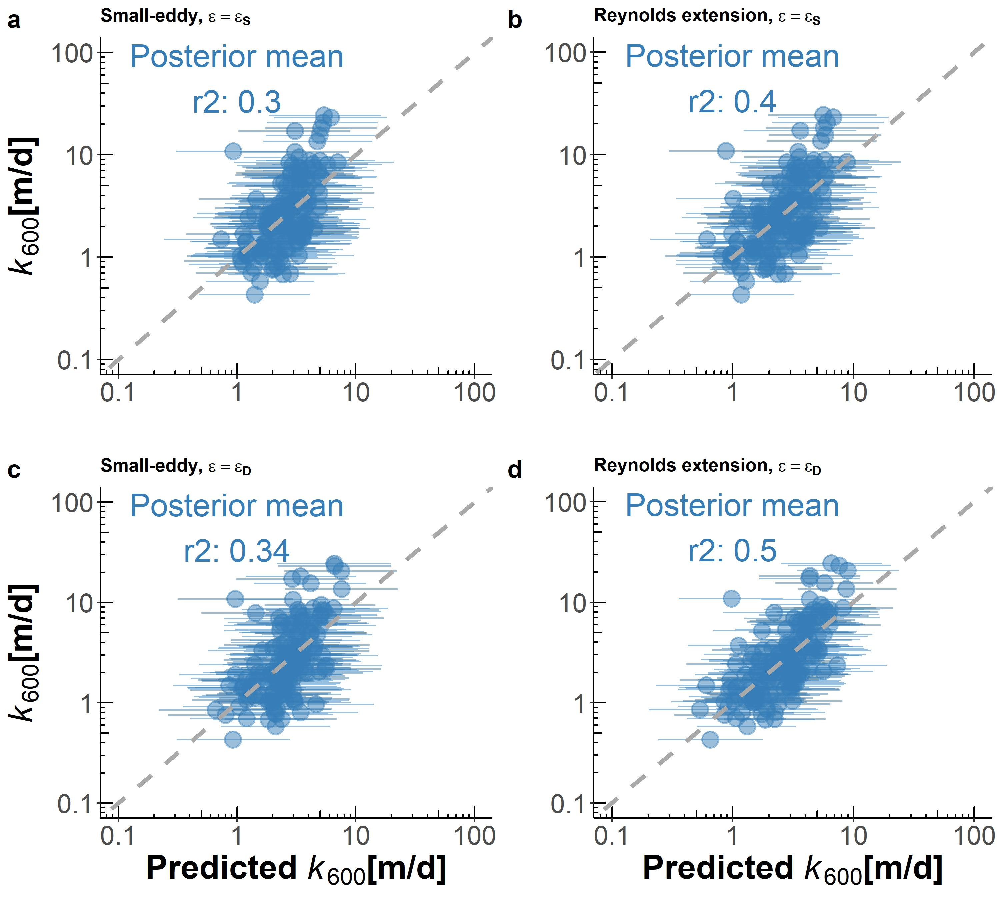

```{r setup, include=FALSE}
knitr::opts_chunk$set(echo = TRUE)
options(scipen=999)
```

## Contents
This supplementary information contains 6 texts, 6 figures and 4 tables.

## Test S1: Estimating how hydraulically wide SWOT rivers are
To quantify the prevalence of hydraulically-wide, SWOT-observable rivers, we used the dataset of field-measured river hydraulics outlined in Section 2.1. That dataset has over 500,000 discrete measurements of river width, velocity, area, and discharge that were made by the United States Geological Survey (USGS) to calibrate streamgauge rating curves. Here, we describe how this dataset was filtered down to `r HG_swot$n` SWOT-observable rivers.

First, we removed all measurements tagged by the USGS as 'poor', measurements with non-finite values, or measurements of 0. While this would indicate a dry channel, our hydraulic geometry model necessitates within-bank flow. Likewise, because hydraulic geometry only applies to within-bank flows and not flood events, we remove all overbank flows. This was done by first filtering for sites with at least 20 measurements (to build robust estimates of bankfull hydraulics) and then calculating bankfull width and depth as the width or depth with a return period of two years. While the only true way to calculate bankfull hydraulics is manually in the field, this is obviously impractical here. A two-year return period is a standard approximation for determining out-of-bank flow in single-channel meandering rivers and was the method used by @brinkerhoffReconcilingAtaStationAtManyStations2019. We then removed all measurements with a width or depth beyond their respective at-a-station 2 year values.

Finally, we filtered this dataset to only measurements at least 100m wide ('SWOT-observable'). This left us with `r HG_swot$n` total river hydraulics measurements.

## Text S2: Gas exchange model derivations
In this text we provide the full algebra to arrive at the four physically-based gas exchange models we tested in this study. Consult Appendix A for all variable definitions. Subscripts denote variants of the same parameter, depending on which $\epsilon$ model is employed (see Main Text).

**Small-eddy models (Equation 3 from Main Test)**

*Log-law-of-the-wall model for the turbulent dissipation rate (assume* $\epsilon=\epsilon_S$ *)*

$$k_{600}=\beta_1(\epsilon_S)^{1/4} \mathbf{(S1)}$$
$$k_{600}=\beta_1(\frac{U_*^3}{H})^{1/4} \mathbf{(S2)}$$
$$k_{600}=\beta_1(\frac{\sqrt{gR_hS}^3}{H})^{1/4} \mathbf{(S3)}$$
$$k_{600}=\beta_1(\frac{(gHS)^{3/2}}{H})^{1/4} \mathbf{(S4)}$$
$$log(k_{600})=\beta_1+\frac{3}{8}log(gS)+\frac{1}{8}log(H)\mathbf{(S5)}$$

*Form-drag model for the turbulent dissipation rate (assume* $\epsilon=\epsilon_D$ *)*

$$k_{600}=\beta_1(\epsilon_D)^{1/4} \mathbf{(S6)}$$
$$log(k_{600})=\beta_1+\frac{1}{4}log(gS\bar{U}) \mathbf{(S7)}$$

**Reynolds extension models (Equation 4 from Main Text)**

*Log-law-of-the-wall model for the turbulent dissipation rate (assume* $\epsilon=\epsilon_S$ *)*

$$k_{600}=\beta_1(\epsilon_S)^{1/4}A_p^{3/4} \mathbf{(S8)}$$
$$k_{600}=\beta_1(\frac{U_*^3}{H})^{1/4}((U_*H)^{1/2})^{3/4} \mathbf{(S9)}$$
$$k_{600}=\beta_1 U_*^{9/8}H^{1/8} \mathbf{(S10)}$$
$$k_{600}=\beta_1 (gR_hS)^{9/16}H^{1/8} \mathbf{(S11)}$$
$$k_{600}=\beta (gHS)^{9/16}H^{1/8} \mathbf{(S12)}$$

$$log(k_{600})=\beta_1+\frac{9}{16}log(gS)+\frac{11}{16}log(H) \mathbf{(S13)}$$

*Form-drag model for the turbulent dissipation rate (assume* $\epsilon=\epsilon_D$ *)*

$$k_{600}=\beta_1(\epsilon_D)^{1/4}A_p^{3/4} \mathbf{(S14)}$$
$$k_{600}=\beta_1(gS\bar{U})^{1/4}((U_*H)^{1/2})^{3/4} \mathbf{(S15)}$$
$$k_{600}=\beta_1(gS\bar{U})^{1/4}(gR_hS)^{3/16}H^{3/8} \mathbf{(S16)}$$
$$k_{600}=\beta_1(gS\bar{U})^{1/4}(gHS)^{3/16}H^{3/8} \mathbf{(S17)}$$
$$log(k_{600})=\beta_1+\frac{7}{16}log(gS)+\frac{1}{4}log(\bar{U})+\frac{9}{16}log(H) \mathbf{(S18)}$$

## Text S3: Bayesian linear regression hyperparameterization
As detailed in section 2.4, we fit a Bayesian linear regression model using equation 7 and our `r n` estimates of hydraulically-wide $k_{600}$ Here, we provide the model specification. Equation S19 is the regression equation and the prior hyperparameterizations are equations S20-S24. Priors are specified as normal distributions $N(\mu, \sigma^2)$, save $\sigma_{LM}$ which is characteristically specified as an exponential distribution.

$$log(k_{600})=\beta_1+\alpha_1log(gS)+\alpha_2log(\bar{U})+\alpha_3log(H) \mathbf{(S19)}$$
$$\alpha_1 \sim N(\frac{7}{16}, \frac{1}{8}^2) \mathbf{(S20)}$$
$$\alpha_2 \sim N(\frac{1}{4}, \frac{1}{8}^2) \mathbf{(S21)}$$
$$\alpha_3 \sim N(\frac{9}{16}, \frac{1}{8}^2) \mathbf{(S22)}$$
$$\beta_1 \sim N(0, 1^2) \mathbf{(S23)}$$
$$\sigma_{LM} \sim exp(1) \mathbf{(S24)}$$

The equation 7 coefficients, derived from geomorphic assumptions of the SWOT-observable river channel, were used to assign reasonably informative priors for $\alpha_1$, $\alpha_2$, and $\alpha_3$. For the other models in Figure S1, the prior distribution means for $\alpha_1$, $\alpha_2$, and $\alpha_3$ were changed to their respective coefficients derived in Text S2. $\beta_1$ and the model uncertainty $\sigma_{LM}$ were left as uninformative given that we lack any prior knowledge of what they might be.

## Text S4: BIKER hyperparameterization
In this text we explain in detail how BIKER's prior distributions were determined for a given river.

Prior distributions are defined by their hyperparameters. For BIKER, prior distributions are formalized as truncated normal distributions of the log-transformed terms such that $log(X) \sim  \mathcal{N}(\mu, \sigma^2)$ for $\lambda < log(X) < \gamma$, using prior hyperparameters mean ($\mu$), standard deviation ($\sigma$), and upper ($\gamma$) and lower bounds ($\lambda$) for any parameter *X*. It is important to again stress, as we do in the Main Text, that BIKER prior hyperparameters are described using only SWOT data to be completely globally implementable. This use of the data to describe the priors is analogous to the 'empirical Bayes method' [@hoffFirstCourseBayesian2009].

$A_0_i$ and $n_i$ prior hyperparameters were assigned following @brinkerhoffConstrainingRemoteRiver2020. They developed a set of river channel prior hyperparameters for McFLI algorithms that are entirely RS-able and reflect differential channel hydraulics as a function of river geomorphology. They used an extensive database of field measurements and statistical learning to identify patterns that associate river width with the hydraulic priors needed to run McFLIs so that prior hyperparameters are assigned to rivers using only the remotely sensed measurements. For this study, we extracted $A_0_{\lambda}$ and $A_0_{\gamma}$ as the 5th and 95th percentile values rather than the absolute maximum and minimum values to avoid physically impossible bounds on $A_0$.

This leaves the $k_{600_t}$ hyperparameters to be defined. $k_{600_{\mu}}$ is set by invoking the hydraulic geometry (HG) relationships described in Section 3.2.3 of the main text and Table S3 using the data from @brinkerhoffReconcilingAtaStationAtManyStations2019. We replaced both depth and velocity terms from our gas exchange model (Equation 7 in the Main Text) with these HG models, resulting in Equation S25 where *Q* is the mass-conserved streamflow for the river reach.

$$k_{600_{\mu}} = 62.82(gS_{i,t})^{7/16}(0.252Q^{0.388})^{9/16}*(0.276Q^{0.164})^{1/4} \mathbf{(S25)}$$

Obviously, we have no a priori information about *Q*. So, we use the *Q* prior that will be globally available when SWOT launches: a mean annual estimate from a water balance model. This is the standard prior information used to benchmark the SWOT discharge algorithms and is provided with the simulated SWOT data by both @durandIntercomparisonRemoteSensing2016 and @frassonExploringFactorsControlling2021. Using a temporally-invariant estimate of streamflow is the worst case scenario and BIKER's performance will improve with a more informed prior on streamflow (and therefore $k_{600}$). However as noted in the Main Text, our primary goal with this initial validation is to benchmark BIKER's worst case scenario for performance and so we do that here.

$k_{600_{\sigma}}$ is set to 0.58 (log-space). This was provided by posterior mean $\sigma_{LM}$ from the Bayesian linear regression (equation 8 and Table 1) in the main text (Text S3 as well). $k_{600_{\lambda}}$ was set to log(0.001) m/day. $k_{600_{\gamma}}$ was set to log(500) m/day.

## Text S5: Determining complete BIKER model uncertainty
Recall that $\sigma_{k_{600}}$ refers to the total uncertainty inherent in Equation 10, i.e. stemming from the Reynolds-extension model (Equation 8) and Manning's equation for $\bar{U}$. For the purposes of this study, we are validating BIKER against Equation 8 in the main text and so all uncertainties associated with the $\beta_1$ parameter are ignored and we only need to reflect the Manning's uncertainty in our specification of $\sigma_{k_{600}}^2$. Therefore, we take @hagemannBAMBayesianAMHGManning2017's estimated uncertainty from Manning's equation to infer streamflow from SWOT observations (0.25) and inflate it slightly to also account for the hydraulically-wide channel assumption and arrive at 0.30. This is the $\sigma_{k_{600}}$ used in this study.

In the scenario that BIKER is run on real SWOT data, $\sigma_k_{600}$ must reflect the full uncertainty implicit in Equations 10 and 11 in the main text. This means we must also account for uncertainty from the $\beta_1$ parameter. Assuming perfect, no-error measurements are made by the SWOT satellite, the full Equation 8 uncertainty is expressed for some set of hydraulic observations as Equation S25. To quantify total uncertainty in $k_{600}$, we push Monte Carlo simulations through Equation S25 and take the mean uncertainty as a reasonable value for $\sigma_{k_{600}}$ once SWOT launches.

More specifically, we use the 166 hydraulically-wide measurements in our field-measured $k_{600}$ dataset (Section 2 in the Main Text) and run `r n` different Monte Carlo simulations using the distributions for $\alpha_1$, $\alpha_2$, $\alpha_3$, $\beta_1$, $k_{600_\sigma}$, and the Manning's equation uncertainty (0.30 in log-space). Note that each Monte Carlo simulation is itself 10,000 runs in order to obtain a distribution of $k_{600}$ estimates. For each of the `r n` distributions of estimated $k_{600}$, we extract the standard deviation as the uncertainty. We then take the average of those standard deviations to be a reasonable estimate of $\sigma_k_{600}$. This ultimately provided a value of 0.71 and should be used when running BIKER on real SWOT data.

## Text S6: Literature $[CO_2]$ flux models
Here, we describe in more detail the three $[CO_2]$ flux models used to compare against BIKER in Section 3.2.3. The specific equations used are outlined in Table S3.

In brief, gas fluxes ($[FCO_2]$) are only obtainable at the global scale via predictive equations for $k_{CO_2}$ per Equation 2 and 13. Here, we obtain $[FCO_2]$ using the in situ $[CO_2]$ data described in Section 3.1 and $k_{CO_2}$ estimates. The $k_{CO_2}$ estimates are calculated using Equation 8. Equation 8 is calculated using 1) in situ streamflow data, and 2) hydraulic scaling equations from the literature that predict river velocity and depth from streamflow. Specifically, these literature equations are the 'Raymond 2012', 'Raymond 2013', and 'Brinkerhoff 2019' models (Table S3).

For example, the 'Raymond 2012' model uses the hydraulic scaling equations from @raymondScalingGasTransfer2012 to predict velocity and depth, which are in turn used to calculate a $k_{CO_2}$ via equation 8, which finally is used to calculate $[FCO_2]$ via equation 1. Similarly, the 'Raymond 2013' model uses the equations outlined in @raymondGlobalCarbonDioxide2013 and the 'Brinkerhoff 2019' model uses new equations fit to the hydraulics dataset from @brinkerhoffReconcilingAtaStationAtManyStations2019 after the filtering described in Text S1. We chose to include the 'Brinkerhoff 2019' model as the training dataset is far larger than those used in either of the previous two models (Table S3: 104,624 versus 10,837 versus 1,026, respectively). Finally, we converted from $k_600$ to $k_{CO_2}$ following @raymondScalingGasTransfer2012.

## Figure S1


## Figure S2


## Figure S3
![Figure S3: Map of simulated SWOT river locations along the global SWOT river network [@altenauSurfaceWaterOcean2021]. This corresponds to every river that BIKER could be run on once SWOT launches. Also includes approximate location of the $[CO_2]$ timeseries used in this study (Figure S4). Note that river locations are approximate as some hydraulic models are not geo-referenced.](cache/maps/figS2.jpg)

## Figure S4
![Figure S4 Timeseries of the biweekly $[CO_2]$ data from @beaulieuControlsGasTransfer2012. Sampling took place 2008-2009 in the Ohio River (upstream of Cincinnati, Ohio, United States). Dashed black line denotes atmospheric $[CO_2]$ at 400 uatm.](cache/FCO2/figS3.jpg)

## Figure S5


## Figure S6


## Table S1
*Table S1: Studies that gas exchange velocity measurements come from. 'Study' refers to the paper from which these measurements were obtained by us. Any data wrangling was done by those authors. 'Workers' refers to who actually made the measurements in the field. The Raymond et al. (2012) dataset is itself a meta-analysis. Please see that paper for how those measurements were collected, and see the 'Additional Studies' for the workers who actually collected the measurements.*

|**Study**|**Workers**|**Additional studies**|
|---------|-------------|--------------------------|
|@ulsethDistinctAirWater2019|@ulsethDistinctAirWater2019|NA|
|@ulsethDistinctAirWater2019|@hallUseArgonMeasure2018|NA|
|@ulsethDistinctAirWater2019|@schelkerCO2EvasionSteep2016|NA|
|@ulsethDistinctAirWater2019|@mauriceInfluenceFlowBed2017|NA|
|@ulsethDistinctAirWater2019|@raymondScalingGasTransfer2012|@melchingReaerationEquationsDerived1999; @bottEcosystemMetabolismStreams2006; @bottEcosystemMetabolismPiedmont2006; @mulhollandInterbiomeComparisonFactors2001; @bernotInterregionalComparisonLanduse2010; @tsivoglouCharacterizationStreamReaeration1972|
|@churchillPredictionStreamReaeration1964|@churchillPredictionStreamReaeration1964|NA|
|@owensReaerationStudiesStreams1964|@owensReaerationStudiesStreams1964|NA|

## Table S2
*Table S2: Validation metrics used in this study, where Nt is number of observations and i is the specific observation. $\sigma$ refers to the variance of the sample and $\mu$ refers to the mean of the sample. Carrot accents indicate the predicted value.*

| **Description**                   | **Acronym** | **Definition**                                                                                                                                                                                                 | **Ideal Score** | **Possible Range** |
|-----------------------------------|-------------|----------------------------------------------------------------------------------------------------------------------------------------------------------------------------------------------------------------|-----------------|--------------------|
| Correlation Coefficient           | $r$         | $\sqrt{1-(\frac{\sum\limits_{i=1}^{N_t}{(k_{600, i}-\hat{k_{600_i}})^2}}{\sum{(k_{600, i}-\mu_{k_{600}})^2}})}$                                                                                                | 1               | -1 to 1            |
| Normalized root-mean-square error | NRMSE       | $\sqrt{\frac{1}{N_t}\sum\limits_{i=1}^{N_t}(\frac{\hat{k_{600, i}}-k_{600, i}}{\mu_{k_{600, i}}})^2}$                                                                                                          | 0               | 0 to ∞             |
| Kling-Gupta Efficiency            | KGE         | $1 - \sqrt{ (r(k_{600_i}, \hat{k_{600_i}}) - 1)^2 + (\frac{\mu_{\hat{k_{600}}} }{\mu_{k_{600}}} - 1)^2 + (\frac{ \sigma _{\hat{k_{600}}} / \mu _{\hat{k_{600}}} }{ \sigma_{k_{600}} / \mu_{k_{600}}} - 1)^2 }$ | 1               | -∞ to 1            |
| Normalized Mean Absolute Error    | MAE         | $\frac{\frac{\sum\limits_{i=1}^{N_t}(|\hat{k_{600_i}}-k_{600_i})|)}{n})}{\mu_{k_{600}}}$                                                                                                                       | 0               | 0 to ∞             |

## Table S3
*Table S3: Details on the 3 literature models for $CO_2$ fluxes. See Text S6 for more details.*

|**Name**|**Depth equation**|**Velocity equation**|**Description**|**Reference**|
|--------|------------------|---------------------|---------------|-------------|
|Brinkerhoff 2019|$D=0.252Q^{0.388}$|$\bar{U}=0.276Q^{0.164}$|104,624 measurements made across the United States at streamgauges|@brinkerhoffReconcilingAtaStationAtManyStations2019|
|Raymond 2012|$D=0.409Q^{0.294}$|$\bar{U}=0.194Q^{0.285}$|1,026 measurements across the United States|@raymondScalingGasTransfer2012|
|Raymond 2013|$D=0.409Q^{0.294},  D=0.449Q^{0.37}$|$\bar{U}=0.194Q^{0.285}, \bar{U}=0.346Q^{0.120}$|Average of the Raymond 2012 equation and one using 9,811 measurements at US streamgauges|@raymondGlobalCarbonDioxide2013|

## Table S4
*Table S4: Comparison of SWOT-observable hydrography and global hydrography (at mean annual streamflow conditions).*

| **Hydrography Model** | **Surface Area $\mathbf{[km^2]}$** | **Length [km]** |
|--|--|--|
| SWOT River Network [@altenauSurfaceWaterOcean2021] | `r round(global_swot_coverage[global_swot_coverage$model == 'swot',]$sa_km2,0)` | `r round(global_swot_coverage[global_swot_coverage$model == 'swot',]$length_km,0)` |
| Most recent global hydrography estimate [@liuImportanceHydrologyRouting2022] | `r round(global_swot_coverage[global_swot_coverage$model == 'total',]$sa_km2,0)` | `r round(global_swot_coverage[global_swot_coverage$model == 'total',]$length_km,0)` |
| % that SWOT observes [%] | `r round((global_swot_coverage[global_swot_coverage$model == 'swot',]$sa_km2 / global_swot_coverage[global_swot_coverage$model == 'total',]$sa_km2)*100, 1)` | `r round((global_swot_coverage[global_swot_coverage$model == 'swot',]$length_km / global_swot_coverage[global_swot_coverage$model == 'total',]$length_km)*100, 1)` |
## References