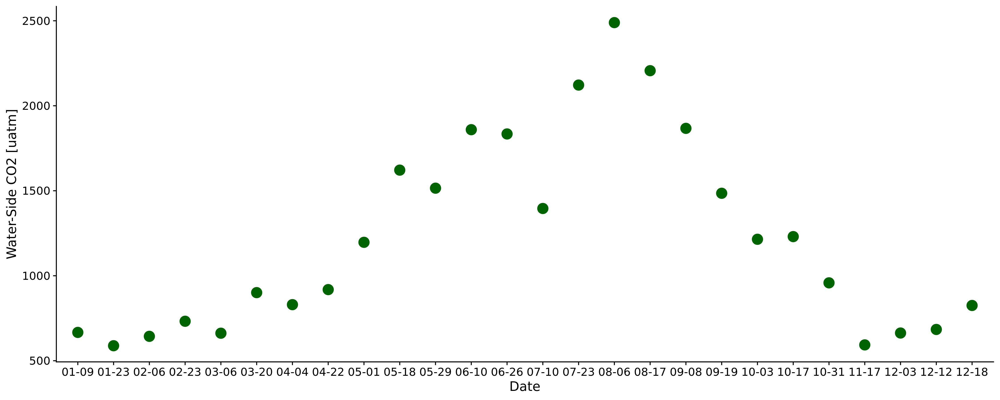

```{r setup, include=FALSE}
knitr::opts_chunk$set(echo = TRUE)
```

##Text S1
[@tsivoglouTracerMeasurementReaeration1976] outlined an energy dissipation model for the reaeration coefficient ($K_2$, or k without depth correction) that is frequently generalized and used to scale $k_{600}$ [@ulsethDistinctAirWater2019a; @raymondScalingGasTransfer2012a]. They showed that $K_2$ scales linearly with the energy dissipation rate eD. Their derivation explicitly shows that $eD=\frac{dH}{dT}$ for some segment of stream where H is water surface elevation and T is hydraulic residence time. For a stream segment with residence time T, the loss in water surface elevation is synonymous with the downward component of flow velocity V in the h dimension over the reach length (i.e. $S_h$). So, we can generalize this to $\frac{dH}{dT}=V_hS_h≈VS_h$. Finally, this can be converted to an energy dissipation rate per unit weight of water such that $eD  [\frac{L^2}{T^3}]=g\frac{dH}{dT}≈gVS_h$. This model is convenient for our use because SWOT will only measure $S_h$ and not channel slope $S_0$. Further, Manning’s equation under non-uniform flow conditions requires $S_h$ and not $S_0$ and so we can conveniently merge the slope terms across equations and directly measure them from SWOT.

##Text S2
In Figure S4 we show that bed roughness only exerts an influence on $k_{600}$ when rivers are incredibly steep. We do this using the 'Keulegan effective roughness height' for the channel bed, which is detailed in equation S1 below (in the form form [@dingmanAnalyticalDerivationAtastation2007b]). This model was first outlined in the 1930s by Keulegan and outlined explicitly in [@fergusonHydraulicsHydraulicGeometry1986a] and [@dingmanAnalyticalDerivationAtastation2007b] in the context of hydraulic geometry (noting that it is a more generalized form of the Manning's and Chezy's velocity~depth relations commonly used in the literature). The model arises from depth integrating the Prandl-von Karman equation for velocity in a turbulent boundary layer ($\frac{u}{u_\star}=2.5ln(\frac{30y}{k_s})$) [@[@fergusonHydraulicsHydraulicGeometry1986a]].

$$V=2.5(gDS)^{1/2}ln(\frac{11D}{y_r})   (S1)$$
$y_r [L]$ is the effective bed roughness height we solved for using the data from [@ulsethDistinctAirWater2019a] where D is channel depth [L], S is channel slope, g is gravitational acceleration $[M/T^2]$, and V is average flow velocity $[M/T]$. Because it is an 'effective/equivalent height', this does not necessairly reflect actual roughness elements in the river channel but is a reasonable way to quantify relative differences in bed roughness across data. It is convenient to use here because it provides an actual roughness height and is not simply a coefficient like the conductance coefficients in Manning's and Chezy's velocity~depth relations.

In Figure S4, this effective roughness height was plotted against $k_{600}$ and the data was progressively filtered for steeper and steeper rivers.


 

 


Table S1 Details on the 3 velocity rating curve models used to estimate bulk carbon efflux from the SWOT rivers (section 5.2.4).
	Equation	Description
Raymond et al. (2012)	lnV=-1.64+0.285lnQ	Trained on Raymond et al. (2012) dataset
Raymond et al. (2013)	lnV=mean{█(-1.64+0.285lnQ,@-1.06+0.12lnQ  )}	Average of Raymond et al. (2012) model and one trained on 9,811 USGS streamgauges
Lauerwald et al. (2015)	lnV=-1.06+0.12lnQ	Borrowed from ½ of the Raymond et al. (2013) calculation (trained on 9,811 USGS streamgauges)

##References