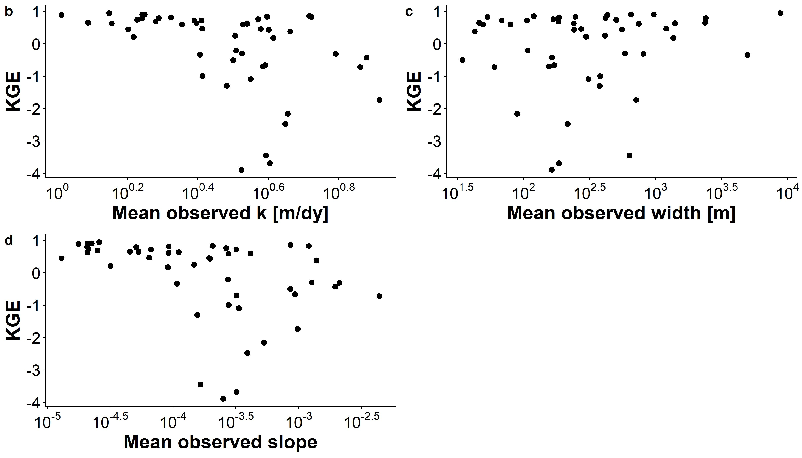

```{r setup, include=FALSE}
knitr::opts_chunk$set(echo = TRUE)
```

##Contents
This supplementary information contains 7 figures and 1 table. Please consult https://github.com/craigbrinkerhoff/RSK600 for all code to build and generate results, figures, and the manuscript.

##Figures

 





##Tables
*Table S1: Details on the 3 velocity hydraulic geometry models used to estimate FCO2 from the SWOT rivers (section 2.4).*

|**Name**|**Equation**|**Description**|**Reference**|
|-------------|-------------|-------------|-------------|-------------|
|Raymond 2012|$ln(V)=-1.64+0.285ln(Q)$|Trained on their dataset|@raymondScalingGasTransfer2012a|
|Raymond 2013|$ln(V)=mean(-1.64+0.285ln(Q),  -1.06+0.12ln(Q))$ |Average of the Raymond 2012 equation and one trained on 9,811 USGS streamgauges|@raymondGlobalCarbonDioxide2013a|
|Lauerwald 2015|$ln(V)=-1.06+0.12ln(Q)$ |Borrowed from 1/2 of the Raymond 2013 calculation (trained on 9,811 USGS streamgauges)|@lauerwaldSpatialPatternsCO22015|

##References