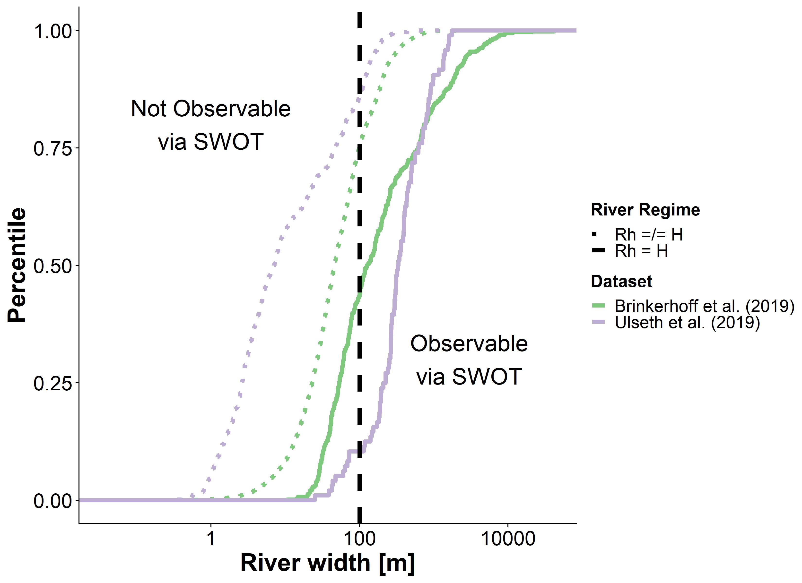

```{r setup, include=FALSE}
knitr::opts_chunk$set(echo = TRUE)
```

##Contents
This supplementary information contains 7 figures and 1 table. Please consult https://github.com/craigbrinkerhoff/RSK600 for all code to build and generate results, figures, and the manuscript.

## Text S1: Deriving two expressions for turbulent kinetic energy production
Below we detail how we arrived at our two expressions for a cross-section-averaged turbulent kinetic energy production (*G*), or equation 2 in the main text.

@nakagawaTurbulenceOpenChannel1993 outline the standard energy budget for turbulent kinetic energy (TKE), at some distance from the bed *h*, for a 2-dimensional open-channel flow (equation S1). *G* is the TKE produced, $\epsilon$ is the TKE dissipated, $T_d$ is TKE transported from the riverbed via turbulent diffusion, and $V_d$ is TKE transported via viscous diffusion. $T_d$ should always be positive at the free surface, but this is increasingly less true as one moves closer to the riverbed. Since we are interested in the TKE budget at the river surface, $V_d$ can be assumed neglible [@nakagawaTurbulenceOpenChannel1993]. 
$$\mathbf{(S1)} G+T_d+V_d=\epsilon$$

@nakagawaTurbulenceOpenChannel1993 further define *G* and the direct energy dissipation *E*, as averaged over the entire river cross-section and integrated over the entire water column, as equation S2 where *H* is the full water-column depth, *U* is the cross-sectional average flow velocity, and $U_*$ is the friction velocity. $U_*$ is defined by the water surface slope *S*, gravitational acceleration *g* and the channel hydraulic radius $R_h$ as $U_*=\sqrt{gSR_h}$.
$$\mathbf{(S2)} \int_{0}^{H}{Gdh} + \int_{0}^{H}{Edh}=UU_*^2$$

$\int_{0}^{H}{Edh}$ can also be assumed neglible at the free surface [@nakagawaTurbulenceOpenChannel1993]. We then integrate over the full water-column depth *H* to arrive at an expression for *G* at the free surface that reduces to equation S5. Equations S3 to S4 show the algebra.
$$\mathbf{(S3)} \int_{0}^{H}{Gdh} = U\sqrt{gSR_h}^2$$
$$\mathbf{(S4)} GH = UgSR_h$$
$$\mathbf{(S5)} G=gSU\frac{R_h}{H}$$
Alternatively, we can derive another expression for *G* from equation S2. This is provided as equation S8 with the necessary algebra in equations S6-S7.
$$\mathbf{(S6)} \int_{0}^{H}{Gdh}=UU_*^2$$
$$\mathbf{(S7)} GH=UU_*^2$$
$$\mathbf{(S8)} G=\frac{UU_*^2}{H}$$

## Text S2: BIKER hyperparameterization
We assign prior hyperparameters using SWOT data only. All priors are formalized within the model as truncated normal distributions of the log-transformed terms such that $log(X) \sim  \mathcal{N}(\mu, \sigma^2)$ for $\lambda < log(X) < \gamma$, using prior hyperparameters mean ($\mu$), standard deviation ($\sigma$), and upper ($\gamma$) and lower bounds ($\lambda$) for any parameter *X*.

$A_0$ prior hyperparameters were assigned following an updated version of the method developed by @brinkerhoffConstrainingRemoteRiver2020a. They developed a set of river channel prior hyperparameters for McFLI algorithms that are entirely RS-able and reflect differential channel hydraulics as a function of river geomorphology. They used an extensive database of field measurements and machine learning to identify patterns that associate river width with the hydraulic priors needed to run McFLIs so that prior hyperparameters may be assigned to rivers using only the existing remotely sensed data. For this study, we extracted $\lambda$ and $\gamma$ as the Xth percentile values rather than the absoulte maximum and minimum values to avoid physically impossible bounds on $A_0$. This leaves the $k_{600}$ hyperparameters to be defined. We assigned those by using a simple slope regression model to predict $U_*$, trained on the @ulsethDistinctAirWater2019a: equation S9 assigns $\mu$ while $\sigma^2$ was set to equation S9's log-transformed standard error after propogation of errors for both equation S9 and equation 4 in the main text: 1.12. $\lambda$ and $\gamma$ were set to log(0.001) m/day and log(500) m/day, respectively. Finally, we estimate $\sigma_{k_{600}}$ using the standard model error from equation 4 in the main text and as fit on the data shown in Figure 3a.

$$\mathbf{(S9)} \mu_{k_{600}}=56.0294 * a(ln(S_h))^b$$

## Text S3: BIKER validation setup
Regardless of the validation setup or SWOT error budget used, we do not have observed $k_{600}$ data for these rivers, and to our knowledge no field dataset of $k_{600}$ exists in the type of temporal and spatial frequency that SWOT (and therefore the BIKER algorithm) provides. Therefore, we take the model outlined in row 1 of Table 1 and use that to calculate the observed $k_{600}$, that BIKER is validated against (equation S10).

$$\mathbf{(S10)} k_{600, obs}=56.0294\sqrt{gS_hR_{h, obs}}$$

It also means that, for a fair validation scheme, $\sigma_{k_{600}}^2$ in equation 5 in the main text must be set to reflect only error from our assumptions about calculating *dA* and not the parameter uncertainity inherent in the model coefficient (i.e. the 56.0294 in equation 4 in the main text). Because this model is only theoretically valid when $R_h=H$, we convientantly do not need to account for uncertanties associated with assuming that $R_h = H$. So for this validation, $\sigma_{k_{600}}^2$ is set to 0.20 (natural-log space) to reflect a small degree of uncertainity that could arise from assuming a rectangular river channel. However once SWOT launches, it should reflect the total uncertainty described in Text S3 (1.12).

Validation is performed using the BIKER posterior means. Validation metrics take two forms (and are detailed in Table S1). To validate across all rivers and timesteps, we used the coefficient of determination $r^2$ and the root mean square error RMSE. Three normalized metrics were used for by-river validation: RRMSE and NRMSE are normalized root mean square errors that have been normalized by the observed value and the mean observed value (respectively). rBIAS is a measure of prediction bias that is normalized by the mean observed value. r2 is again used on the by-river case.

## Text S4: BIKER FCO2 calculations
To calculate $CO_2$ fluxes and carbon efflux, we pair @beaulieuControlsGasTransfer2012a's biweekly 26 $CO_2$ and water temperature samples with every 11th SWOT observation by date, ignoring the timesteps beyond 26. This amounts to only ~15% of the SWOT observations and we deem this acceptable. We sample every 11 days as this is the average sampling resolution for SWOT and the $CO_2$ and water temperature data are approximately the same at a 14 day resolution. Not all of the SWOT rivers have observations for a full year, and when simulation dates are not available they are assumed to start on January 1st. We then pair the modeled $k_{CO_2}$ values (obtained from $k_{600}$ and equation S11) with these water-side $CO_2$ concentrations and water temperatures. In equation S11, *Sc* is the Schmidt number at the observed water temperature. This was calculated following @raymondScalingGasTransfer2012a and @wanninkhofRelationshipWindSpeed1992a. Atmospheric $CO_2$ was assumed 390 uatm. $FCO_2$ validation was performed using the same metrics as $k_{600}$ validation (Table 1).

$$\mathbf{(S11)} k_{CO2, temp}=k_{600}*(Sc/600)^{-1/2}$$
To calculate the bulk carbon efflux, we multiply the median $FCO_2$ value across all rivers and timesteps (in Tg-C/yr) by the total average surface area of all 47 rivers.

##Figures





##Tables
*Table S1: Validation metrics used in this study, where r is the correlation coefficient, Nt is number of observations and i is the specific observation. σ refers to the variance of the sample and μ refers to the mean of the sample. As is standard, a carrot accent indicates the predicted value.*

|**Description**|**Acronym**|**Definition**|**Ideal Score**|**Possible Range**|**Validation Scheme**|
|-----------|-------|----------|-----------|--------------|-----------------|
|Coefficient of determination|$r^2$| $1-(\frac{\sum\limits_{i=1}^{N_t}{(k_{600, i}-\hat{k_{600}})^2}}{\sum{(k_{600, i}-\bar{k_{600}})^2}})$ |1|0 to 1|	All rivers and all timesteps|
|Root-mean-square-error|RMSE| $\sqrt{\frac{1}{N_t}\sum\limits_{i=1}^{N_t}(\hat{k_{600, i}}-k_{600, i})^2}$ |0|0 to ∞|All rivers and all timesteps|
|Relative root-mean-square error|RRMSE| $\sqrt{\frac{1}{N_t}\sum\limits_{i=1}^{N_t}(\frac{\hat{k_{600, i}}-k_{600, i}}{k_{600, i}})^2}$ |0|0 to ∞|By river|
|Normalized root-mean-square error|NRMSE| $\sqrt{\frac{1}{N_t}\sum\limits_{i=1}^{N_t}(\frac{\hat{k_{600, i}}-k_{600, i}}{\bar{k_{600, i}}})^2}$ |0|0 to ∞|By river|
|Relative bias|rBIAS| $\frac{1}{N_t}\sum\limits_{i=1}^{N_t}(\frac{\hat{k_{600, i}}-k_{600, i}}{\bar{k_{600, i}}})$ |0|-∞ to ∞|By river|

*Table S2: Details on the 3 depth hydraulic geometry models used to estimate FCO2 from the SWOT rivers (section 2.4).*

|**Name**|**Equation**|**Description**|**Reference**|
|-------------|-------------|-------------|-------------|-------------|
|Brinkerhoff 2019|$D=0.258Q^{0.395}$|530,945 measurements made across the United States at streamgauges|this study; @brinkerhoffReconcilingAtaStationAtManyStations2019|
|Raymond 2012|$D=0.409Q^{0.294}$|1,026 measurements across the United States|@raymondScalingGasTransfer2012a|
|Raymond 2013|$D=0.409Q^{0.294},  D=0.449Q^{0.37}$ |Average of the Raymond 2012 equation and one using 9,811 measurements at US streamgauges|@raymondGlobalCarbonDioxide2013a|

##References