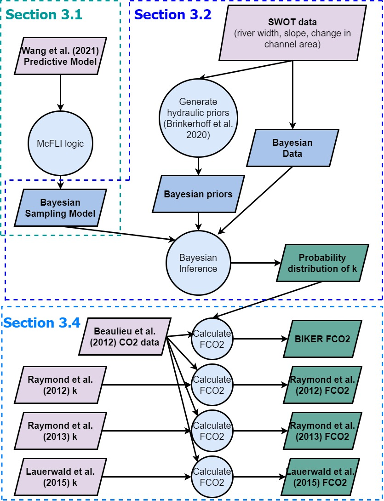
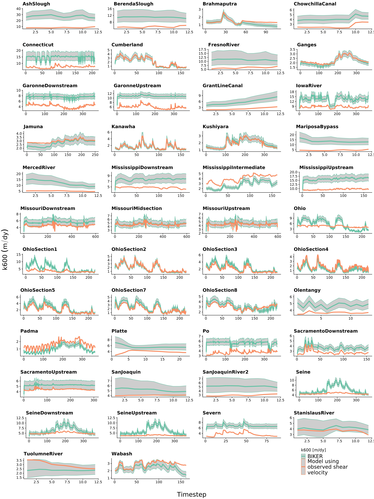

```{r setup, include=FALSE}
knitr::opts_chunk$set(echo = TRUE)
```

## Contents
This supplementary information contains 4 texts, 3 figures and 3 tables. Please consult https://github.com/craigbrinkerhoff/RSK600 for all code to build and generate results, figures, and the manuscript.

## Test S1: Estimating how many SWOT rivers are hydraulically wide
To quantify how frequently SWOT-observable rivers are also hydraulically wide river channels (section 3 of main text), we used the dataset of field-measured river hydraulics in @brinkerhoffReconcilingAtaStationAtManyStations2019. That dataset has over 500,000 discrete measurements of river width, velocity, area, and discharge that were made by the United States Geological Survey (USGS) to calibrate streamgauge rating curves. Here, we describe how this dataset was filtered down to 171,553 measurements and how we quantified what was 'hydraulically wide'.

First, we removed all measurements tagged by the USGS as 'poor', measurements with impossible values, or measurements of 0. While this would indicate a dry channel, our hydraulic geometry model necessitates within-bank flow. Likewise, because hydraulic geometry only applies to within-bank flows and not flood events, we remove all overbank flows. This was done by first filtering for sites with at least 20 measurements (to build robust estimates of bankfull hydraulics) and then calculating bankfull width and depth as the width or depth with a return period of two years. While the only true way to calculate bankfull hydraulics is manually in the field, this is obviously impractical here. A two year return period is a standard approximation for determining out-of-bank flow in single-channel meandering rivers and was the method used by @brinkerhoffReconcilingAtaStationAtManyStations2019. We then removed all measurements with a width or depth beyond their respective at-a-station 2 year values.

After joining this dataset with the hydraulics measurements provided with the 763 $k_{600}$ measurements, we classified each measurement as hydraulically wide if its hydraulic radius was within 4% of its mean flow depth. Hydraulic radius was calculated assuming a rectangular channel such that $R_H=2H+W$. Because these measurements were almost entirely made at streamgauges, which generally have a location bias favoring stable channels near bridges and other structures that yield lower width dynamics than those observed away from gauges [@allenPatternsRiverWidth2015; @parkWorldwideVariationsHydraulic1977], we used a wider threshold of 4%. In the 'width-limited' scenario common at streamgauges, the hydraulic radius is likely further from the mean flow depth than would occur naturally. The slightly more liberal threshold of 4% allowed for implicit accounting for this sampling bias. For gas exchange velocity model fitting however, we continued to use the more conservative (and theoretically defensibl) threshold of 1%.

## Text S2: BIKER hyperparameterization
In this text we explain in detail how BIKER's hyperparameter values were set for each river.

We assign prior hyperparameters using SWOT data only. All priors are formalized within the model as truncated normal distributions of the log-transformed terms such that $log(X) \sim  \mathcal{N}(\mu, \sigma^2)$ for $\lambda < log(X) < \gamma$, using prior hyperparameters mean ($\mu$), standard deviation ($\sigma$), and upper ($\gamma$) and lower bounds ($\lambda$) for any parameter *X*.

$A_0$ prior hyperparameters were assigned following an updated version of the method developed by @brinkerhoffConstrainingRemoteRiver2020. They developed a set of river channel prior hyperparameters for McFLI algorithms that are entirely RS-able and reflect differential channel hydraulics as a function of river geomorphology. They used an extensive database of field measurements and machine learning to identify patterns that associate river width with the hydraulic priors needed to run McFLIs so that prior hyperparameters may be assigned to rivers using only the existing remotely sensed data. For this study, we extracted $\lambda_{A_0}$ and $\gamma_{A_0}$ as the 5th and 95th percentile values rather than the absolute maximum and minimum values to avoid physically impossible bounds on $A_0$.

This leaves the $k_{600}$ hyperparameters to be defined. We assigned those by using a simple slope regression model to predict $U_*$ solely from a SWOT-observable value. It was trained on the @ulsethDistinctAirWater2019 dataset. Equation S9 assigns $\mu_{k_{600}}$ while $\sigma^2_{k_{600}}$ was set to equation S9's log-transformed standard error after propogation of errors for both equation S9 and equation 6 in the main text. This amounted to a value of 1.12. $\lambda_{k_{600}}$ and $\gamma_{{k_600}}$ were set to log(0.001) m/day and log(500) m/day, respectively. Finally, we estimate $\sigma_{k_{600}}$ using the standard model error from equation 6 in the main text and as fit on the data shown in Figure 3a.

**NEEDS TO BE REDONE**
$$\mathbf{(S9)} \mu_{k_{600}}=56.0294 * a(ln(S_h))^b$$

## Text S3: BIKER validation setup
In this text, we explain the BIKER validation setup in detail.

Regardless of the validation setup or SWOT error budget used, we do not have observed $k_{600}$ data for these rivers, and to our knowledge no field dataset of $k_{600}$ exists in the type of temporal and spatial frequency that SWOT (and therefore the BIKER algorithm) provides. Therefore, we take the model outlined in row 1 of Table 1 in the main text and use that to calculate the observed $k_{600}$, that BIKER is validated against (equation S10).

$$\mathbf{(S10)} k_{600, obs}=56.0294\sqrt{gS_hR_{h, obs}}$$

It also means that, for a fair validation scheme, $\sigma_{k_{600}}^2$ in equation 7 in the main text must be set to reflect only error from our assumptions about calculating *dA* and not the parameter uncertainity inherent in the model coefficient (i.e. the 56.0294 in equation 6 in the main text). Because this model is only theoretically valid when $R_h=H$, we convientantly do not need to account for uncertanties associated with assuming that $R_h = H$. So for this validation, $\sigma_{k_{600}}^2$ is set to 0.20 (natural-log space) to reflect a small degree of uncertainity that could arise from assuming a rectangular river channel. However once SWOT launches, it should reflect the total uncertainty described in Text S3 (1.12).

Validation is performed using the BIKER posterior means. Validation metrics take two forms (and are detailed in Table S1). To validate across all rivers and timesteps, we used the coefficient of determination $r^2$ and the root mean square error RMSE. Four normalized metrics were used for by-river validation: RRMSE and NRMSE are normalized root mean square errors that have been normalized by the observed value and the mean observed value (respectively). rBIAS is a measure of prediction bias that is normalized by the mean observed value. r2 is again used on the by-river case too.

## Text S4: BIKER FCO2 workflow
Here, we explain how $CO_2$ fluxes were calcualted for each simulated SWOT river.

To calculate $CO_2$ fluxes and carbon efflux, we pair @beaulieuControlsGasTransfer2012's biweekly 26 $CO_2$ and water temperature samples with every 11th SWOT observation by date, ignoring the timesteps beyond 26. This amounts to only ~15% of the SWOT observations and we deem this acceptable. We sample every 11 days as this is the average sampling resolution for SWOT and the $CO_2$ and water temperature data are approximately the same at a 14 day resolution. Not all of the SWOT rivers have observations for a full year, and when simulation dates are not available they are assumed to start on January 1st. We then pair the modeled $k_{CO_2}$ values (obtained from $k_{600}$ and equation S11) with these water-side $CO_2$ concentrations and water temperatures. In equation S11, *Sc* is the Schmidt number at the observed water temperature. This was calculated following @raymondScalingGasTransfer2012 and @wanninkhofRelationshipWindSpeed1992. Atmospheric $CO_2$ was assumed 390 uatm. $FCO_2$ validation was performed using the same metrics as $k_{600}$ validation (Table 1).

$$\mathbf{(S11)} k_{CO2, temp}=k_{600}*(Sc/600)^{-1/2}$$
To calculate the bulk carbon efflux, we multiply the median $FCO_2$ value across all rivers and timesteps (in Tg-C/yr) by the total average surface area of all 47 rivers.

## Figure S1
**UPDATE**


## Figure S2


## Figure S3


## Table S1
*Table S1: Studies that gas exchange velocity measurements come from. 'Study' refers to the paper from which these measurements were taken. Any data wrangling was done by those authors. 'Field Workers' refers to who actually made the measurements. The Raymond et al. (2012) dataset is itself a meta-analysis. Please see that paper for how those measurements were collected. We used the set of measurements ultimately published by Ulseth et al. 2019.*

|**Study**|**Workers**|**Number of measurements**|
|---------|-------------|--------------------------|
|@ulsethDistinctAirWater2019|@ulsethDistinctAirWater2019||
|@ulsethDistinctAirWater2019|@hallUseArgonMeasure2018||
|@ulsethDistinctAirWater2019|@schelkerCO2EvasionSteep2016||
|@ulsethDistinctAirWater2019|@mauriceInfluenceFlowBed2017||
|@ulsethDistinctAirWater2019|@raymondScalingGasTransfer2012||
<!-- |@raymondScalingGasTransfer2012|@melchingReaerationEquationsDerived| -->
<!-- |@raymondScalingGasTransfer2012|@tsivoglouCharacterizationStreamReaeration1972| -->
<!-- |@raymondScalingGasTransfer2012|Stroud Water Center| -->
<!-- |@raymondScalingGasTransfer2012|@bernotInterregionalComparisonLanduse2010| -->
<!-- |@raymondScalingGasTransfer2012|@mulhollandInterbiomeComparisonFactors2001| -->
<!-- |@churchillPredictionStreamReaeration1964|@churchillPredictionStreamReaeration1964|| -->
<!-- |@owensReaerationStudiesStreams1964|@owensReaerationStudiesStreams1964|| -->

## Table S2
*Table S2: Validation metrics used in this study, where r is the correlation coefficient, Nt is number of observations and i is the specific observation. σ refers to the variance of the sample and μ refers to the mean of the sample. As is standard, a carrot accent indicates the predicted value.*

|**Description**|**Acronym**|**Definition**|**Ideal Score**|**Possible Range**|**Validation Scheme**|
|-----------|-------|----------|-----------|--------------|-----------------|
|Coefficient of determination|$r^2$| $1-(\frac{\sum\limits_{i=1}^{N_t}{(k_{600, i}-\hat{k_{600}})^2}}{\sum{(k_{600, i}-\bar{k_{600}})^2}})$ |1|0 to 1|	All rivers and all timesteps|
|Root-mean-square-error|RMSE| $\sqrt{\frac{1}{N_t}\sum\limits_{i=1}^{N_t}(\hat{k_{600, i}}-k_{600, i})^2}$ |0|0 to ∞|All rivers and all timesteps|
|Relative root-mean-square error|RRMSE| $\sqrt{\frac{1}{N_t}\sum\limits_{i=1}^{N_t}(\frac{\hat{k_{600, i}}-k_{600, i}}{k_{600, i}})^2}$ |0|0 to ∞|By river|
|Normalized root-mean-square error|NRMSE| $\sqrt{\frac{1}{N_t}\sum\limits_{i=1}^{N_t}(\frac{\hat{k_{600, i}}-k_{600, i}}{\bar{k_{600, i}}})^2}$ |0|0 to ∞|By river|
|Relative bias|rBIAS| $\frac{1}{N_t}\sum\limits_{i=1}^{N_t}(\frac{\hat{k_{600, i}}-k_{600, i}}{\bar{k_{600, i}}})$ |0|-∞ to ∞|By river|

## Table S3
*Table S3: Details on the 3 depth hydraulic geometry models used to estimate FCO2 from the SWOT rivers (section 2.4).*

|**Name**|**Equation**|**Description**|**Reference**|
|-------------|-------------|-------------|-------------|-------------|
|Brinkerhoff 2019|$D=0.258Q^{0.395}$|530,945 measurements made across the United States at streamgauges|this study; @brinkerhoffReconcilingAtaStationAtManyStations2019|
|Raymond 2012|$D=0.409Q^{0.294}$|1,026 measurements across the United States|@raymondScalingGasTransfer2012|
|Raymond 2013|$D=0.409Q^{0.294},  D=0.449Q^{0.37}$ |Average of the Raymond 2012 equation and one using 9,811 measurements at US streamgauges|@raymondGlobalCarbonDioxide2013|

## References